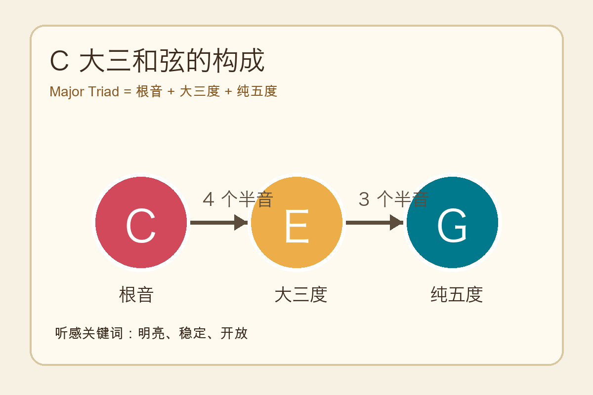
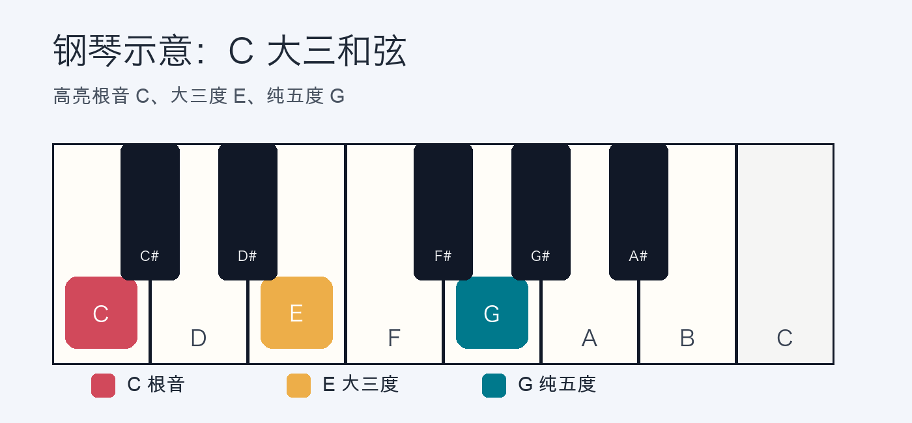
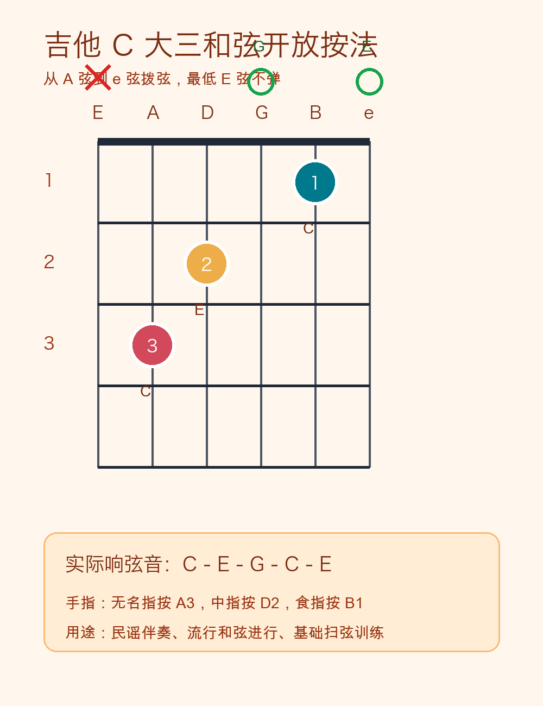

# 2026-04-20：大三和弦 Major Triad

## 今日知识点

大三和弦是西方音乐里最基础、最常用的和弦之一，听感通常明亮、稳定、开放。它由三个音组成：

- 根音：决定和弦名字。
- 大三度：距离根音 4 个半音，决定“大调”明亮感。
- 纯五度：距离根音 7 个半音，提供稳定支撑。

以 C 大三和弦为例：

```text
C Major Triad = C + E + G

C 到 E = 4 个半音 = 大三度
C 到 G = 7 个半音 = 纯五度
```

## 音程结构图



也可以理解为“先搭一个大三度，再搭一个小三度”：

C 先到 E 是 4 个半音，再从 E 到 G 是 3 个半音，所以大三和弦可以记成：

`根音 + 大三度 + 纯五度`

## 在钢琴上的位置

C 大三和弦在钢琴上最直观，因为只需要按白键 C、E、G。



推荐指法：右手 `1-3-5` 按 `C-E-G`，左手 `5-3-1` 按 `C-E-G`。

钢琴使用场景：

- 伴奏：在 C 大调歌曲里，C 大三和弦常作为主和弦，表达“回家”“落地”的感觉。
- 分解和弦：把 C-E-G 同时按，改成依次弹 C、E、G、E，就能做简单抒情伴奏。
- 和声判断：听到 C 大调音乐回到 C-E-G，通常会有稳定、结束、解决的感觉。

钢琴例子：

```text
右手旋律：E  D  C
左手和弦：C  E  G

弹法：
1. 左手同时按 C-E-G。
2. 右手依次弹 E-D-C。
3. 听最后落到 C 时是否有稳定感。
```

分解伴奏练习：

```text
拍子：4/4

左手：C   E   G   E  | C   E   G   E
拍点：1   2   3   4  | 1   2   3   4
```

## 在吉他上的位置

吉他上的 C 大三和弦常见开放和弦按法如下：



这个按法实际弹出的音从低到高是：

`C - E - G - C - E`

它还是 C 大三和弦，因为核心音仍然只有 C、E、G，只是有些音重复了。

吉他使用场景：

- 民谣伴奏：C 大三和弦是 C 大调、G 大调、F 大调歌曲里非常常见的基础和弦。
- 和弦进行：C - G - Am - F 是流行歌常见进行，C 在开头时会提供明亮起点。
- 扫弦练习：用 C 和弦练习“下、下上、上下上”的基础节奏型。

吉他例子：

```text
和弦进行：C  | G  | Am | F

每个和弦弹 4 拍：
C：下 下上 上下上
G：下 下上 上下上
Am：下 下上 上下上
F：下 下上 上下上
```

如果 F 横按困难，可以先用简化 F：

`F` 简化版可以按 `xx3211`。

## 听感关键词

- 明亮
- 稳定
- 开放
- 像“开始”或“回到家”

## 今日练习

1. 在钢琴上找到任意一个 C，向右数 4 个半音找到 E，再从 C 向右数 7 个半音找到 G。
2. 用右手 1-3-5 指同时按下 C-E-G，听它的稳定感。
3. 在吉他上按 C 开放和弦，只弹 A 弦到 e 弦，避免弹最低的 E 弦。
4. 对比 C 大三和弦和 A 小和弦的听感，先不分析理论，只描述一个“亮”、一个“暗”的区别。

## 一句话总结

大三和弦 = 根音 + 大三度 + 纯五度；在钢琴上可以直接看到音程结构，在吉他上常以开放和弦或横按和弦形式用于伴奏。
