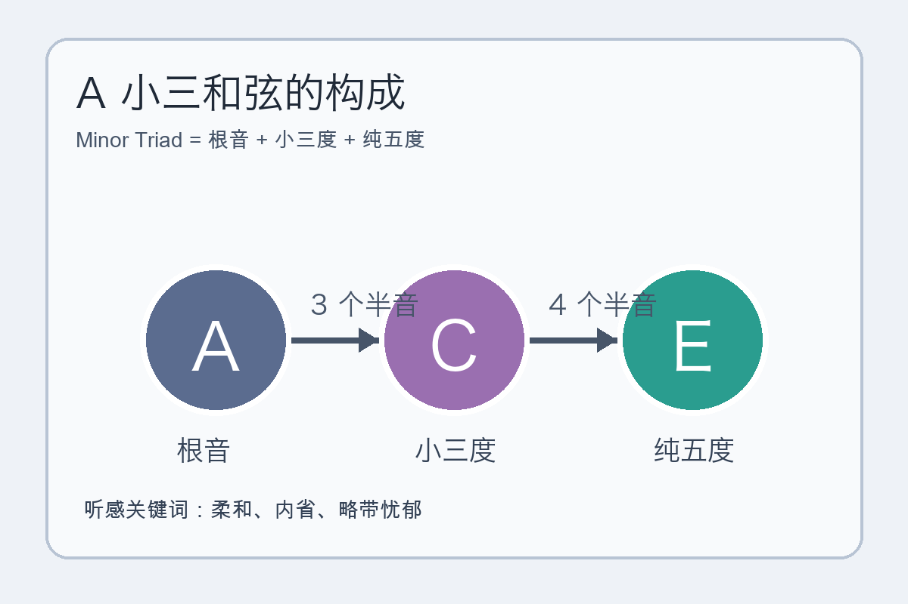
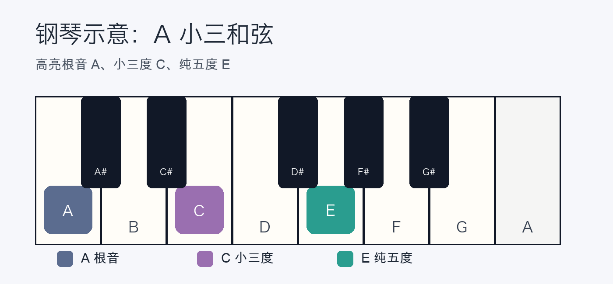
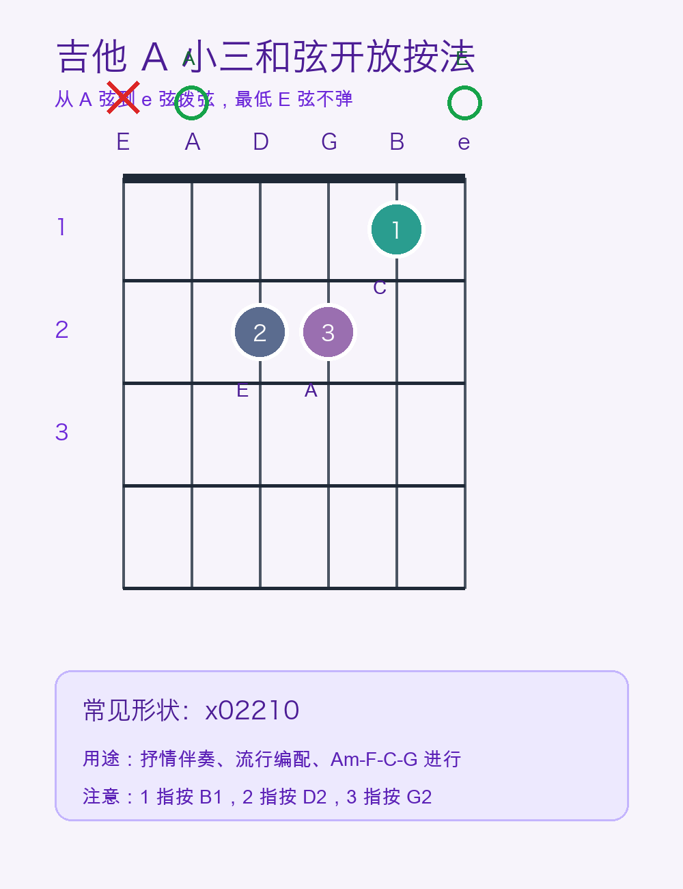

# 2026-04-20：小三和弦 Minor Triad

## 今日知识点

小三和弦是最常见的基础和弦类型之一，和大三和弦相比，它的听感通常更柔和、内省，很多抒情、叙事、略带忧郁的段落都会用到它。它由三个核心音组成：

- 根音：决定和弦名字。
- 小三度：距离根音 3 个半音，决定“小调色彩”。
- 纯五度：距离根音 7 个半音，提供稳定骨架。

以 A 小三和弦为例：

```text
A Minor Triad = A + C + E

A 到 C = 3 个半音 = 小三度
A 到 E = 7 个半音 = 纯五度
```

和大三和弦相比，它的内部结构刚好反过来：先是一个小三度，再叠一个大三度，所以可以记成：

`根音 + 小三度 + 纯五度`

## 音程结构图



这个结构非常重要，因为你之后学到的很多小调和弦、本位和弦、流行歌曲常用伴奏，都能追溯到这个最基础的三音堆叠方式。

## 钢琴使用场景

在钢琴上，A 小三和弦是非常适合入门的小三和弦，因为它只用白键 `A-C-E` 就能弹出来，眼睛和耳朵都容易建立联系。



推荐指法：右手 `1-3-5` 按 `A-C-E`，左手 `5-3-1` 按 `A-C-E`。

钢琴上的典型使用场景：

- 抒情伴奏：当旋律需要更柔和、不那么“落地”的情绪时，A 小三和弦比 A 大三和弦更自然。
- 分解和弦：把 `A-C-E` 改成依次弹 `A-E-C-E`，很容易做出流行抒情伴奏型。
- 和声对比：先弹 `C-E-G` 再弹 `A-C-E`，能明显听到从明亮转向内敛的色彩变化。

钢琴可演奏例子：

```text
拍子：4/4

左手：A   E   C   E | A   E   C   E
右手：C   B   A   - | C   B   A   -
拍点：1   2   3   4 | 1   2   3   4
```

练习时先让左手保持均匀，再让右手最后落到 A，去感受“小调稳定但不明亮”的收束感。

## 吉他使用场景

吉他上最常见的小三和弦入门形状之一就是 `Am` 开放和弦。它手感自然，又大量出现在民谣和流行歌曲里，是必须熟悉的基础按法。



标准按法是 `x02210`，也就是：

- 第 6 弦不弹。
- 第 5 弦空弦是根音 A。
- 第 4、3 弦按第 2 品。
- 第 2 弦按第 1 品。
- 第 1 弦空弦。

吉他的典型使用场景：

- 民谣弹唱：`Am-F-C-G`、`Am-G-F-E` 这类进行很常见。
- 分解伴奏：从第 5 弦开始拨 `A-D-G-B-G-D`，很适合慢歌前奏。
- 情绪转换：一首歌里从 C 大三和弦切到 Am，经常会让情绪马上变得更细腻。

吉他可演奏例子：

```text
和弦进行：Am | F  | C  | G

每个和弦 4 拍，先用最基础下扫：
1   2   3   4
下  下  下  下
```

弹熟以后，可以换成：

```text
下  下上  上下上
```

这样会更接近流行歌曲常见的伴奏质感。

## 可演奏例子

如果你同时接触钢琴和吉他，可以用同一个和声思路练：

```text
和声循环：Am | F | C | G
```

钢琴练法：

- 左手弹根音 `A-F-C-G`。
- 右手分别弹三和弦 `A-C-E`、`F-A-C`、`C-E-G`、`G-B-D`。

吉他练法：

- 直接按 `Am-F-C-G` 做 4 小节循环。
- 先保证换和弦不断拍，再追求扫弦流畅。

这个例子有一个很实用的价值：你会听到小三和弦并不是“悲伤专属”，它更准确地说是在和声里提供一种不那么直白、但很有叙事感的色彩。

## 今日练习

1. 在钢琴上找到一个 A，向右数 3 个半音找到 C，再从 A 数到 E，确认小三和弦的两个关键距离。
2. 先后弹 `C-E-G` 和 `A-C-E`，只描述听感差异，不急着套标签。
3. 在吉他上按 `Am` 开放和弦，连续 8 小节只做均匀下扫，确保第 6 弦不误触。
4. 用钢琴或吉他循环弹 `Am-F-C-G`，留意 `Am` 出现时整体色彩如何变化。
5. 尝试闭眼听 `A-C-E`，唱出最低音 A，建立“和弦名字由根音决定”的听觉习惯。

## 一句话总结

小三和弦 = 根音 + 小三度 + 纯五度；它在钢琴上容易看清结构，在吉他上常以 `Am` 等开放和弦进入真实伴奏场景。
