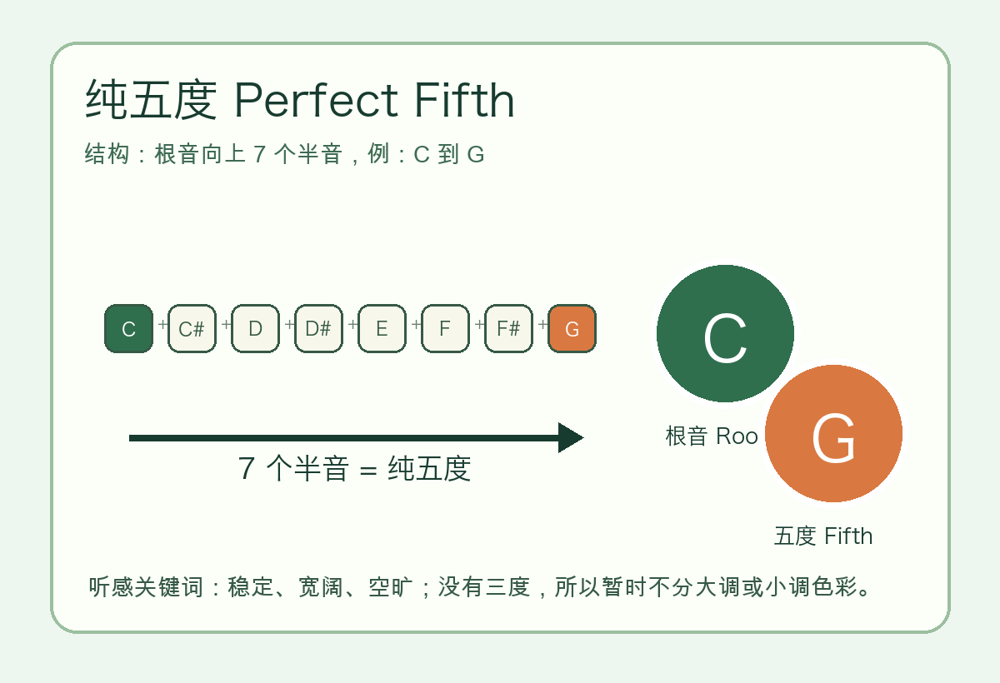
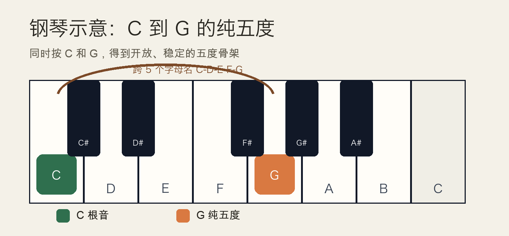
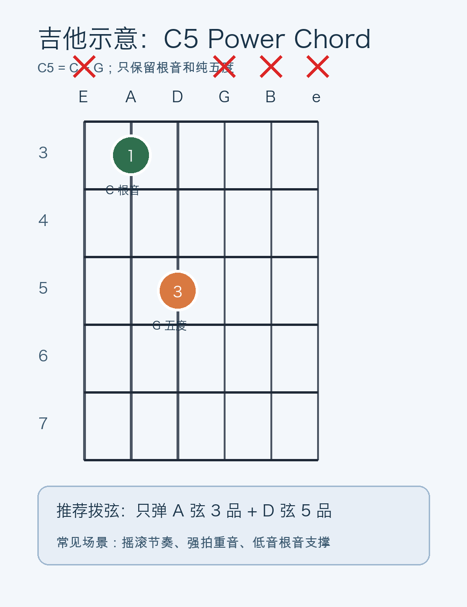

# 2026-04-21：纯五度 Perfect Fifth

## 今日知识点

纯五度是最稳定、最常用的基础音程之一。它指的是从一个根音向上数到第 5 个字母名，并且实际距离为 7 个半音。以 C 为例：

```text
C 到 G = 纯五度
C - C# - D - D# - E - F - F# - G
一共向上走 7 个半音
```

纯五度的关键不是“第 5 个琴键”，而是两个条件同时成立：

- 字母名距离是五度：C-D-E-F-G。
- 半音距离是 7 个半音。



纯五度听起来稳定、宽阔、空旷。它没有三度，所以不会直接告诉你“大调明亮”还是“小调暗淡”；这也是为什么吉他的 power chord 只用根音和五度时，既可以放进大调段落，也可以放进小调段落。

## 钢琴使用场景

在钢琴上，C 到 G 的纯五度非常直观：左手或右手同时按下 `C-G`，会得到一个开放、稳定但不完整的和声骨架。



钢琴上常见用法：

- 左手空五度伴奏：左手只弹 `C-G`，右手可以自由决定旋律偏大调还是小调。
- 低音支撑：在 C 大调或 C 小调段落里，低音区的 `C-G` 很适合制造稳定根基。
- 和弦搭建：昨天学过的 C 大三和弦 `C-E-G` 和 A 小三和弦 `A-C-E` 都包含纯五度骨架，五度负责稳定，三度负责色彩。

钢琴可演奏例子：

```text
拍子：4/4

左手：C   G   C   G  | C   G   C   G
右手：E   D   C   -  | Eb  D   C   -
拍点：1   2   3   4  | 1   2   3   4
```

第一小节右手用 `E`，更像 C 大调色彩；第二小节右手用 `Eb`，更像 C 小调色彩。左手的 `C-G` 不变，你会听到“纯五度提供骨架，三度决定明暗”。

## 吉他使用场景

吉他上的纯五度最常见场景是 power chord。比如 `C5` 只包含 `C` 和 `G`，不包含 E 或 Eb，所以它没有明确的大三和弦或小三和弦属性。



图中按法可以记成：

```text
C5 = x35xxx

第 5 弦 3 品 = C
第 4 弦 5 品 = G
其他弦先不弹或消音
```

吉他上常见用法：

- 摇滚节奏：power chord 声音集中，失真音色下仍然清楚。
- 强拍重音：在每小节第 1 拍弹根音 + 五度，能给段落很强的落点。
- 可移动形状：把 `x35xxx` 整体平移，根音换到哪里，和弦名就跟着变成对应的 `根音 + 5`。

吉他可演奏例子：

```text
和弦进行：C5 | G5 | A5 | F5

C5：x35xxx
G5：35xxxx
A5：57xxxx
F5：13xxxx

节奏：每个和弦 4 拍
1   2   3   4
下  闷  下  下
```

如果刚开始不好消音，先只练 `C5 = x35xxx`，右手只拨第 5、4 弦。声音干净比速度更重要。

## 可演奏例子

同一个纯五度骨架，可以在钢琴和吉他上这样练：

```text
核心音：C - G
目标：先听稳定骨架，再加入第三个音改变色彩
```

钢琴练法：

```text
1. 左手按住 C-G。
2. 右手先弹 E，听 C 大调色彩。
3. 右手改弹 Eb，听 C 小调色彩。
4. 左手始终保持 C-G 不变。
```

吉他练法：

```text
1. 先弹 C5：x35xxx。
2. 再弹完整 C：x32010，听到更明亮的 C 大三和弦。
3. 再弹 Cm：x35543 或只听 C-Eb-G，感受小调色彩。
```

这个练习能帮你分清：纯五度负责“稳”，三度负责“明暗”。

## 今日练习

1. 在钢琴上找到 C，向右数 7 个半音到 G，同时弹下 `C-G`。
2. 在钢琴低音区弹 `C-G-C-G`，感受它比单独 C 更有支撑力。
3. 在吉他上按 `C5 = x35xxx`，只拨第 5、4 弦，确保其他弦不响。
4. 把 `C5` 平移两品变成 `D5 = x57xxx`，听形状不变但音高上移。
5. 对比 `C5`、`C`、`Cm`，用自己的话描述“空旷”“明亮”“暗淡”的差别。

## 一句话总结

纯五度 = 根音向上 7 个半音；它在钢琴上常做空五度伴奏，在吉他上常变成 power chord，是稳定和声骨架的核心。
