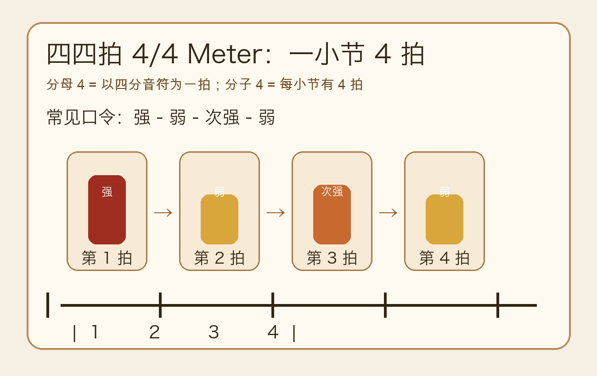
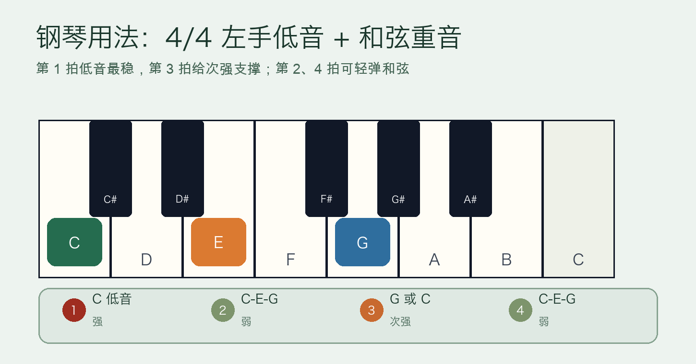
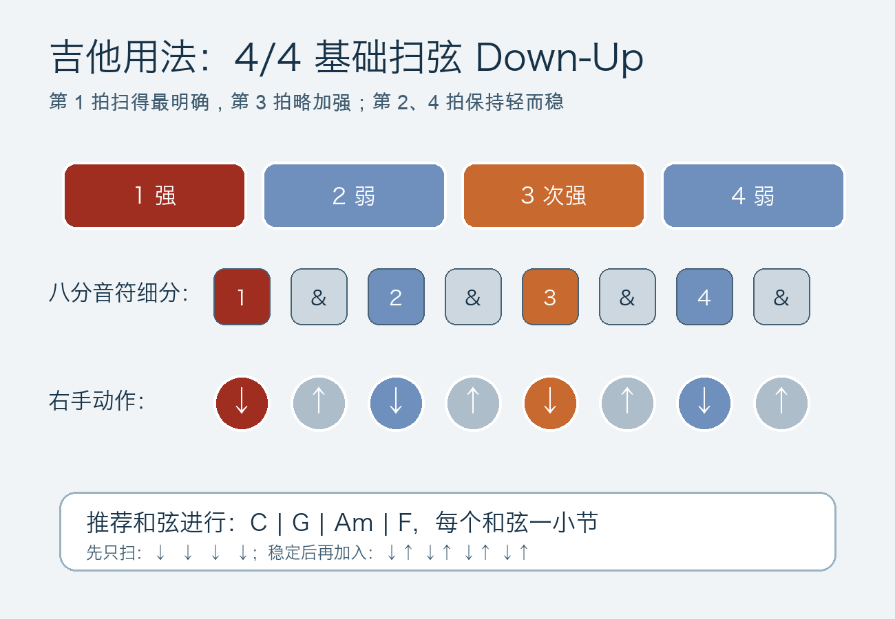

# 2026-04-22：四四拍与强弱规律 4/4 Meter

## 今日知识点

四四拍写作 `4/4`，意思是：每小节有 4 拍，并且每一拍以四分音符为基本单位。它是流行、摇滚、民谣、古典入门曲中最常见的拍号之一。

理解四四拍不要只记“数到 4”，更重要的是听出每一拍的重量：

```text
1      2      3      4
强     弱     次强   弱
```

第 1 拍像“落地”，通常最稳定、最有方向感；第 3 拍比第 2、4 拍重一点，但不如第 1 拍强。这个强弱循环会让音乐有规律地向前走。



四四拍的关键是“周期感”：你不是平均地敲 1、2、3、4，而是在每一小节里制造 `强 - 弱 - 次强 - 弱` 的呼吸。

## 钢琴使用场景

在钢琴上，四四拍最直接的用法是安排左手伴奏重音。以 C 大调为例，可以让第 1 拍弹低音 `C`，第 3 拍弹 `G` 或再弹一次 `C`，第 2、4 拍用较轻的 `C-E-G` 和弦填充。



常见用法：

- 左手第 1 拍弹根音：让听者知道小节从哪里开始。
- 左手第 3 拍弹五度或根音：制造次强支撑，避免伴奏塌掉。
- 右手旋律可以在第 1、3 拍落重要音，也可以在第 2、4 拍制造轻快的经过音。
- 弹伴奏时，音量不是四拍完全一样，而是第 1 拍最稳，第 3 拍略重，第 2、4 拍轻。

钢琴可演奏例子：

```text
拍号：4/4
和弦：C

拍点：1       2       3       4
左手：C低音   C-E-G   G低音   C-E-G
力度：强      弱      次强    弱
```

练的时候先慢速数拍：`1 2 3 4`。每数到 `1`，让低音更明确；每数到 `3`，给一点支撑，但不要超过第 1 拍。

## 吉他使用场景

在吉他上，四四拍经常体现为扫弦节奏。最入门的方式是每拍一次下扫：

```text
1   2   3   4
↓   ↓   ↓   ↓
强  弱  次强 弱
```

稳定之后，可以把每拍拆成两个八分音符，形成 `↓↑ ↓↑ ↓↑ ↓↑`。下扫通常落在数字拍上，上扫落在 `&` 上。



吉他上常见用法：

- 民谣弹唱：右手持续扫弦，左手每小节换一个和弦。
- 流行伴奏：第 1 拍扫得更完整，第 2、4 拍可轻扫或加强背拍。
- 摇滚节奏：第 1、3 拍可以用低音弦或闷音强调律动。
- 练换和弦时，四四拍能帮你固定“什么时候必须换到下一个和弦”。

吉他可演奏例子：

```text
和弦进行：C | G | Am | F
每个和弦一小节，每小节 4 拍

基础版：
1   2   3   4
↓   ↓   ↓   ↓

进阶版：
1 & 2 & 3 & 4 &
↓ ↑ ↓ ↑ ↓ ↑ ↓ ↑
```

先保证数字拍不乱，再加入上扫。右手像钟摆一样持续运动，即使某一下不碰弦，手也不要停。

## 可演奏例子

今天的目标是把同一个四四拍重音感放到钢琴和吉他里。

钢琴练法：

```text
速度：♩ = 70
和弦：C | G | Am | F

每个和弦一小节：
1      2      3      4
根音   和弦   五度   和弦
强     弱     次强   弱
```

示例分配：

```text
C 小节：C低音  C-E-G  G低音  C-E-G
G 小节：G低音  G-B-D  D低音  G-B-D
Am小节：A低音  A-C-E  E低音  A-C-E
F 小节：F低音  F-A-C  C低音  F-A-C
```

吉他练法：

```text
和弦：C | G | Am | F
每个和弦扫 4 拍

第 1 轮：每拍下扫一次
第 2 轮：每拍下上扫一次
第 3 轮：第 1 拍稍重，第 3 拍略重，第 2、4 拍轻
```

如果你能在换和弦时继续稳定数 `1 2 3 4`，说明你已经开始把“和弦形状”放进“节拍框架”里，而不是孤立地弹和弦。

## 今日练习

1. 不拿乐器，连续拍手 8 小节：第 1 拍重拍，第 3 拍中等，第 2、4 拍轻拍。
2. 在钢琴上只用 C 和弦练 4 小节：`C低音 - C-E-G - G低音 - C-E-G`。
3. 在吉他上用 C 和弦先扫 `↓ ↓ ↓ ↓`，每小节第 1 拍略重。
4. 把吉他节奏改成 `↓↑ ↓↑ ↓↑ ↓↑`，口中同时数 `1 & 2 & 3 & 4 &`。
5. 用同一组和弦 `C | G | Am | F`，分别在钢琴和吉他上弹一遍，检查第 1 拍是否最清楚。

## 一句话总结

四四拍不是平均的 4 下，而是每小节循环一次 `强 - 弱 - 次强 - 弱`；钢琴伴奏和吉他扫弦都要围绕这个重音骨架组织。
