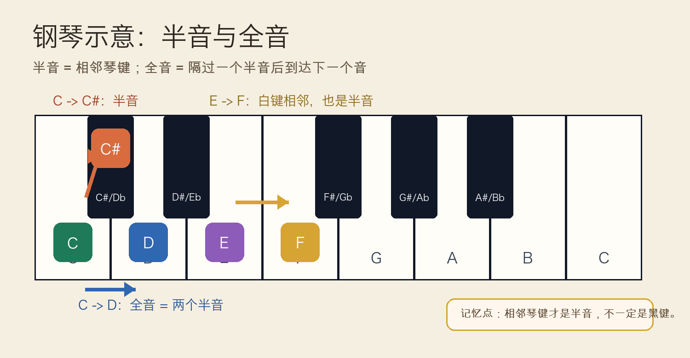
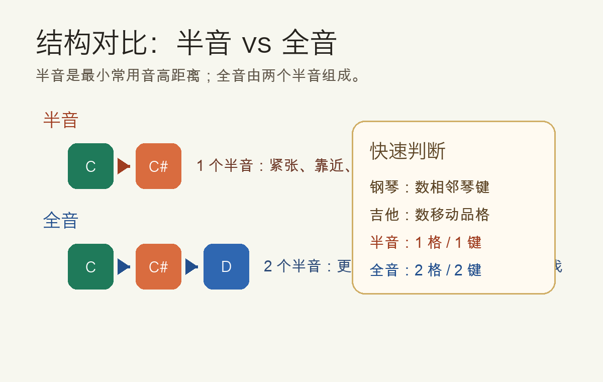
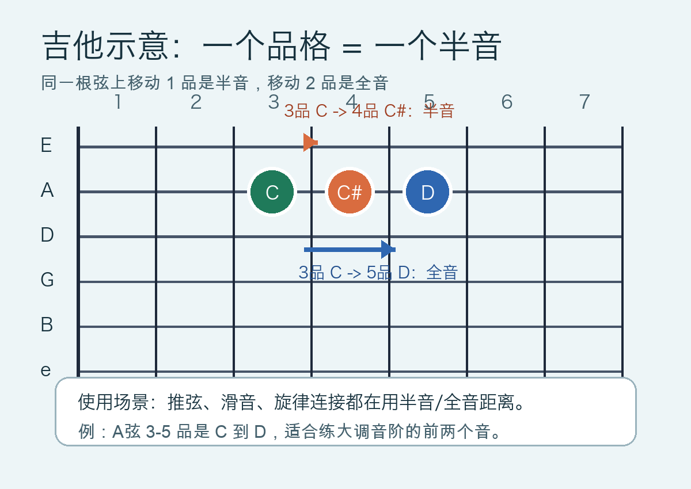

# 2026-04-23：全音与半音 Whole Step & Half Step

## 今日知识点

半音是西方十二平均律里最小的常用音高距离。钢琴上两个相邻琴键之间就是一个半音；吉他同一根弦上相邻两个品格之间也是一个半音。

全音等于两个半音。也就是说，从 `C` 到 `C#` 是半音，从 `C#` 到 `D` 又是半音，所以 `C` 到 `D` 合起来就是全音。



容易误会的一点是：半音不一定要经过黑键。钢琴上 `E` 到 `F` 是两个相邻白键，所以它们也是半音；`B` 到 `C` 也是半音。判断半音时不要只看颜色，要看“中间有没有夹着另一个琴键”。



这个知识点非常基础，因为大调音阶、小调音阶、调号、旋律走向、推弦和滑音都会反复用到“走半音还是走全音”的判断。

## 钢琴使用场景

在钢琴上，半音和全音最常用于找音阶。以 C 大调为例，它的音阶结构是：

```text
C  D  E  F  G  A  B  C
全 全 半 全 全 全 半
```

这串 `全 全 半 全 全 全 半` 是大调音阶的核心公式。只要你能在键盘上准确数半音和全音，就可以从任何一个音开始推导大调音阶。

钢琴上常见用法：

- 找旋律：如果旋律从 `C` 走到 `D`，它是比较自然、开阔的一步全音；如果从 `E` 走到 `F`，它是更近、更紧的半音。
- 听辨紧张感：半音距离更近，常常带有“想要解决”的感觉；全音更像平稳前进。
- 推导音阶：不用死记每个调有几个升降号，先从根音开始按全音半音结构数。
- 练手指位置：半音通常是相邻键移动，全音需要跨过中间一个琴键。

钢琴可演奏例子：

```text
右手练习 1：半音
C - C# - D - D# - E - F

右手练习 2：全音
C - D - E - F# - G# - A#

右手练习 3：C 大调音阶结构
C - D - E - F - G - A - B - C
全  全  半  全  全  全  半
```

练习时先慢慢弹，并且每移动一次就说出“半音”或“全音”。不要只让手指记位置，要让耳朵也记住两种距离的不同。

## 吉他使用场景

在吉他上，全音与半音更直观：同一根弦移动 1 品就是半音，移动 2 品就是全音。例如 A 弦 3 品是 `C`，A 弦 4 品是 `C#`，A 弦 5 品是 `D`。



吉他上常见用法：

- 推弦：把一个音推高半音或全音，本质上是在模仿移动 1 品或 2 品后的音高。
- 滑音：从 3 品滑到 5 品就是上行全音，声音比单独换指更连贯。
- 音阶指型：大调、小调、五声音阶都由不同的全音和半音排列组成。
- 和弦连接：很多和弦外音、经过音、低音连接都来自半音或全音移动。

吉他可演奏例子：

```text
A 弦练习：
3品 C  -> 4品 C#：半音
4品 C# -> 5品 D ：半音
3品 C  -> 5品 D ：全音

连续弹法：
A弦 3 - 4 - 5 - 7 - 8
    C   C#  D   E   F
    半  半  全  半
```

如果你会推弦，可以在 B 弦 8 品弹 `G`，尝试轻推到接近 9 品的 `G#`，这是半音推弦；再试着推到接近 10 品的 `A`，这是全音推弦。推弦时要用耳朵检查目标音，不只是靠手感。

## 可演奏例子

今天的目标是把同一个距离概念放到钢琴和吉他上互相验证。

钢琴练法：

```text
第一轮：只弹半音
C - C# - D - D# - E - F

第二轮：只弹全音
C - D - E - F# - G# - A#

第三轮：弹 C 大调
C - D - E - F - G - A - B - C
边弹边念：全 全 半 全 全 全 半
```

吉他练法：

```text
第一轮：A 弦相邻品格
3 - 4 - 5
C - C# - D
半 半

第二轮：A 弦隔一品移动
3 - 5 - 7
C - D - E
全 全

第三轮：把 C 大调前五个音放在 A 弦
3 - 5 - 7 - 8 - 10
C - D - E - F - G
全 全 半 全
```

钢琴和吉他练完后，回到听觉：半音更近、更紧，全音更宽、更像向前迈一步。只要这个听感建立起来，后面学习音阶和调性会轻松很多。

## 今日练习

1. 在钢琴上找到 `E-F` 和 `B-C`，确认它们虽然都是白键，但中间没有其他键，所以是半音。
2. 在钢琴上从 `C` 开始弹 `全 全 半 全 全 全 半`，得到完整 C 大调音阶。
3. 在吉他 A 弦弹 `3-4-5`，说出 `C-C#-D`，并标记两个连续半音。
4. 在吉他 A 弦弹 `3-5-7`，感受每次跨 2 品的全音距离。
5. 随机选一个起点音，分别向上找一个半音和一个全音，并在钢琴或吉他上弹出来。

## 一句话总结

半音是相邻键或相邻品格的距离，全音等于两个半音；学会数全音和半音，就是学会推导音阶和理解旋律移动的第一步。
