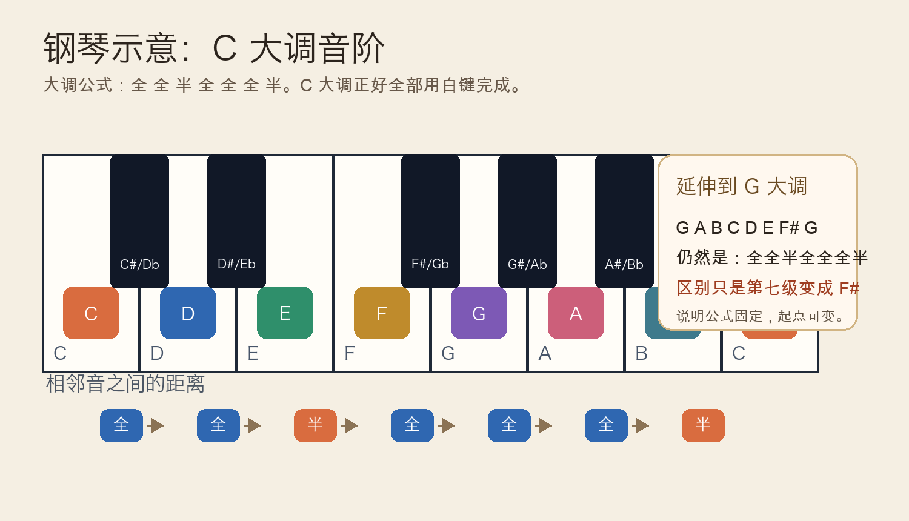
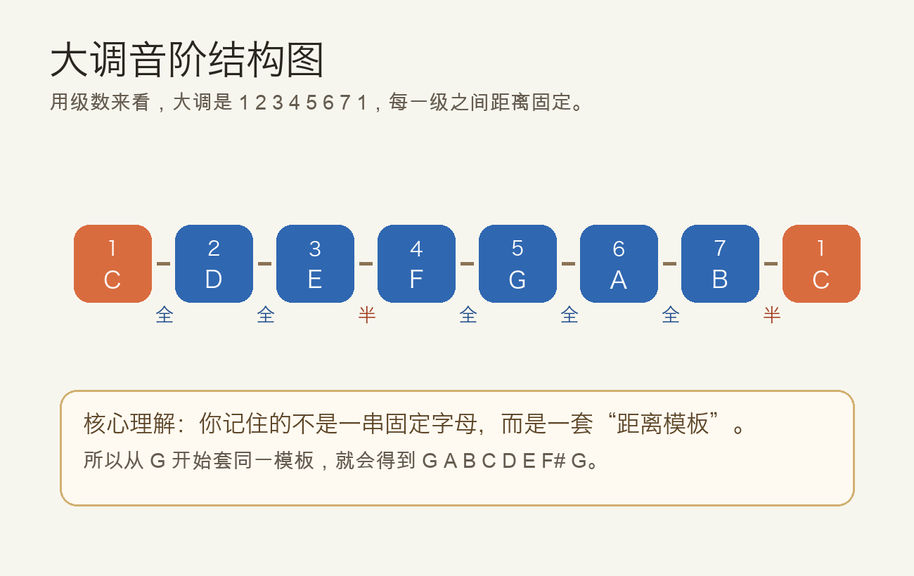
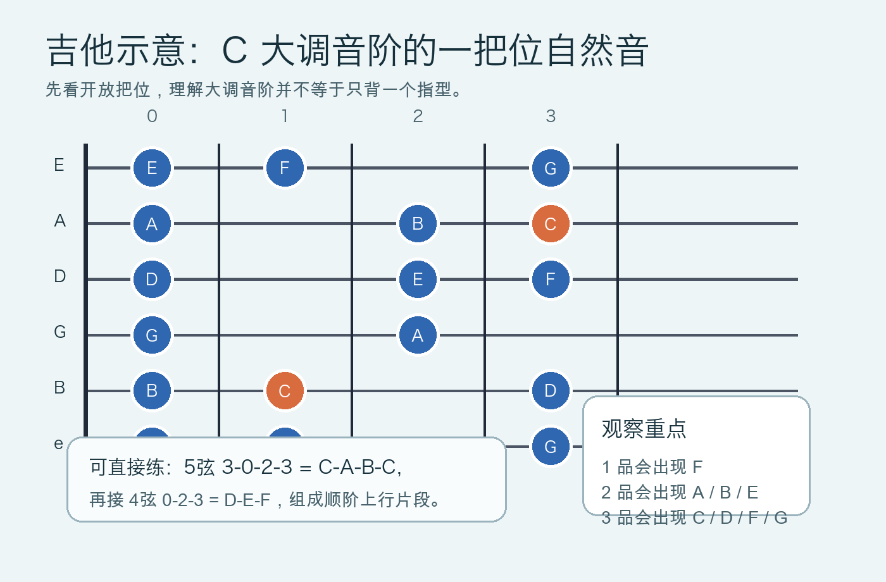

# 2026-04-24：大调音阶 Major Scale

## 今日知识点

大调音阶可以理解成“最常见、最稳定的一套七声音高排列方式”。如果只背 `C-D-E-F-G-A-B-C`，很容易把它误以为是一串固定字母；更重要的其实是它背后的距离公式：

```text
全 全 半 全 全 全 半
```

也就是从第 1 级到第 2 级是全音，第 2 级到第 3 级也是全音，第 3 级到第 4 级是半音，后面继续按同样规律往上走。昨天学的全音与半音，今天就真正开始“组装”为一条完整音阶。



最容易上手的是 `C` 大调，因为它刚好全部由白键组成：`C D E F G A B C`。但大调音阶并不等于 C 大调本身。只要你保留同样的距离公式，从别的音开始也能得到别的大调，例如：

```text
G A B C D E F# G
```

这里多出的 `F#` 不是例外，而是在“全全半全全全半”公式下必然出现的结果。



所以，今天真正要记住的是两件事：

- 大调音阶是一个“距离模板”。
- 字母音名会变，但模板不会变。

## 钢琴使用场景

钢琴上，大调音阶最常见的作用是找调、练指法、理解旋律归属感，以及为和弦和伴奏打地基。

在 `C` 大调里，你几乎可以立刻感受到几个稳定位置：

- `C` 像“家”，旋律停在这里最稳。
- `G` 常像向前推进的支点。
- `B` 离上方 `C` 只差半音，听起来会有明显的“想解决回去”的感觉。

钢琴练习时，不要只把它当成手指跑动。更有效的方法是边弹边意识到每一步的距离：

```text
C - D - E - F - G - A - B - C
全  全  半  全  全  全  半
```

钢琴可演奏例子：

```text
右手上行：
1 2 3 1 2 3 4 5
C D E F G A B C

右手下行：
5 4 3 2 1 3 2 1
C B A G F E D C

和声音感练习：
左手持续弹 C
右手依次弹 C-D-E-F-G-A-B-C
听每一级与主音 C 的关系
```

如果你已经会一点伴奏，可以先用左手弹单音 `C` 或空五度 `C-G`，右手弹 C 大调音阶，马上就能把“调内音”这个概念听出来。

## 吉他使用场景

吉他上，大调音阶最实用的地方是旋律、riff、即兴入门和找和弦内音。很多人一开始只记和弦形状，却不知道旋律为什么“在这个调里能通”；答案通常就是：旋律大部分来自同一个大调音阶。

在 C 大调里，开放把位就能找到大量自然音：



吉他上可以先用很直观的方式理解它：

- 同一根弦上数全音和半音，确认音阶距离。
- 在一把位找自然音，感受调内音如何分布。
- 把音阶和已知和弦连接起来，例如 `C`、`F`、`G` 和弦都能从 C 大调里找到核心音。

吉他可演奏例子：

```text
单弦版（A 弦）：
3 - 5 - 7 - 8 - 10 - 12 - 14 - 15
C   D   E   F   G    A    B    C

开放把位片段：
5弦 3-0-2-3
C  A B C

接 4弦 0-2-3
D E F
```

如果你在弹 `C - F - G - C` 这类常见进行，可以尝试在和弦之间插入 C 大调音阶的经过音。这样会比只扫和弦更像“会说话”的伴奏。

## 可演奏例子

今天把同一个知识点分别落到钢琴和吉他上：

钢琴版本：

```text
练习 1：完整音阶
C D E F G A B C

练习 2：分组三音
C D E | D E F | E F G | F G A

练习 3：主音回归感
C E G | B C
```

吉他版本：

```text
练习 1：A 弦单弦上行
3 5 7 8 10
C D E F G

练习 2：开放把位自然音
5弦 3-0-2-3 | 4弦 0-2-3
C  A B C | D E F

练习 3：和弦连接
C 和弦后弹：B-C
G 和弦后弹：F-E-D-C
```

这几个例子有一个共同目的：不要把大调音阶练成抽象知识，而要把它和“旋律怎么走、和弦怎么连、哪里最稳定”直接连起来。

## 今日练习

1. 在钢琴上慢速弹一遍 `C` 大调音阶，上行和下行都要边弹边念出“全全半全全全半”。
2. 在钢琴上从 `G` 开始，自己按公式推导出 `G` 大调，并确认为什么需要 `F#`。
3. 在吉他 A 弦上弹 `C-D-E-F-G`，观察 `E-F` 之间只隔 1 品，验证大调中的半音位置。
4. 在吉他开放把位找出两个 `C` 音，分别弹出并听它们作为“家”的稳定感。
5. 选一个最简单的和弦进行 `C-F-G-C`，在每个和弦之间插入 1 到 2 个 C 大调音阶音做连接。

## 一句话总结

大调音阶不是死记一串音名，而是记住“全全半全全全半”这套固定距离模板，再把它放到钢琴和吉他的具体位置上。
