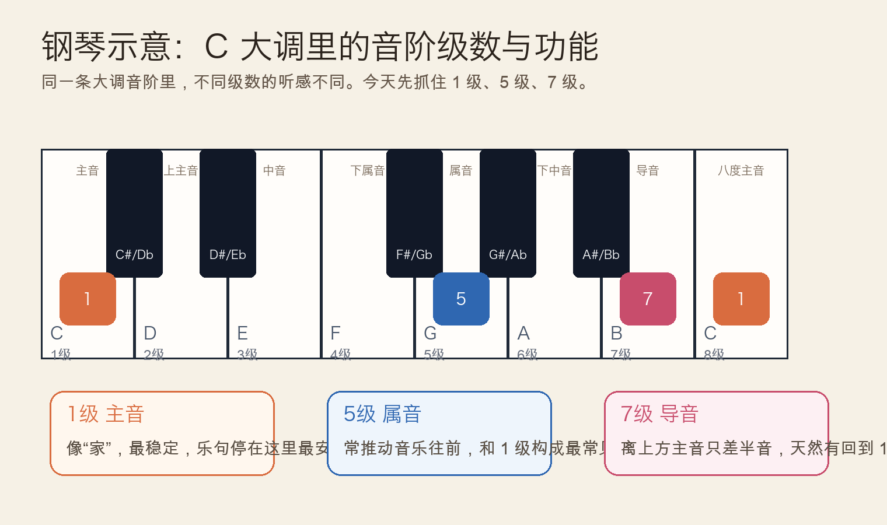
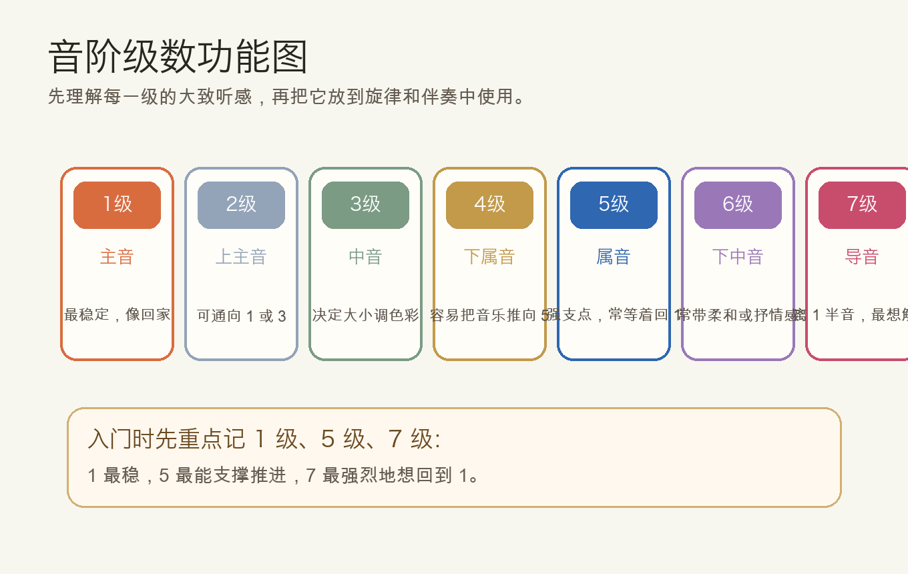
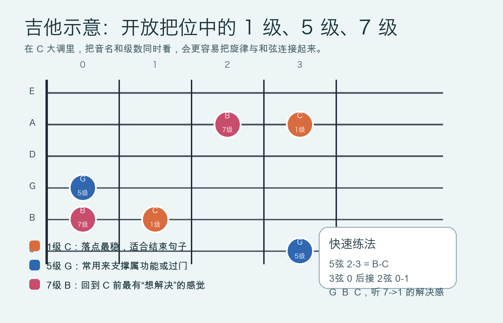

# 2026-04-27：音阶级数与功能 Scale Degrees

## 今日知识点

昨天学的是“大调音阶是一套固定距离模板”，今天往前走一步：同一条音阶里的每一个音，不只是排在第几个位置，它还带着不同的“功能感”。这就是音阶级数。

在 `C` 大调里：

```text
C  D  E  F  G  A  B  C
1  2  3  4  5  6  7  1
```

这里的 `1 2 3 4 5 6 7` 就叫级数。它们不是冷冰冰的编号，而是帮助你判断“这个音听起来稳不稳、想往哪里走、适合放在乐句什么位置”的工具。



入门阶段最值得先抓住的是 3 个核心级数：

- `1级` 主音：最稳定，像“家”，旋律停在这里最有结束感。
- `5级` 属音：有明显支撑和推进作用，常和 `1级` 形成骨架。
- `7级` 导音：离上方 `1级` 只差半音，天然会让人期待回到主音。



所以今天不是背更多音名，而是开始建立“音有角色”这件事。以后你听到一句旋律为什么想落回去、一个和弦为什么像在往前推，很多时候都和这些级数功能有关。

## 钢琴使用场景

钢琴上学习级数最直观，因为键盘从左到右排列清楚，你可以边弹边听每一级的感觉变化。

一个很实用的练法是左手持续弹低音 `C`，右手依次弹：

```text
C D E F G A B C
1 2 3 4 5 6 7 1
```

这样你会听到：

- `1级 C` 最稳，像句号。
- `5级 G` 很像支点，常让音乐站得住。
- `7级 B` 最“悬”，会明显想回到 `C`。

钢琴上的实际用途通常有三类：

- 弹旋律时判断落点。想结束一句，优先试 `1级`；想留一点悬念，可以先停在 `5级` 或 `7级`。
- 做伴奏时抓骨架音。左手弹 `C-G-C`，你已经在用 `1级` 和 `5级` 建稳定感。
- 听辨时建立方向感。听到 `B-C` 这种半音上行时，往往就是 `7级 -> 1级` 的解决。

钢琴可演奏例子：

```text
例子 1：稳定与不稳定
右手：C - G - B - C
级数：1 - 5 - 7 - 1

例子 2：一句话式旋律
右手：E - F - G | B - C
级数：3 - 4 - 5 | 7 - 1

例子 3：左手伴奏支点
左手：C - G - C
右手：C - D - E - G - B - C
```

## 吉他使用场景

吉他上，级数最重要的价值是把“指型记忆”变成“有功能的音位记忆”。如果你只知道某个音在哪一品，却不知道它是 `1级` 还是 `7级`，你会更难把旋律、riff 和和弦串起来。

在 `C` 大调开放把位里，可以先重点找这些音：



- `1级 C`：5 弦 3 品，2 弦 1 品。
- `5级 G`：3 弦空弦，1 弦 3 品。
- `7级 B`：5 弦 2 品，2 弦空弦。

它们的实际使用场景很常见：

- 在弹 `C` 和弦时，用 `C` 做旋律落点最稳。
- 在 `G` 或 `G7` 感觉的段落里，用 `G` 会更像支撑音。
- 在回到 `C` 之前弹 `B-C`，会立刻出现很典型的“导向主音”效果。

吉他可演奏例子：

```text
例子 1：导音解决
5弦：2 - 3
B   C
7级 1级

例子 2：属音到主音
3弦空弦 -> 2弦1品
G -> C
5级 -> 1级

例子 3：开放把位短句
3弦0 2弦0 2弦1
 G   B   C
 5   7   1
```

这类小片段比机械跑音阶更接近真实音乐，因为你已经在练“功能解决”而不是只练手型。

## 可演奏例子

今天用同一个概念分别做钢琴和吉他的小练习：

钢琴版本：

```text
练习 A
C - G - B - C
感受：稳 -> 支撑 -> 悬念 -> 回家

练习 B
C - D - E - G | B - C
把最后两个音弹得更明显，听 7 -> 1 的解决
```

吉他版本：

```text
练习 A
5弦 2-3
B-C

练习 B
3弦0 2弦0 2弦1
G-B-C

练习 C
C 和弦扫一下后，补 2弦0-1
B-C
```

如果你把这些片段弹顺，会开始感觉到：旋律不是随便挑音，而是在“找最合适的功能位置”。

## 今日练习

1. 在钢琴上弹一遍 `C D E F G A B C`，每弹一个音都念出对应级数。
2. 在钢琴上反复弹 `B-C`、`G-C`、`C-G-C`，分别描述它们是“悬念”“支撑”还是“结束”。
3. 在吉他上找出两个 `C`、两个 `G`、两个 `B`，边弹边说出它们是 `1级`、`5级`、`7级`。
4. 在吉他上练 `5弦 2-3` 和 `3弦0 2弦0 2弦1`，注意听 `7级 -> 1级` 的解决感。
5. 自己写一个 4 到 5 个音的小旋律，要求最后落在 `C`，并至少经过一次 `B`。

## 一句话总结

音阶级数不是给音编号而已，而是在告诉你每个音在调里扮演什么角色，尤其要先听懂 `1级` 的稳定、`5级` 的支撑和 `7级` 的回归倾向。
