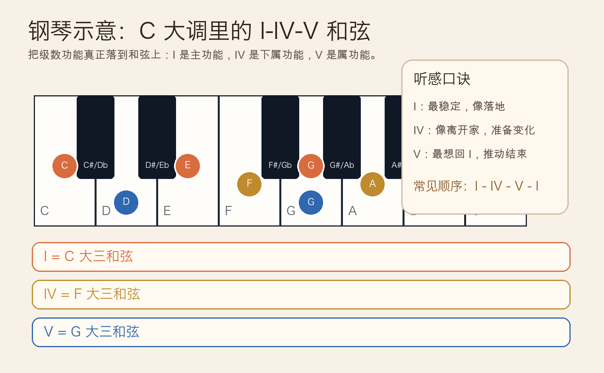
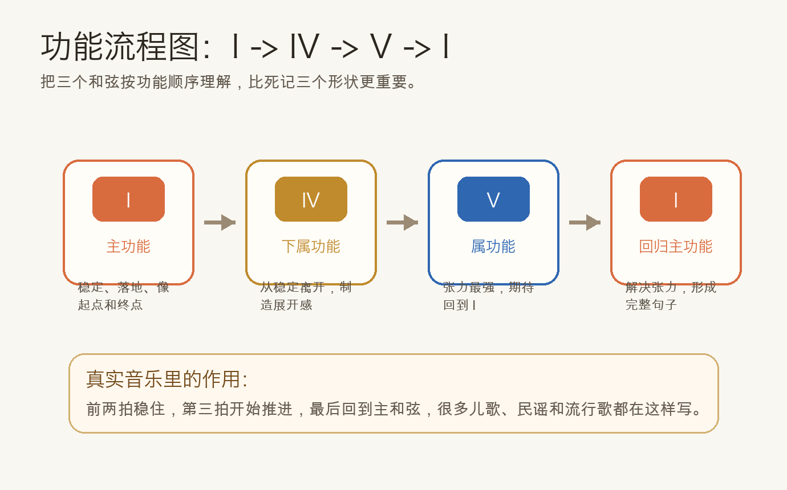
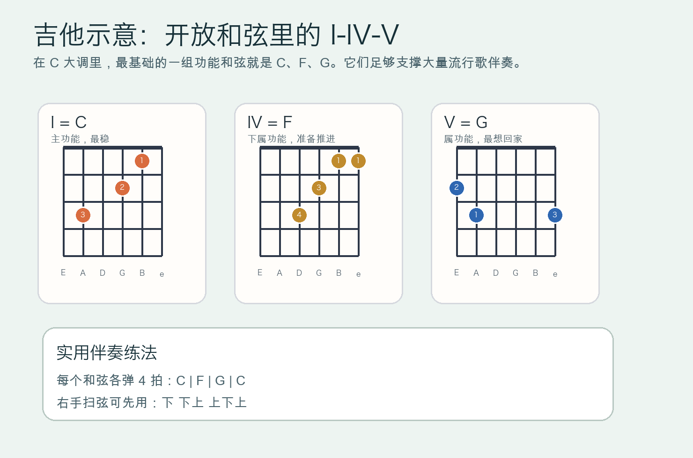

# 2026-04-28：自然大调中的 I-IV-V 和弦

## 今日知识点

昨天你已经知道了音阶里的 `1级`、`4级`、`5级` 各自有不同的功能感，今天把这个概念推进一步：如果分别从这三个级数上叠出三和弦，就得到自然大调里最常见的一组基础和声骨架，也就是 `I-IV-V`。

以 `C` 大调为例：

```text
I   = C-E-G = C 大三和弦
IV  = F-A-C = F 大三和弦
V   = G-B-D = G 大三和弦
```

这三个和弦之所以重要，不是因为它们“很常见”这么简单，而是因为它们刚好对应三种最基础的功能：

- `I` 主功能：最稳定，像“到家”。
- `IV` 下属功能：把音乐从稳定里带出去，准备展开。
- `V` 属功能：张力最强，天然想回到 `I`。



所以当你听到很多简单歌曲里有一种“出发 -> 展开 -> 推进 -> 回来”的感觉，底层常常就是 `I -> IV -> V -> I`。这已经不是单个音的功能，而是和弦层面的功能流程。



入门阶段先把 `C` 大调里的 `C-F-G-C` 听熟、弹熟，比一开始背很多复杂和弦更有价值，因为它会直接建立你对“和声方向”的耳朵。

## 钢琴使用场景

钢琴上学习 `I-IV-V` 的优势是可视化很强。你能直接看到：

- `C` 和弦以 `C` 为根音，听起来最稳。
- `F` 和弦把重心从 `C` 挪开，像一句话正在继续。
- `G` 和弦尤其是接回 `C` 时，会明显产生“该回来了”的感觉。

最基础的练法是左手只弹根音，右手弹原位三和弦：

```text
左手：C | F | G | C
右手：C-E-G | F-A-C | G-B-D | C-E-G
```

这个练习的价值不是练手快，而是训练你把“功能感”听出来：

- 弹 `C` 时，感受稳定。
- 弹 `F` 时，感受展开。
- 弹 `G` 时，感受推进。
- 回到 `C` 时，感受解决。

钢琴上的实际用途很广：

- 给旋律配和弦时，很多初级旋律只靠 `I-IV-V` 就能完成基础伴奏。
- 左手做柱式和弦或分解和弦时，`C-F-G-C` 是最常见的起步进行。
- 弹唱伴奏里，如果你还不会复杂和声，先用 `I-IV-V` 也能支撑完整段落。

## 吉他使用场景

吉他上，`I-IV-V` 的价值尤其直接，因为它几乎就是开放和弦伴奏的核心入口。

在 `C` 大调中，对应的是：

- `I = C`
- `IV = F`
- `V = G`



这组和弦在吉他上的常见场景包括：

- 民谣弹唱：很多简单歌曲主歌或副歌都能用 `C-F-G-C` 搭出框架。
- 节奏扫弦：右手只要先稳定 4 拍扫弦，就能立刻进入“真实伴奏”状态。
- 写歌入门：如果你会唱一条简单旋律，先试着让乐句落在 `C`，中间经过 `F` 和 `G`，就能快速做出最基础的和声支撑。

如果你觉得 `F` 大横按还太难，可以先用简化版 `F` 和弦，不影响你先理解功能顺序。

## 可演奏例子

钢琴版本：

```text
例子 1：柱式和弦
左手：C  F  G  C
右手：C-E-G | F-A-C | G-B-D | C-E-G

例子 2：分解伴奏
左手：C     F     G     C
右手：C-G-E-G | F-C-A-C | G-D-B-D | C-G-E-G
```

吉他版本：

```text
例子 1：每个和弦 4 拍
| C | F | G | C |

例子 2：基础扫弦
每小节：下 下上 上下上
进行：C -> F -> G -> C
```

如果你愿意边唱边练，可以随便唱一句 4 小节旋律，然后让最后一句稳稳落回 `C`，你会立刻听到 `V -> I` 的解决感。

## 今日练习

1. 在钢琴上弹 `C-F-G-C`，每换一个和弦都说出它是 `I`、`IV` 还是 `V`。
2. 钢琴左手只弹根音，右手弹三和弦，连续循环 4 轮，专门听 `G` 回 `C` 的感觉。
3. 在吉他上慢速切换 `C -> F -> G -> C`，先不求快，先求每个和弦响清楚。
4. 用吉他对这组和弦做 4 小节扫弦，每小节保持稳定四拍。
5. 自己写一个 4 小节顺序，至少包含一次 `I`、一次 `IV`、一次 `V`，最后必须回到 `I`。

## 一句话总结

`I-IV-V` 是自然大调里最基础的功能和弦骨架：`I` 负责稳定，`IV` 负责展开，`V` 负责推进并回到 `I`。
