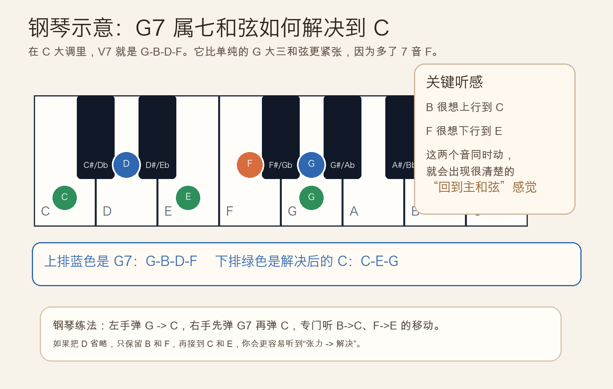
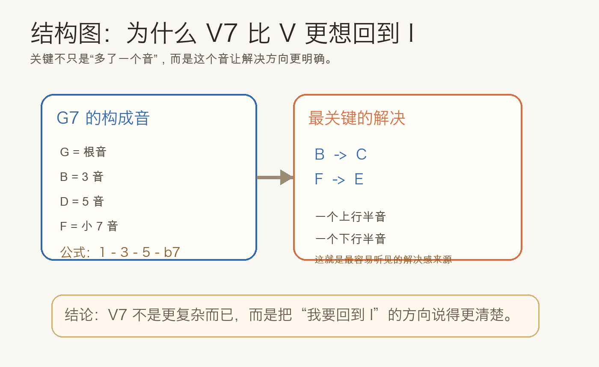
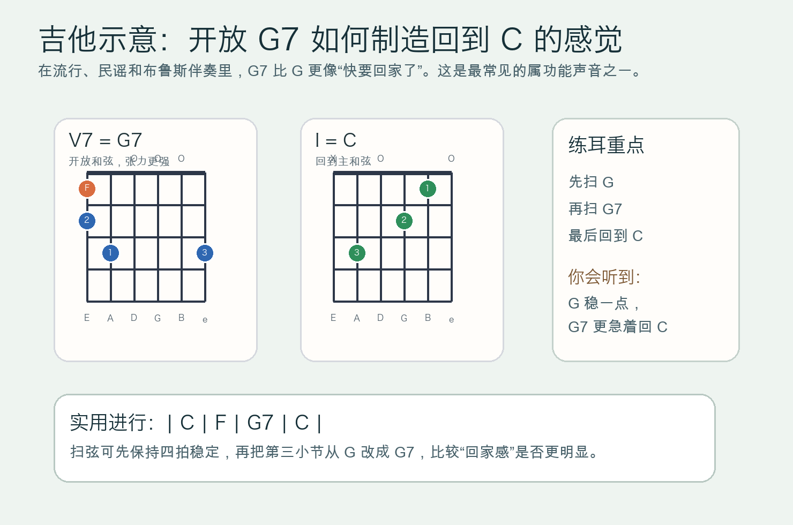

# 2026-04-29：属七和弦 V7

## 今日知识点

昨天你已经学过自然大调里的 `I-IV-V` 和弦，今天只往前推进一步：把 `V` 再加上一个七度音，就得到最常见的属七和弦 `V7`。

以 `C` 大调为例：

```text
V   = G-B-D
V7  = G-B-D-F
```

和普通的 `G` 大三和弦相比，`G7` 多出来的 `F` 不是“装饰”，而是让这个和弦更强烈地想回到 `C`。原因可以先抓住最实用的两个音：

- `B` 很想上行到 `C`
- `F` 很想下行到 `E`

当这两个音一起解决时，你会明显听到一种“悬着的东西终于落下来了”的感觉。这就是 `V7 -> I` 比 `V -> I` 更有终止感的核心。



如果你先弹 `G`，再弹 `G7`，最后回到 `C`，通常会听到：

- `G` 已经有属功能，但还比较“普通”
- `G7` 的张力更明确
- 回到 `C` 时，解决感更完整



入门阶段不需要先背很多调里的七和弦，先把 `C` 大调中的 `G7 -> C` 听熟、弹熟，你就会真正理解什么叫“属功能加强”。

## 钢琴使用场景

钢琴上学习 `V7` 很直观，因为你能直接看到解决方向：

- 右手弹 `G-B-D-F`，这是 `G7`
- 接着把 `B` 挪到 `C`，把 `F` 挪到 `E`
- 其余音自然落到 `C-E-G`


在钢琴伴奏里，`V7` 常见于这些场景：

- 一句旋律快结束时，用 `G7` 增强“准备回家”的感觉
- 弹唱前奏或尾奏时，把原本的 `G` 换成 `G7`，终止会更明确
- 左手弹根音 `G -> C`，右手从 `G7 -> C`，这是最基础也最有效的功能训练

如果你觉得四个音同时看起来有点多，可以先只弹右手里的 `B` 和 `F`，再解决到 `C` 和 `E`。这样更容易直接听出张力和释放。

## 吉他使用场景

吉他上，`G7` 是非常常见的开放和弦。它最大的价值不是“颜色更复杂”，而是回到 `C` 时更有结束感。



实际使用时你会经常遇到：

- `| C | F | G7 | C |` 这种四小节基础伴奏
- 民谣弹唱里把最后一个 `G` 改成 `G7`
- 布鲁斯或老歌风格里，用属七和弦让和声更有推进性

一个很实用的练法是先扫 `G`，再扫 `G7`，最后回 `C`，比较两种回归感的差别。即使不分析理论，你的耳朵也会告诉你 `G7` 更“急着解决”。

## 可演奏例子

钢琴版本：

```text
例子 1：最基础的解决
左手：G        C
右手：G-B-D-F  C-E-G

例子 2：只练关键音
左手：G      C
右手：B-F -> C-E
```

吉他版本：

```text
例子 1：基础进行
| C | F | G7 | C |

例子 2：对比练习
先弹：| C | F | G  | C |
再弹：| C | F | G7 | C |
专门比较最后两小节的解决感
```

## 今日练习

1. 在钢琴上弹 `G -> G7 -> C`，说出哪一步开始明显出现张力。
2. 单独练右手 `B-F -> C-E`，连续做 8 次，专门听半音解决。
3. 在吉他上分别扫 `G` 和 `G7`，然后都回到 `C`，比较哪一个更有终止感。
4. 用 `| C | F | G7 | C |` 循环 4 轮，保持拍子稳定，不要急着换和弦。
5. 自己唱一条 4 小节旋律，把最后一小节配成 `G7 -> C`，听它是否比 `G -> C` 更像结尾。

## 一句话总结

`V7` 就是在属和弦上加上小七度，它会把“回到 I”的方向表达得更明确，因此比单纯的 `V` 更有解决感。
