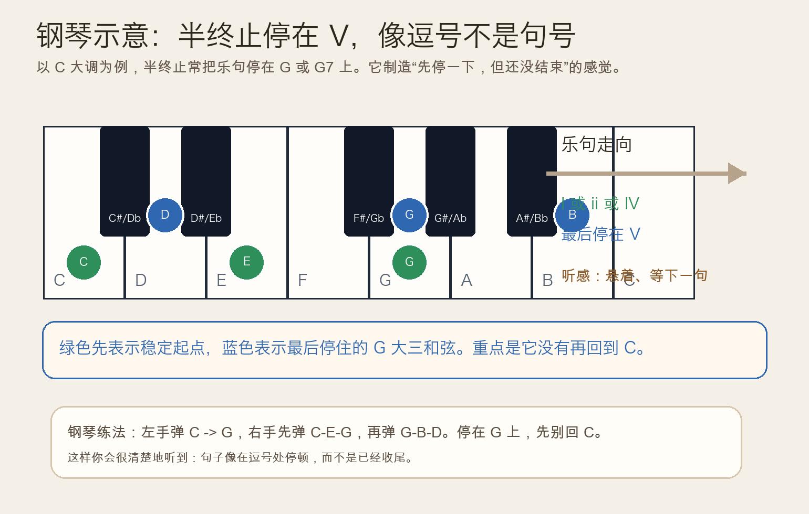
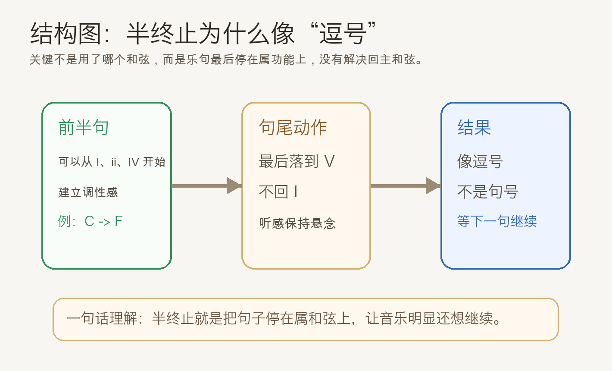
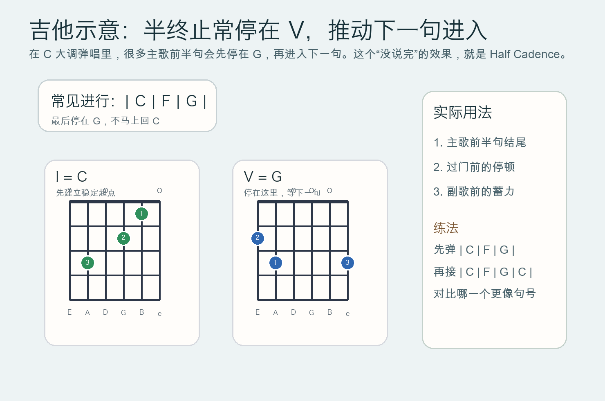

# 2026-05-02：半终止 Half Cadence

## 今日知识点

昨天你学的是正格终止：`V` 或 `V7` 回到 `I`，像真正的句号。今天只往前推一步，学习另一个同样常见、但结尾感完全不同的概念：**半终止**（Half Cadence）。

半终止的重点不是“从哪个和弦来”，而是**乐句最后停在 `V` 或 `V7` 上**。也就是说，音乐先走到属功能，却故意不解决回主和弦，所以听起来像：

- 先停一下
- 但还没结束
- 下一句应该马上接着来

在 `C` 大调里，一个最简单的半终止例子是：

```text
C -> F -> G
```

或者：

```text
Dm -> G
```

因为最后停在 `G`，耳朵通常会觉得“后面还差一个 `C`”。这就是半终止最核心的听感。你可以把它先理解成：**半终止像逗号，正格终止像句号**。



如果说正格终止的作用是“把话说完”，那半终止的作用就是“把话停住，但故意留一个悬念”。很多主歌前半句、乐段中间、或者准备进入副歌之前，都会先用半终止把能量挂在空中。



## 钢琴使用场景

钢琴上学习半终止很适合做“对比训练”，因为你能马上听出“停在属和弦”和“回到主和弦”差别有多大。

- 左手先弹 `C -> G`
- 右手先弹 `C-E-G`，再弹 `G-B-D`
- 停在 `G` 上，不要急着补 `C`

这样一停，你会发现音乐不像真正结束，更像在等下一个小节继续说话。


钢琴里的常见使用场景有：

- 一句旋律的前半句先停在 `V`，后半句再解决到 `I`
- 左手分解和弦伴奏时，用半终止把乐句分成“问句”和“答句”
- 给旋律配和声时，如果不想太早结束，就先让句尾落在属和弦

例如你弹：

```text
第一句：C - F - G
第二句：C - F - G - C
```

第一句就很像“问题”，第二句才像“回答”。

## 吉他使用场景

吉他里，半终止非常常见，因为弹唱编配经常需要“先把句子吊住”，让下一句或者副歌更自然地进来。

- 民谣扫弦里，前半句可以停在 `G`
- 流行弹唱里，副歌前一小节停在属和弦会更有推进感
- 分解和弦时，停在 `V` 会让听众自然期待回到 `I`



最直接的吉他对比方法是：

- 先弹 `| C | F | G |`
- 再弹 `| C | F | G | C |`

前者像一句没说完的话，后者才像完整收尾。半终止最实用的价值，就在这种“把乐句继续往前推”的能力。

## 可演奏例子

钢琴版本：

```text
例子 1：基础半终止
左手：C        G
右手：C-E-G    G-B-D

例子 2：四小节问答
第 1 句：C    F    G
第 2 句：C    F    G    C
比较第 1 句和第 2 句的结尾感
```

吉他版本：

```text
例子 1：主歌前半句
| C | F | G |

例子 2：问句和答句
问句：| C | Am | Dm | G |
答句：| C | Am | Dm | G | C |
```

## 今日练习

1. 在钢琴上连续弹 8 次 `C -> G`，每次都停在 `G`，专门听“还没结束”的感觉。
2. 在钢琴上对比 `C - F - G` 和 `C - F - G - C`，判断哪一个更像逗号，哪一个更像句号。
3. 在吉他上循环 `| C | F | G |` 4 轮，感受每轮最后都必须再接下一轮才舒服。
4. 在吉他上弹 `| C | Am | Dm | G |`，然后试着唱一句旋律，体会句尾停在 `G` 时的推进感。
5. 自己写两句和弦：第一句用半终止结束，第二句再回到主和弦，做一个最简单的“问答句”。

## 一句话总结

半终止就是让乐句停在 `V` 或 `V7` 上，它不像真正结束，更像一个明确要求“下一句继续”的逗号。
