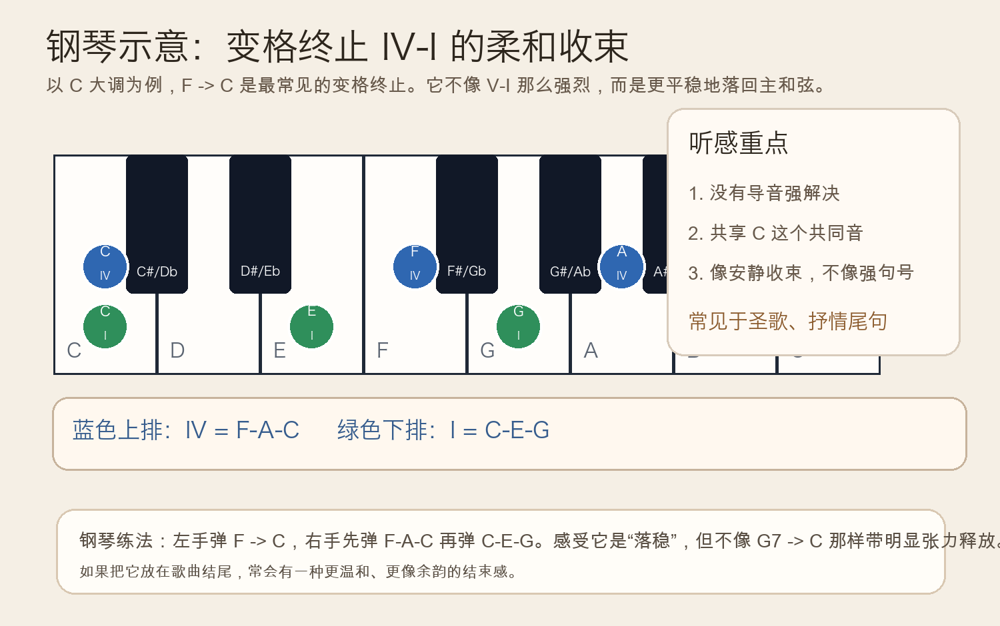
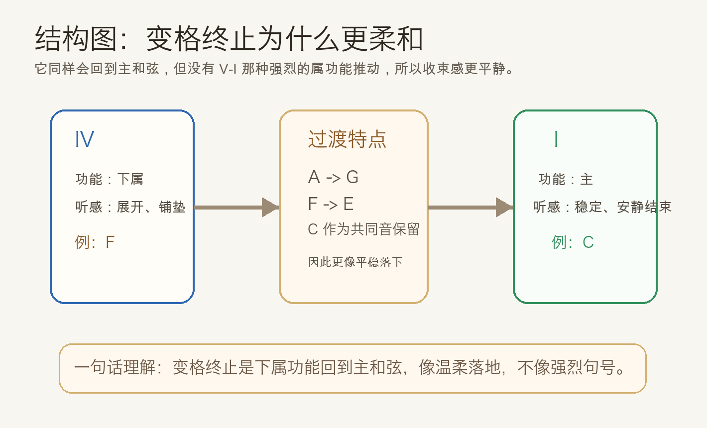
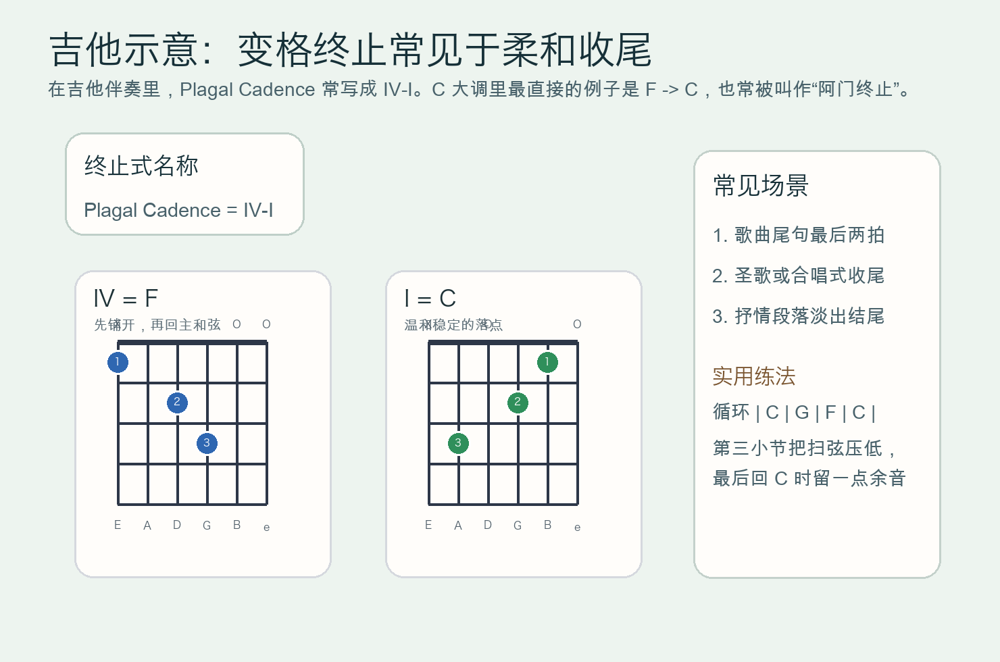

# 2026-05-03：变格终止 Plagal Cadence

## 今日知识点

昨天你学的是半终止：乐句停在 `V` 上，像一个还没说完的逗号。今天继续学习另一种常见终止式：**变格终止**（Plagal Cadence）。

变格终止最常见的形式是：

```text
IV -> I
```

在 `C` 大调里，就是：

```text
F -> C
```

它和正格终止 `V -> I` 一样，最后也会回到主和弦 `I`，但听感很不一样。正格终止像一个明确、有分量的句号；变格终止则更像**柔和地收住、安静地落地**。很多人第一次听到它，会觉得“也结束了”，但不是那种很强烈、很戏剧化的结束。

为什么会这样？因为 `IV -> I` 没有 `V -> I` 那种强烈的属功能推动。它更多是从“铺开、展开”的下属功能，回到“稳定、归家”的主功能，所以听起来更温和，也更适合抒情、合唱或带余韵的结尾。



你也可以先把它理解成：**正格终止像正式句号，变格终止像把声音轻轻放下来的收尾**。在圣歌和很多流行歌的尾句里，这种感觉都很常见，因此它也常被叫作“阿门终止”。



## 钢琴使用场景

钢琴上学变格终止，最适合和正格终止直接做对比。你可以先弹：

```text
G -> C
```

再弹：

```text
F -> C
```

两者都能回到 `C`，但第一个更像“终于解决了”，第二个更像“平静地收束了”。


钢琴里的常见使用场景有：

- 乐句已经基本结束，但你不想用太强的张力解决
- 伴奏收尾时，希望最后一句更柔和、更抒情
- 在和声练习里，用它和 `V-I` 做听辨比较，训练不同终止感

一个很好用的弹法是：

- 左手弹 `F -> C`
- 右手先弹 `F-A-C`，再弹 `C-E-G`
- 保持连贯，不要弹得太硬，听共同音 `C` 留下来的稳定感

## 吉他使用场景

吉他里，变格终止很适合用于弹唱收尾，因为它不会像 `G -> C` 那样太“宣告式”，而是更像把句子柔和地放下。

- 民谣弹唱的最后一句可以用 `F -> C`
- 副歌结尾如果不想太强调“胜利式结束”，可以改用 `IV-I`
- 指弹或分解和弦里，变格终止特别适合做安静尾声



最直接的吉他体验方法是对比下面两种收尾：

```text
强收尾：| F | G | C |
柔收尾：| F | C |
```

前者更像完成一个明确句号，后者则更像把尾音留在空气里。

## 可演奏例子

钢琴版本：

```text
例子 1：基础变格终止
左手：F        C
右手：F-A-C    C-E-G

例子 2：四小节收尾
| C | G | F | C |
把最后两小节听成 IV-I 的柔和收束
```

吉他版本：

```text
例子 1：最小单位练习
| F | C |

例子 2：常见流行收尾
| C | Am | F | C |
最后的 F -> C 就是一个简单的变格终止
```

## 今日练习

1. 在钢琴上交替弹 `G -> C` 和 `F -> C`，连续比较 8 次，说出哪一个更强、哪一个更柔和。
2. 在钢琴上弹 `| C | G | F | C |`，把最后两小节单独重复，专门听 `IV-I` 的收束感。
3. 在吉他上循环 `| F | C |` 8 次，最后一次把扫弦放轻，体验“阿门终止”式的尾声。
4. 在吉他上分别弹 `| F | G | C |` 和 `| F | C |`，判断哪个更像正式句号，哪个更像柔和落地。
5. 自己写一个四小节和弦句子，要求最后必须用 `IV-I` 收尾。

## 一句话总结

变格终止就是 `IV -> I`，它同样会结束乐句，但结束方式更柔和、更平静，像把声音轻轻放回主和弦。
