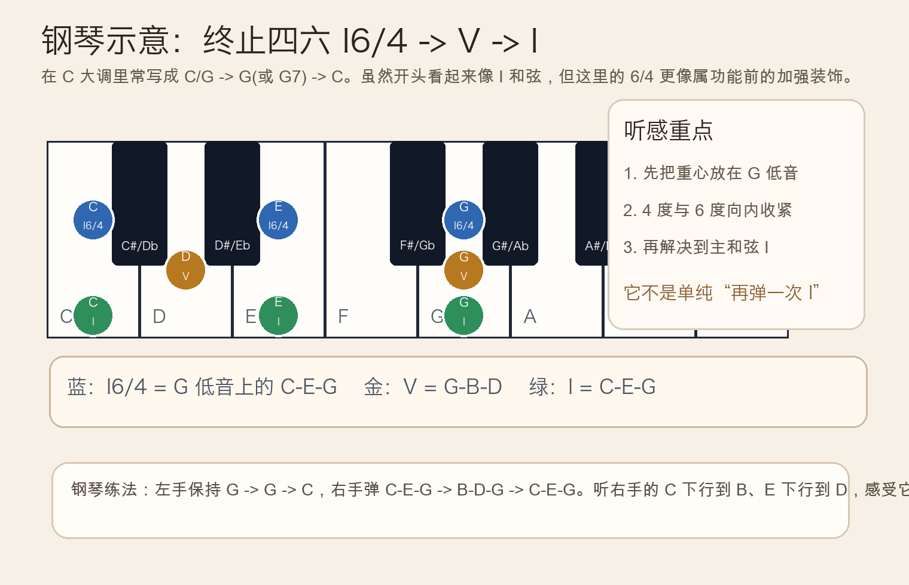
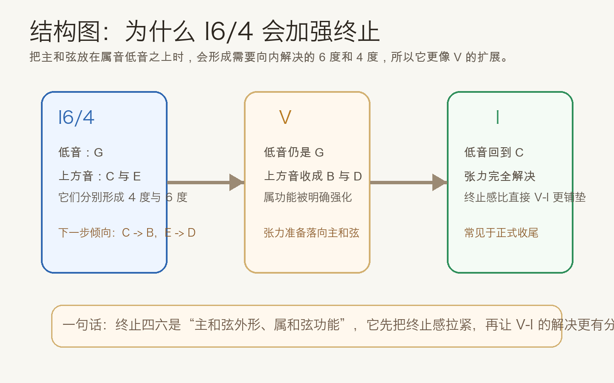
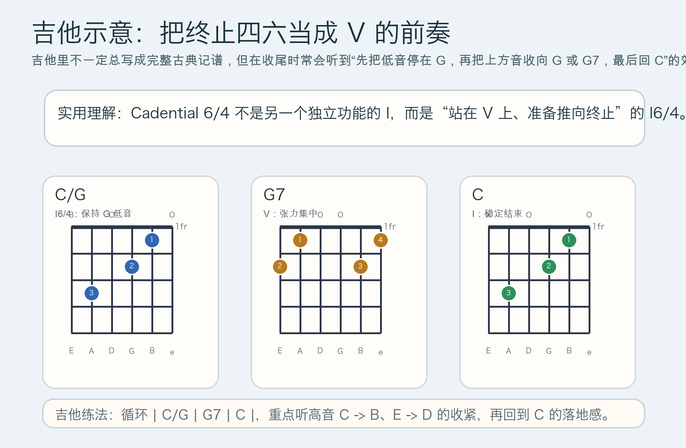

# 2026-05-04：终止四六 Cadential 6/4

## 今日知识点

前几天你已经学过几种“怎么结束”的方法：正格终止 `V-I`、半终止停在 `V`、变格终止 `IV-I`。今天继续往前走一步，学习一个经常出现在正式收尾前的和声手法：**终止四六**（Cadential 6/4）。

它最常见的骨架是：

```text
I6/4 -> V -> I
```

如果放在 `C` 大调里，可以先理解成：

```text
C/G -> G 或 G7 -> C
```

这里最容易误会的地方是：`I6/4` 看起来像“主和弦 `C-E-G` 只是换了个低音 `G`”，所以初学时常会把它当成一个普通的第一转位或第二转位和弦。但在终止语境里，它**不只是“再弹一次 I”**。因为低音稳稳停在属音 `G` 上，而上方的 `C` 和 `E` 会分别向 `B` 和 `D` 收紧，所以它听起来更像**属和弦前的一次蓄力**。

你可以把它想成：先把终止感拉紧，再让 `V -> I` 的解决更有重量。也就是说，终止四六虽然长得像主和弦，功能上却更接近“被装饰、被扩展的 `V`”。



从声音运动上看，最关键的是这两个方向：

- `C -> B`
- `E -> D`

低音则常保持 `G -> G -> C`。这就是为什么它会制造出一种“马上要结束了，但还要先绷一下”的感觉。



## 钢琴使用场景

钢琴上学终止四六，最好的方法不是只看和弦名字，而是直接听三个阶段的差别：

```text
I6/4 -> V -> I
C/G  -> G -> C
```

在手上怎么实现：

- 左手弹 `G -> G -> C`
- 右手弹 `C-E-G -> B-D-G -> C-E-G`

这样弹时，你会立刻感受到：第一拍虽然出现了 `C-E-G`，但由于低音不是 `C` 而是 `G`，整个重心并没有真正回家，反而像在为 `V` 做准备。


钢琴里的常见使用场景有：

- 古典风格乐句收尾前，让最后一次终止更正式
- 伴奏写法里，需要把 `V-I` 的结束感再放大一点
- 听辨训练时，用来区分“表面像 I、实际像 V 的准备”

## 吉他使用场景

吉他上不一定总是用严格的古典记谱去写“终止四六”，但这个声音思路非常常见。尤其在 `C` 大调收尾时，你可以把低音和重心先放在 `G`，然后再进入 `G7`，最后回到 `C`。

最直观的练法是：

```text
| C/G | G7 | C |
```

其中 `C/G` 就是把 `C` 和弦建立在 `G` 低音之上。这样一来，虽然高音层还是 `C-E-G` 的材料，但听觉重心已经偏向属音，下一步转进 `G7` 会非常自然。



吉他里的实际场景通常包括：

- 歌曲最后一行想做更完整的收尾，而不是直接 `G7 -> C`
- 指弹编配里，希望低音线更稳定地停在 `G`
- 和弦分析时，理解 slash chord 不只是换低音，有时还带着明确功能

## 可演奏例子

钢琴版本：

```text
例子 1：最小终止单元
左手：G        G        C
右手：C-E-G    B-D-G    C-E-G

例子 2：四小节收尾
| F | C/G | G7 | C |
把第二小节听成终止四六，而不是普通的稳定主和弦
```

吉他版本：

```text
例子 1：基础收尾
| C/G | G7 | C |

例子 2：更完整的句子
| Am | F | C/G | G7 | C |
后面三和弦会比直接 | Am | F | G7 | C | 更有“正式终止”的味道
```

## 今日练习

1. 在钢琴上反复弹 `| C/G | G | C |` 8 次，专门听 `C -> B` 和 `E -> D` 的收紧过程。
2. 在钢琴上对比 `| G | C |` 和 `| C/G | G | C |`，判断哪个终止更有铺垫、哪个更直接。
3. 在吉他上循环 `| C/G | G7 | C |`，让低音尽量清楚，感受 slash chord 对功能重心的影响。
4. 把一个你熟悉的 `G7 -> C` 收尾，改写成 `C/G -> G7 -> C`，听听结束感是否更正式。
5. 自己口头回答一句：为什么终止四六虽然写着 `I6/4`，却不能简单当成普通主和弦？

## 一句话总结

终止四六就是在属音低音上先摆出 `I6/4` 的外形，再推进 `V -> I`，它的作用不是“回家”，而是**把终止前的张力再拉紧一次**。
