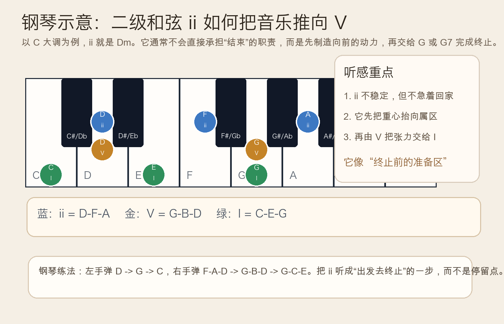
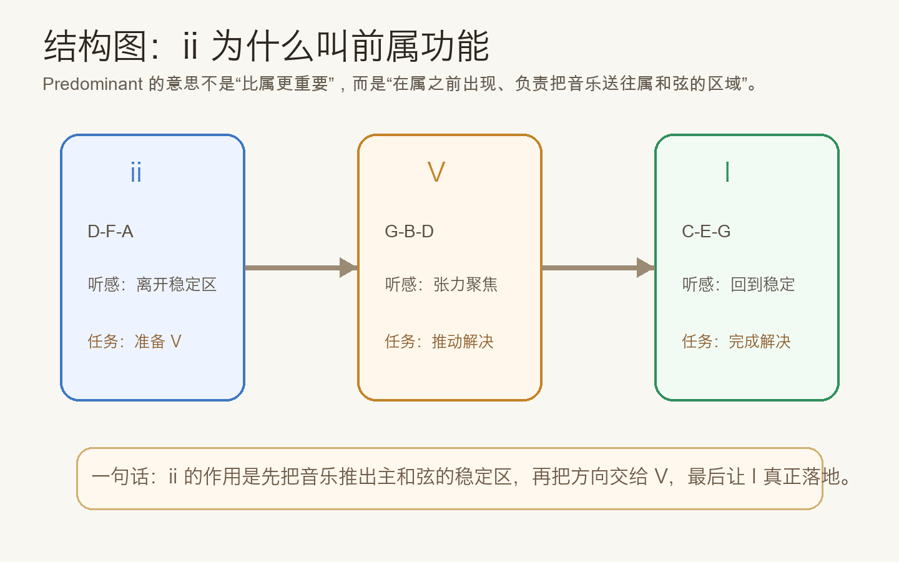
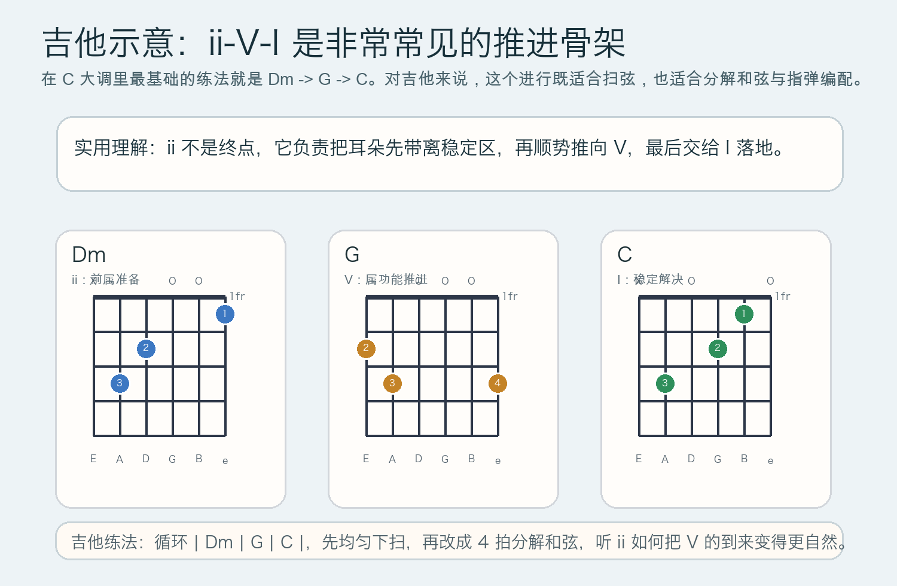

# 2026-05-05：二级和弦 ii 的前属功能 Predominant ii

## 今日知识点

昨天你已经学到，终止四六会把 `V-I` 前的张力再拉紧一次。今天再往前退一步，学习一个更早出现、但同样很关键的角色：**二级和弦 `ii` 的前属功能**（Predominant ii）。

在大调里，`ii` 是建立在第二级音上的三和弦。以 `C` 大调为例：

```text
ii = D-F-A = Dm
```

它最常见的去向不是直接回 `I`，而是先走向 `V`，再由 `V` 回到 `I`：

```text
ii -> V -> I
Dm -> G -> C
```

这里最重要的不是“二级和弦的名字”，而是它在句子里的位置和任务。`I` 是稳定区，`V` 是张力最集中的区域，而 `ii` 常常像一个“把音乐推出稳定区、送往属和弦”的准备站。所以它被叫做 **前属功能**，也就是“出现在属和弦之前、帮助音乐走向属和弦”的功能。

你可以把它想成三步：

- `I` 像在家里
- `ii` 像走到门口、已经决定要出发
- `V` 像真正站到悬念最大的位置

这样理解之后，`ii` 就不再只是一个新和弦，而是和声进行里的“方向指示牌”。



如果只弹 `Dm`，你会觉得它已经离开 `C` 的稳定感，但又还没到最强的终止张力；一旦接上 `G`，耳朵就会很自然地期待 `C`。这正是前属功能的核心：**不负责结束，而是负责把结束准备好**。



## 钢琴使用场景

钢琴上学习 `ii`，最直接的方法就是亲手把它放进 `ii-V-I` 里。以 `C` 大调为例：

```text
左手：D -> G -> C
右手：F-A-D -> G-B-D -> G-C-E
```

这里不必一开始就追求复杂配位，先把三个和弦的功能听清楚更重要：

- `Dm` 让音乐从主和弦的稳定区迈出去
- `G` 把紧张感集中起来
- `C` 才真正落地


钢琴里的常见使用场景有：

- 给乐句收尾做铺垫，让 `V-I` 不会显得太突然
- 左手伴奏时，先用 `ii` 预热，再把右手旋律推向终止
- 听辨训练时，分清“已经离开稳定”与“已经准备结束”其实是两个阶段

## 吉他使用场景

吉他上，`ii-V-I` 是非常实用的基础骨架。就算你暂时不弹爵士，它在流行、民谣、指弹改编里也都很常见。`C` 大调里最简单的版本就是：

```text
| Dm | G | C |
```

这三个和弦的手型都很常见，所以你可以很快把注意力放在“功能听感”上，而不只是换和弦本身。



吉他里的实际场景通常包括：

- 歌曲副歌结束前，用 `Dm -> G -> C` 做自然收尾
- 分解和弦伴奏里，让低音线有“向终点靠近”的方向感
- 编配时不想直接 `G -> C`，就先插入 `Dm` 增加层次

如果你会一点点指弹，可以把 `Dm` 当成“先提气”，`G` 当成“把气顶住”，`C` 当成“落下来”。这样弹出来的句子会比直接三和弦平铺更有叙事感。

## 可演奏例子

钢琴版本：

```text
例子 1：基础 ii-V-I
左手：D        G        C
右手：F-A-D    G-B-D    G-C-E

例子 2：四小节收尾
| C | Dm | G | C |
把第二小节听成“准备区”，第三小节听成“张力区”
```

吉他版本：

```text
例子 1：基础进行
| Dm | G | C |

例子 2：更完整的句子
| Am | Dm | G | C |
其中 Dm 不是随便插入，而是在为 G 做准备
```

## 今日练习

1. 在钢琴上反复弹 `| Dm | G | C |` 8 次，每次都说出它们分别是 `ii`、`V`、`I`。
2. 在钢琴上对比 `| C | G | C |` 和 `| C | Dm | G | C |`，判断哪一个收尾更有“准备终止”的过程。
3. 在吉他上循环 `| Dm | G | C |`，先做四拍下扫，再改成分解和弦，感受前属功能是否更清楚。
4. 把一个你熟悉的 `G -> C` 收尾，改写成 `Dm -> G -> C`，听听句子是否更完整。
5. 自己口头回答一句：为什么 `ii` 不叫“终止和弦”，却在终止前经常出现？

## 一句话总结

二级和弦 `ii` 的前属功能，就是先把音乐从主和弦的稳定区推出来，再把方向交给 `V`，让最后回到 `I` 更自然、更有层次。
