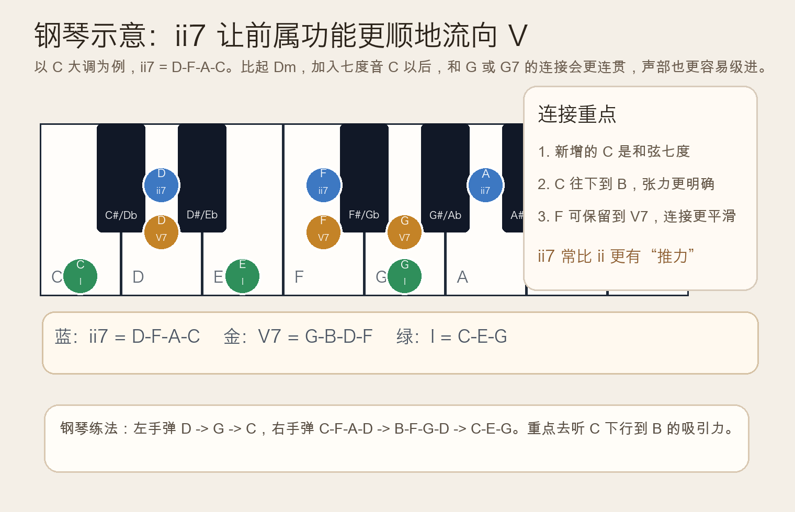
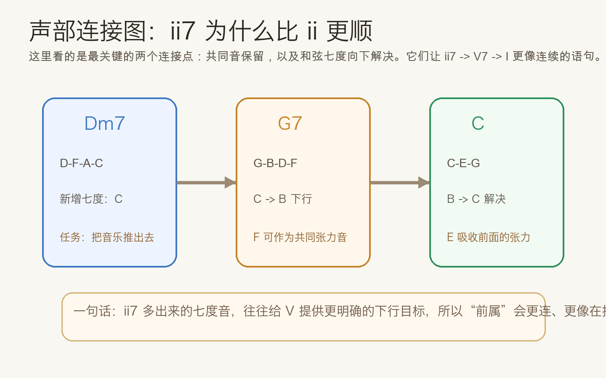
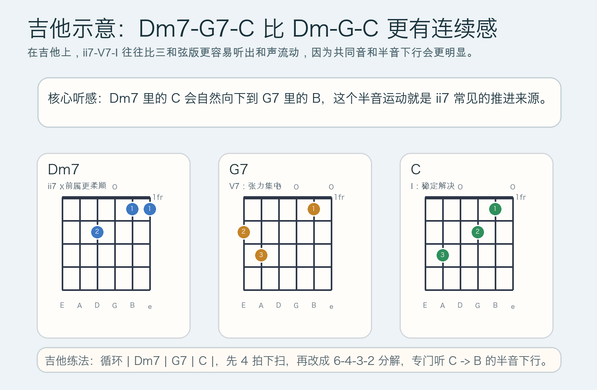

# 2026-05-06：二级七和弦 ii7 的前属功能 Predominant ii7

## 今日知识点

昨天你已经学到，`ii` 会把音乐从主和弦的稳定区推向 `V`。今天只在这个知识点上前进一步：**把二级和弦扩展成二级七和弦 `ii7`，为什么会让前属功能更顺、更像真的在“推动”音乐。**

以 `C` 大调为例：

```text
ii = D-F-A = Dm
ii7 = D-F-A-C = Dm7
```

`ii7` 比 `ii` 多出来的那个音是 `C`。这个音不是随便“加厚”一下而已，它有很明确的和声作用：当音乐走向 `V` 或 `V7` 时，`C` 很容易下行到 `B`，于是耳朵会更清楚地感到“正在往属和弦靠近”。

```text
Dm7 -> G7 -> C
D-F-A-C -> G-B-D-F -> C-E-G
```

所以理解 `ii7` 的关键，不是把它当成一个全新的独立世界，而是看它怎样优化了 `ii -> V -> I` 这条路线。它常见的两个特点是：

- 它保留了 `ii` 作为前属和弦的方向感
- 它通过七度音制造了更自然的声部下行

这就是为什么很多时候你会觉得 `Dm7 -> G7 -> C` 比 `Dm -> G -> C` 更像一句完整的话。前者不是“和弦更多所以更高级”，而是**连接更顺，目标更明确**。



如果用一句最实用的话概括：`ii7` 还是前属，只是它比 `ii` 更会“把路铺好”。尤其是当你已经学过 `V7` 之后，就更容易听到 `ii7` 并不是抢走属功能，而是在为属功能做准备。



## 钢琴使用场景

钢琴上学 `ii7`，最好不要一上来背定义，而是直接弹它和 `V7` 的连接。以 `C` 大调为例，可以先用这样一个简单配位：

```text
左手：D        G        C
右手：C-F-A-D  B-F-G-D  C-E-G
```

这里右手第一拍的 `C` 是今天最值得你注意的新音。它不是主和弦意义上的稳定 `C`，而是 `Dm7` 的七度音。接到 `G7` 时，这个音往下变成 `B`，会让句子明显出现“靠近终点”的感觉。

钢琴里的实际使用场景通常包括：

- 给 `V7-I` 之前再补一层更柔顺的准备，不让终止显得太突兀
- 伴奏时让中间声部出现更自然的级进，而不是每个和弦都硬性跳动
- 练耳时分辨 `ii` 和 `ii7` 的区别：两者都能前属，但 `ii7` 更有流动感


## 吉他使用场景

吉他上，`ii7-V7-I` 的直接版本就是：

```text
| Dm7 | G7 | C |
```

它比昨天的 `| Dm | G | C |` 多了一点“和声黏性”。原因很简单：`Dm7` 和 `G7` 之间的共同音和半音下行更容易听出来，所以扫弦时不只是换了一个和弦名字，而是真的更有推进方向。



吉他里的常见使用场景包括：

- 流行或民谣歌曲收尾时，用 `Dm7 -> G7 -> C` 做比三和弦更细腻的解决
- 指弹编配里让内声部更顺，避免每次都只靠低音根音推动
- 学习七和弦时，把它放回功能链条里理解，而不是单独死记手型

如果你已经会开放和弦，今天最实用的收获不是“我又学了一个新按法”，而是听出 `Dm7` 为什么会让后面的 `G7` 来得更自然。

## 可演奏例子

钢琴版本：

```text
例子 1：基础 ii7-V7-I
左手：D        G        C
右手：C-F-A-D  B-F-G-D  C-E-G

例子 2：四小节句子
| C | Dm7 | G7 | C |
把第二小节听成“准备更充分的前属区”
```

吉他版本：

```text
例子 1：基础进行
| Dm7 | G7 | C |

例子 2：更完整的句子
| Am | Dm7 | G7 | C |
注意 Dm7 里的 C，听它如何把耳朵推向 G7
```

## 今日练习

1. 在钢琴上分别弹 `| Dm | G | C |` 和 `| Dm7 | G7 | C |`，比较哪一个连接更顺。
2. 单独盯住钢琴右手里的 `C -> B -> C`，反复弹 8 次，感受七度音下行再解决的张力。
3. 在吉他上循环 `| Dm7 | G7 | C |`，先做四拍下扫，再改成分解和弦，听内声部的流动。
4. 把昨天的 `| Dm | G | C |` 练习改写成 `| Dm7 | G7 | C |`，说出你听到的差别。
5. 用自己的话回答一句：`ii7` 为什么仍然叫前属，而不是属和弦？

## 一句话总结

二级七和弦 `ii7` 仍然负责把音乐送向 `V`，但因为多出了会下行解决的七度音，所以它比 `ii` 更顺、更会推动句子前进。
