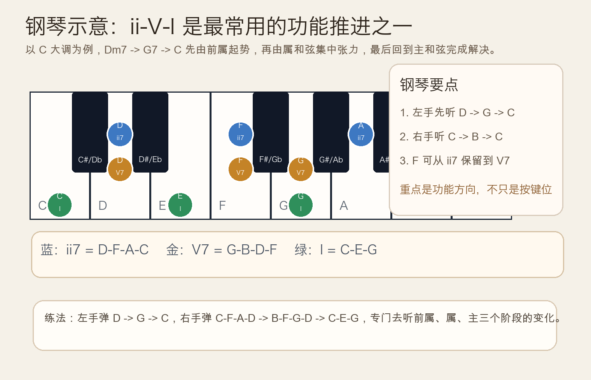
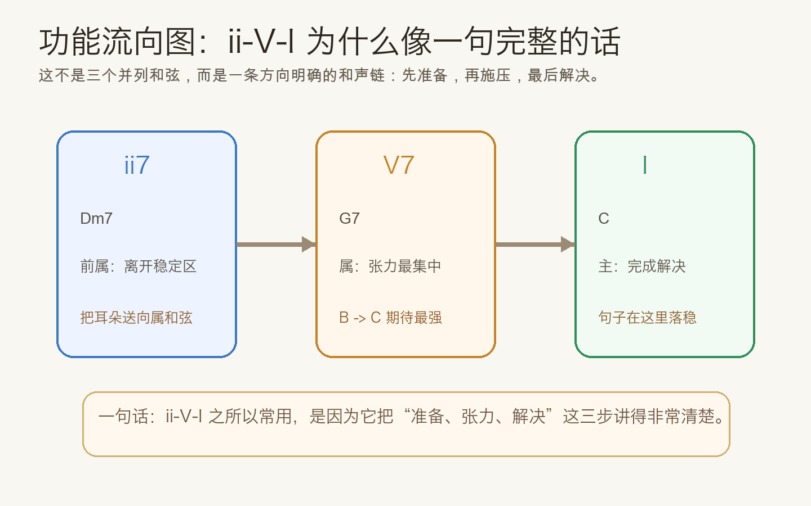
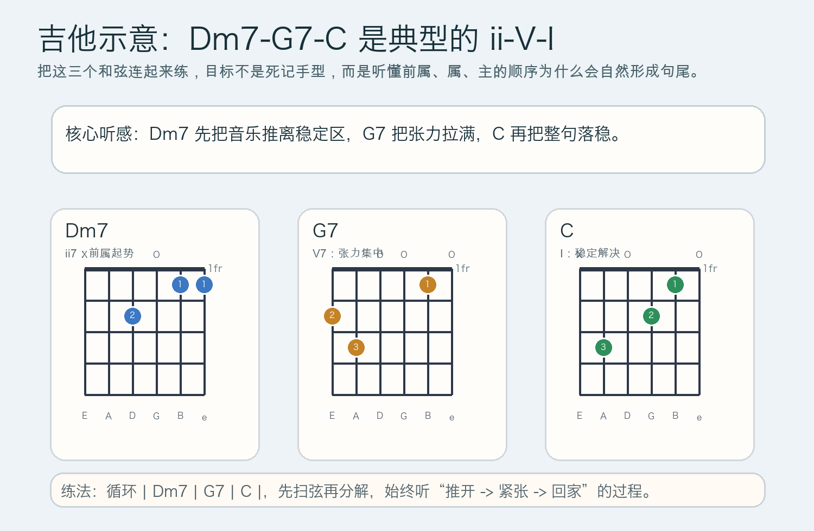

# 2026-05-07：ii-V-I 和声进行 ii-V-I Progression

## 今日知识点

你前两天已经分别学过 `ii` 和 `ii7` 的前属功能。今天只把这个思路再推进一步：**把 `ii`、`V`、`I` 连成一个完整句法，理解为什么 `ii-V-I` 会成为流行、爵士、编配和伴奏里的高频骨架。**

以 `C` 大调为例：

```text
ii-V-I = Dm7 - G7 - C
        = D-F-A-C -> G-B-D-F -> C-E-G
```

这个进行之所以重要，不是因为它“高级”，而是因为三段功能分工非常清楚：

- `ii` 或 `ii7`：把音乐从稳定区推离，进入准备阶段
- `V` 或 `V7`：集中张力，制造“必须解决”的感觉
- `I`：把前面的张力收回来，形成落点

如果把它想成一句话，`ii` 像起势，`V` 像把重点说出来，`I` 像句号。你前一天学的 `ii7`，在这里就不再是孤立知识，而是这条常用路线里的第一步。



`ii-V-I` 的实用价值在于：它不是只存在于教材里，而是会不断出现在真实音乐中。无论是钢琴伴奏、吉他扫弦、爵士即兴前的和声底板，还是流行歌里的句尾推进，本质上都经常在用这条“前属 -> 属 -> 主”的逻辑。



## 钢琴使用场景

钢琴上练 `ii-V-I`，最有价值的不是一次把和弦弹得很满，而是听清楚每一步为什么成立。以 `C` 大调为例，可以先弹：

```text
左手：D        G        C
右手：C-F-A-D  B-F-G-D  C-E-G
```

这里你会听到三个关键变化：

- `Dm7` 先把音乐从主和弦的稳定感里带出来
- `G7` 把 `B` 和 `F` 的张力推到前面
- `C` 把 `B -> C` 的吸引和整体句子的落点一起完成

钢琴里的常见使用场景包括：

- 给歌曲句尾增加更完整的推进，而不是直接从某个和弦跳回主和弦
- 在左手伴奏中建立清楚的低音方向：`D -> G -> C`
- 在右手和声练习里学习共同音保留与半音解决


## 吉他使用场景

吉他上，`ii-V-I` 最直接的练法就是：

```text
| Dm7 | G7 | C |
```

如果你只把它看成三个和弦名字，那会很容易流于背手型；真正有用的是听出它的功能顺序。`Dm7` 不负责结束，而是负责把耳朵送到 `G7`；`G7` 不负责稳定，而是负责把张力推满；`C` 才是最后的落点。



吉他的常见使用场景包括：

- 歌曲尾句或主歌转副歌前，用它做更清楚的和声推进
- 指弹编配时，用 `Dm7 -> G7 -> C` 做比纯三和弦更顺的连接
- 学习爵士和声入门时，把开放和弦或封闭和弦放回真实功能链条里理解

今天在吉他上最值得注意的，不是某个单独和弦难不难按，而是三者连起来时，为什么你会自然觉得最后一定要回到 `C`。

## 可演奏例子

钢琴版本：

```text
例子 1：基础 ii-V-I
左手：D        G        C
右手：C-F-A-D  B-F-G-D  C-E-G

例子 2：四小节伴奏
| C | Dm7 | G7 | C |
第 2-3 小节听成一句完整推进
```

吉他版本：

```text
例子 1：基础进行
| Dm7 | G7 | C |

例子 2：扩展成常见句子
| Am | Dm7 | G7 | C |
把后 3 个和弦听成连续的 ii-V-I
```

## 今日练习

1. 在钢琴上连续弹 8 次 `| Dm7 | G7 | C |`，只盯住 `D -> G -> C` 的低音方向。
2. 右手单独弹 `C-F-A-D -> B-F-G-D -> C-E-G`，说出哪几个音是保留、哪几个音在解决。
3. 在吉他上循环 `| Dm7 | G7 | C |`，先每小节 4 次下扫，再改成分解和弦。
4. 把 `| C | Dm7 | G7 | C |` 录下来，听第 2 到第 4 小节是否比直接 `| C | G7 | C |` 更像完整句子。
5. 用自己的话解释一句：为什么 `ii-V-I` 不是三个并列和弦，而是一条有方向的功能链？

## 一句话总结

`ii-V-I` 的核心不是记住三个名字，而是听懂“前属推动、属制造张力、主完成解决”这一条最常用的和声路线。
