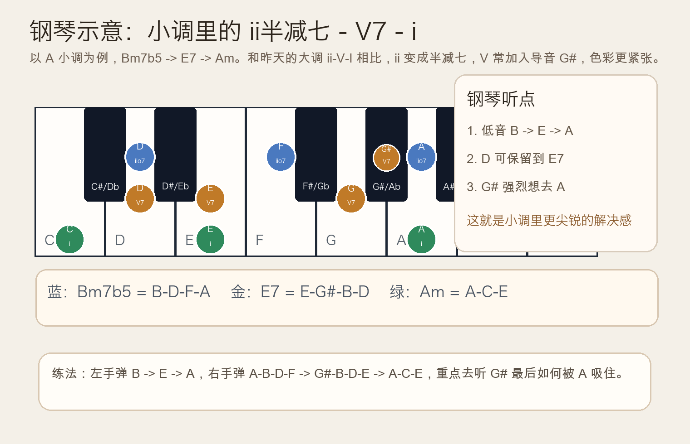
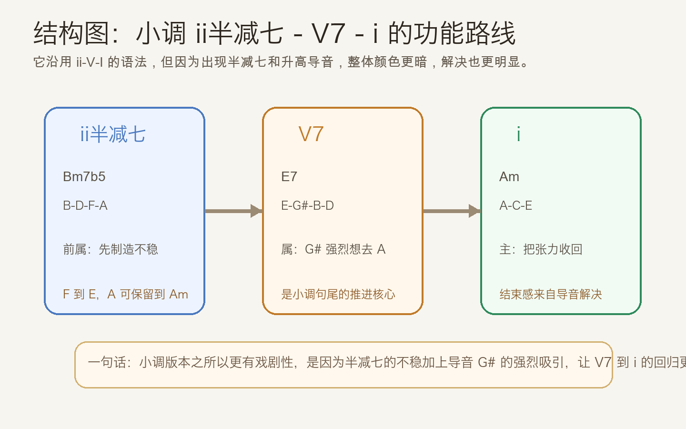
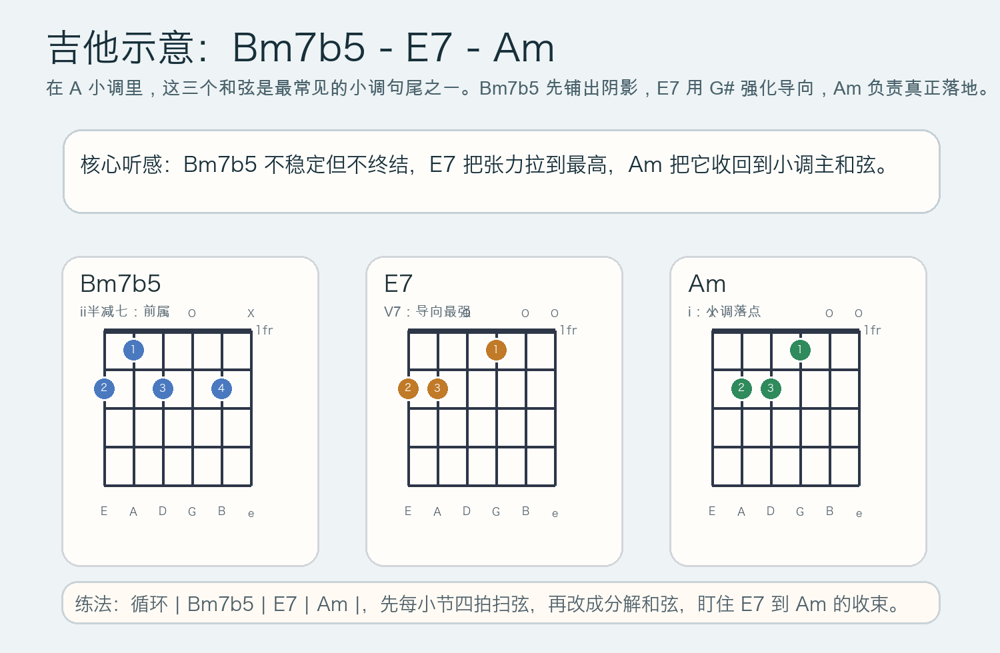

# 2026-05-08：小调中的 ii半减七-V7-i Minor ii Half-Diminished - V7 - i

## 今日知识点

昨天你学的是大调里的 `ii-V-I`，今天只前进一步：**把同样的功能句法搬到小调里，看看为什么 `ii半减七 - V7 - i` 会比大调版本更紧、更暗、也更有解决感。**

以 `A` 小调为例：

```text
ii半减七-V7-i = Bm7b5 - E7 - Am
              = B-D-F-A -> E-G#-B-D -> A-C-E
```

这里最关键的变化有两个：

- `ii` 不再是普通小七和弦，而是 `Bm7b5`，本身就带着不稳定感
- `V7` 往往使用升高的导音 `G#`，它会强烈地想解决到 `A`

所以小调版本不是简单把昨天的和弦名字改一改，而是把“前属 -> 属 -> 主”的路线染上更强的戏剧张力。你可以把它理解成：昨天是清晰的和声句法，今天是在同样句法上加入更明显的阴影和吸引力。



从功能上看，三步还是很明确：

- `Bm7b5`：让音乐离开稳定区，但先不终结
- `E7`：把张力集中起来，尤其是 `G# -> A`
- `Am`：把整句真正收回来



## 钢琴使用场景

钢琴上学这个知识点，重点不是把和弦弹得多满，而是听清楚小调里“导音解决”到底有多强。你可以先弹一个很基础的版本：

```text
左手：B        E        A
右手：A-B-D-F  G#-B-D-E A-C-E
```

这里最值得听的地方有三个：

- 低音 `B -> E -> A` 和昨天的大调逻辑一致，说明功能路线没变
- `D` 可以从 `Bm7b5` 保留到 `E7`，让连接听起来很顺
- `G#` 最后到 `A` 的解决，是小调版本最鲜明的张力来源

在钢琴上的常见使用场景包括：

- 给小调歌曲句尾做更完整的收束，而不是直接回 `Am`
- 在左手伴奏中建立清晰的低音方向 `B -> E -> A`
- 在右手和声训练里专门练导音 `G#` 向主音 `A` 的解决


## 吉他使用场景

吉他上最常见的练法就是把它直接放进一个三和弦循环里：

```text
| Bm7b5 | E7 | Am |
```

`Bm7b5` 的声音会比普通小七和弦更悬着，因为里面有减五度；到了 `E7`，`G#` 会把“必须回到 `Am`”的感觉推得很明确。也就是说，吉他上不要只把它当作一个“稍难按的和弦组合”，而要把它听成一个非常常见的小调句尾语法。



吉他的常见使用场景包括：

- 小调抒情歌或日系和声里，主歌尾句、前奏结尾、间奏收束
- 指弹编配时，用 `Bm7b5 -> E7 -> Am` 代替更直白的 `E7 -> Am`
- 学爵士或流行和声时，理解为什么小调里常见的句尾比大调更有颜色

## 可演奏例子

钢琴版本：

```text
例子 1：基础句尾
左手：B        E        A
右手：A-B-D-F  G#-B-D-E A-C-E

例子 2：四小节伴奏
| Am | Bm7b5 | E7 | Am |
第 2-4 小节听成一次完整的小调推进
```

吉他版本：

```text
例子 1：基础进行
| Bm7b5 | E7 | Am |

例子 2：扩展成常见小调句子
| Am | Bm7b5 | E7 | Am |
先把最后 3 个和弦听成一个固定收尾
```

## 今日练习

1. 在钢琴上连续弹 8 次 `| Bm7b5 | E7 | Am |`，只盯住低音 `B -> E -> A`。
2. 右手单独弹 `A-B-D-F -> G#-B-D-E -> A-C-E`，特别去听 `G# -> A`。
3. 在吉他上循环 `| Bm7b5 | E7 | Am |`，先每小节 4 次下扫，再改成分解和弦。
4. 录一段 `| Am | Bm7b5 | E7 | Am |`，对比只弹 `| E7 | Am |` 时，哪一种更像完整句子。
5. 用自己的话解释：为什么小调里的 `ii半减七 - V7 - i` 会比大调 `ii-V-I` 更有戏剧性？

## 一句话总结

小调里的 `ii半减七 - V7 - i` 仍然是“前属 -> 属 -> 主”的路线，但因为半减七的不稳和导音 `G#` 的强烈吸引，解决感会比大调更尖锐、更深。
