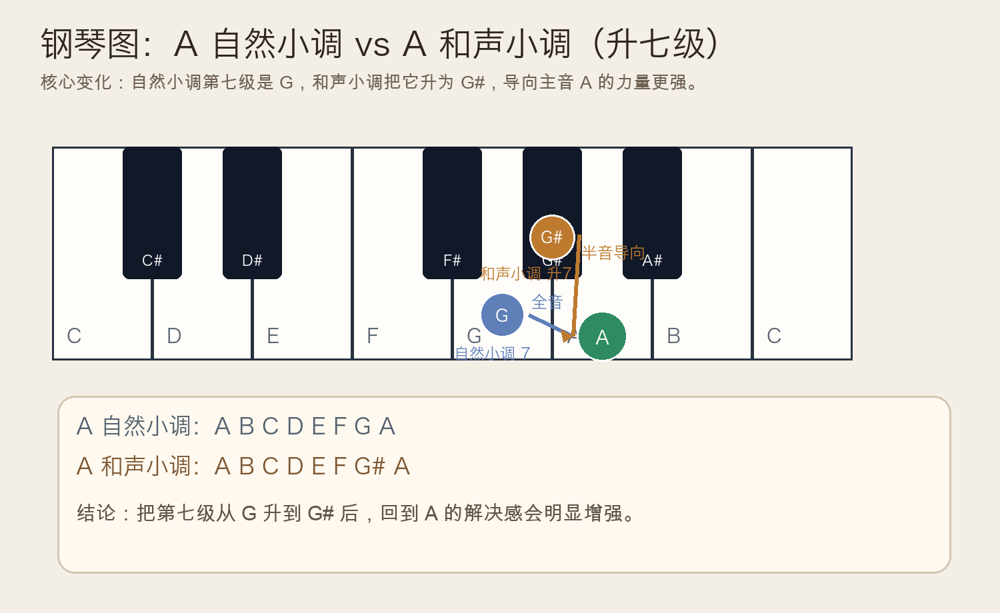
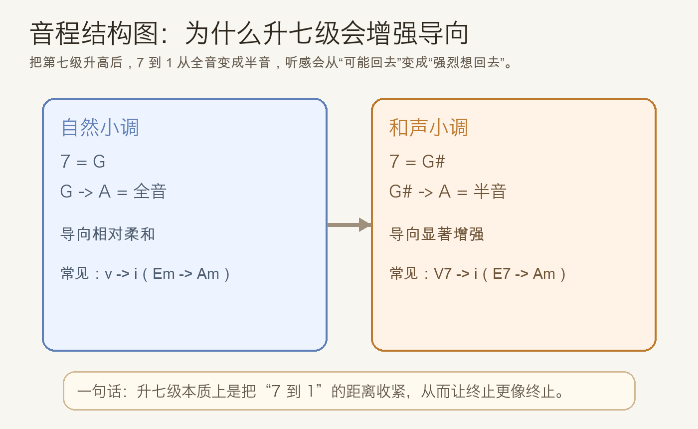
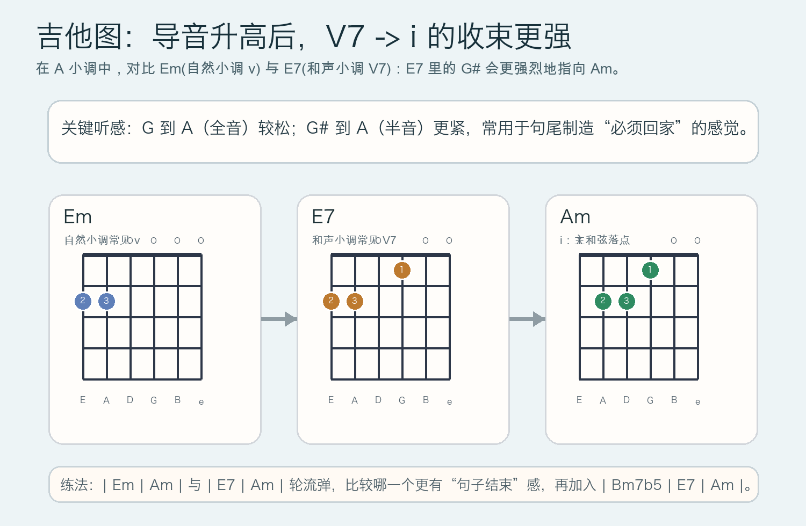

# 2026-05-11：和声小调中的导音与升七级 Harmonic Minor Leading Tone

## 今日知识点

今天只讲一个关键点：**为什么小调里常把第七级升高（升七级）**。

以 `A` 小调为例：

- 自然小调：`A B C D E F G A`
- 和声小调：`A B C D E F G# A`

区别就在第七级：`G -> G#`。这不是“写法变化”，而是功能变化。因为：

- `G -> A` 是全音，回归感相对松
- `G# -> A` 是半音，导向会明显更强

所以在和声进行里，和声小调更容易形成明确的“要回主音”的听感，这也是你在小调终止里经常听到 `V7 -> i` 的原因。





## 钢琴使用场景

钢琴上最直接的使用场景是句尾终止。你可以这样对比：

- 版本 A（自然小调倾向）：`Em -> Am`
- 版本 B（和声小调倾向）：`E7 -> Am`

当你在右手或旋律里把 `G` 改成 `G#`，你会明显听到“必须回到 A”的感觉增强。实际伴奏里，这个处理常用于：

- 小调主歌或副歌的句尾收束
- 前奏最后两拍做“拉回主和弦”
- 抒情段落里增强终止感而不加快节奏

## 吉他使用场景

吉他上同样适合用“对比法”练耳和上手：

- 先弹 `| Em | Am |`
- 再弹 `| E7 | Am |`

`E7` 中的 `G#` 会让回到 `Am` 更有终止力度。这个思路在流行、小调民谣、日系和声中都很常见，尤其在段落结束处非常实用。



## 可演奏例子

钢琴例子：

```text
例子 1（两种句尾对比）
| Em | Am |
| E7 | Am |

例子 2（四小节）
| Am | Dm | E7 | Am |
右手在 E7 小节强调 G#，落到 Am 时回 A。
```

吉他例子：

```text
例子 1（终止感对比）
| Em | Am | Em | Am |
| E7 | Am | E7 | Am |

例子 2（常见小调句子）
| Am | Dm | E7 | Am |
先慢速分解，再 4/4 扫弦。
```

## 今日练习

1. 在钢琴上弹 `| Em | Am |` 与 `| E7 | Am |` 各 8 次，记录你听到的终止感差异。
2. 右手单独练 `G -> A` 和 `G# -> A`，比较全音与半音导向强度。
3. 吉他循环 `| E7 | Am |` 2 分钟，保持节拍稳定并听清 `G#` 的作用。
4. 在 `| Am | Dm | E7 | Am |` 中，尝试把旋律最后一拍落在 `G#` 再回 `A`。
5. 用一句话回答：升七级改变的是“音名写法”还是“功能导向”？为什么？

## 一句话总结

小调升七级的本质，是把第七级到主音的距离收紧成半音，让 `V7 -> i` 的回归更有必然性。
