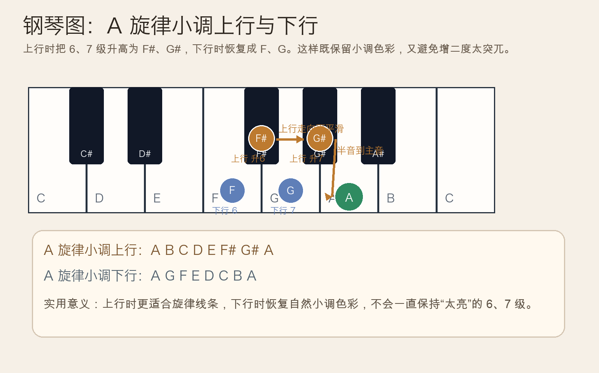
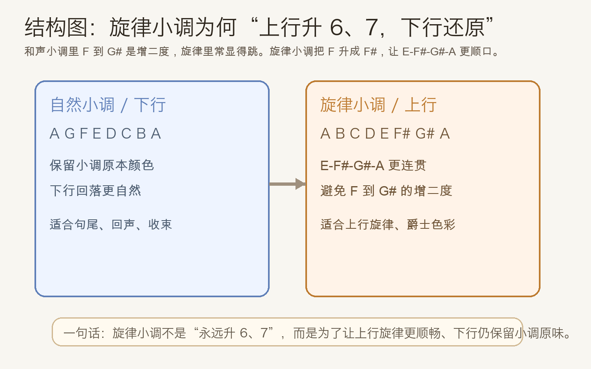
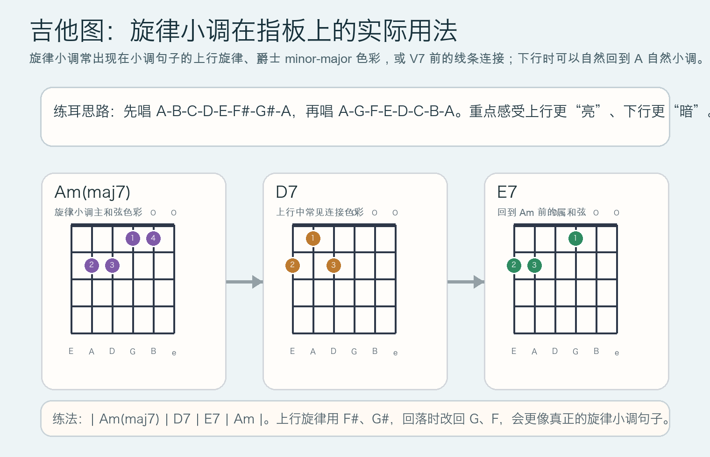

# 2026-05-12：旋律小调的上行与下行 Melodic Minor

## 今日知识点

今天只讲一个知识点：**旋律小调为什么上行和下行不一样**。

以 `A` 小调为例：

- 自然小调：`A B C D E F G A`
- 和声小调：`A B C D E F G# A`
- 旋律小调上行：`A B C D E F# G# A`
- 旋律小调下行：`A G F E D C B A`

旋律小调的重点不是“又多了一种小调背法”，而是它解决了旋律写作里的一个实际问题：

- 和声小调虽然有 `G#`，导音很强，但 `F -> G#` 是增二度，唱起来和弹起来都容易显得生硬
- 旋律小调把第六级也升高成 `F#`，这样 `E-F#-G#-A` 就会更像自然顺滑的上行线条
- 下行时再恢复成自然小调的 `G`、`F`，保留小调原本偏暗的色彩

所以，旋律小调本质上是一个**为旋律服务的折中方案**：上行更流畅，下行更自然。





## 钢琴使用场景

钢琴上最常见的使用场景，是右手旋律需要往主音上走的时候。

例如在 `A` 小调里，如果你的旋律准备从 `E` 往上推到高音 `A`：

- 用自然小调：`E F G A`
- 用和声小调：`E F G# A`
- 用旋律小调：`E F# G# A`

第三种通常最顺耳，因为每一步都更接近“级进上行”。这在下面几种场景里尤其常见：

- 钢琴独奏里，句子准备上冲到高音区
- 左手保持 `Am -> Dm -> E7 -> Am` 时，右手写更歌唱性的旋律
- 爵士或电影配乐里，想让小调既保留张力又不要太“古典硬拐弯”

## 吉他使用场景

吉他上，旋律小调常见于两类用法：

- 单音旋律或即兴：在 `Am` 附近往上爬时，用 `F#`、`G#` 让线条更亮、更顺
- 和声色彩：把 `Am` 扩展成 `Am(maj7)`，再接 `D7`、`E7`，会有明显的旋律小调/爵士小调味道

和昨天的“和声小调升七级”相比，今天多出来的关键点是：**不仅升 7，还常升 6**。这样吉他上的旋律线不会卡在 `F -> G#` 这个太突兀的跳进上。



## 可演奏例子

钢琴例子：

```text
例子 1（右手上行对比）
自然小调：E F G A
和声小调：E F G# A
旋律小调：E F# G# A

例子 2（四小节）
左手：| Am | Dm | E7 | Am |
右手：A B C D | E F# G# A | A G F E | D C B A
前两小节感受上行，后两小节感受下行还原。
```

吉他例子：

```text
例子 1（单音练习）
上行：A B C D E F# G# A
下行：A G F E D C B A

例子 2（和弦+旋律）
| Am(maj7) | D7 | E7 | Am |
在第 1-3 小节上方旋律使用 A 旋律小调上行，
最后回到 Am 时把旋律改成 A G F E 收下来。
```

## 今日练习

1. 在钢琴上分别弹 `E F G A`、`E F G# A`、`E F# G# A`，比较三种上行线条的顺滑程度。
2. 右手弹 `A B C D E F# G# A`，左手只按 `A` 低音，熟悉旋律小调上行的听感。
3. 吉他先单音练 `A 旋律小调上行/下行`，再把上行换到 `| Am(maj7) | D7 | E7 | Am |` 上面。
4. 录一段 20 秒的小调旋律，要求前半段上行使用 `F# G#`，后半段下行恢复 `G F`。
5. 用一句话回答：旋律小调为什么不是“从头到尾都升 6、7 级”？

## 一句话总结

旋律小调的核心，不是多记一个音阶，而是让小调旋律在上行时更顺、下行时仍保留自然小调的味道。
