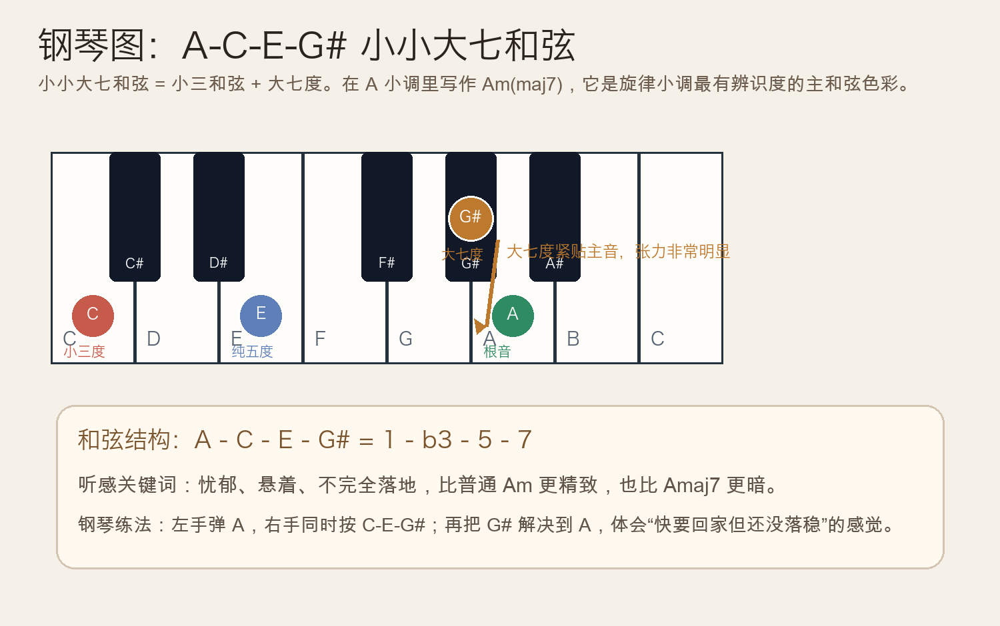
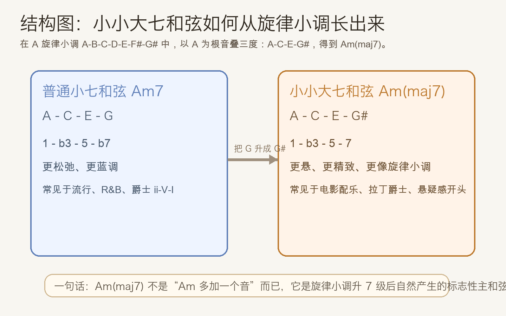
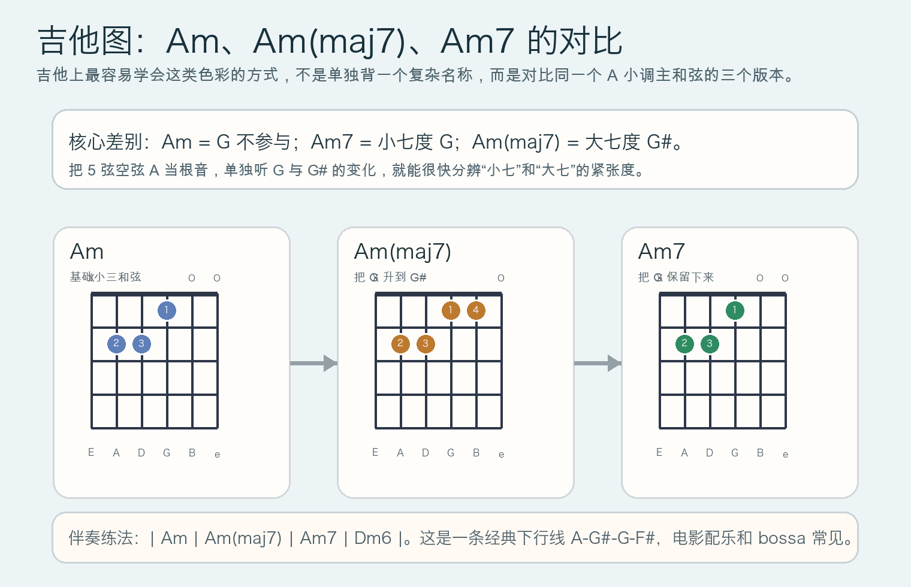

# 2026-05-13：小小大七和弦 Minor-Major Seventh Chord

## 今日知识点

今天只讲一个知识点：**什么是小小大七和弦（minor-major seventh chord）**。

名字看起来拗口，但拆开就很清楚：

- “小”表示它的三和弦骨架是**小三和弦**
- “大七”表示它上面叠的是**大七度**

以 `A` 为例：

- `Am` = `A C E`
- `Am7` = `A C E G`
- `Am(maj7)` = `A C E G#`

关键就在最后这个 `G#`。它不是普通小七和弦里的 `G`，而是离主音 `A` 只差半音的大七度，所以听感会比 `Am7` 更悬、更精致，也更像“还没完全落地”。

这就是它和昨天旋律小调内容的直接连接点：

- `A` 旋律小调上行：`A B C D E F# G# A`
- 以 `A` 为根音按三度叠起来：`A C E G#`
- 得到的就是 `Am(maj7)`

所以，小小大七和弦可以理解为：**旋律小调最有代表性的主和弦色彩之一**。





## 钢琴使用场景

钢琴上最常见的使用场景，是左手已经确定在小调主音上，右手想要一个比普通 `Am` 更细腻、更带悬念的和声颜色。

几个典型场景：

- 电影配乐开头：一个小调主和弦，但不想立刻“落稳”
- 爵士前奏：先给出 `Am(maj7)`，再走向 `Dm7b5`、`E7` 或 `D7`
- 旋律小调练习：右手弹 `A C E G#`，再让 `G# -> A`，直接听见大七度解决到主音的张力

如果你在钢琴上同时按下 `A C E G#`，会感觉它不像普通 `Am` 那样朴素，也不像 `Amaj7` 那样明亮，而是一种**暗色但带锐利边缘**的声音。

## 吉他使用场景

吉他上，最实用的入门方式不是死记“minor-major seventh”这个名字，而是把它和 `Am`、`Am7` 放在一起对比。

最常见的使用场景：

- 小调分解和弦伴奏：`Am -> Am(maj7) -> Am7 -> Dm6`
- bossa / 爵士伴奏：用根音下行制造连续色彩
- 单人弹唱或独奏前奏：让开头比普通小和弦更有“故事感”

这一类写法的核心，不是和弦本身有多复杂，而是**同一个 A 小调主和弦里，让第七音从 G# 再到 G，形成细微却很抓耳的线条变化**。



## 可演奏例子

钢琴例子：

```text
例子 1（先听单个和弦）
左手：A
右手：C E G#
一起按下，停 2 拍，再把 G# 升到 A。

例子 2（四小节颜色变化）
| Am | Am(maj7) | Am7 | Dm6 |
右手最高音：A -> G# -> G -> F#
重点听顶部线条一步一步往下走。
```

吉他例子：

```text
例子 1（和弦分解）
每个和弦弹 4 下：
| Am | Am(maj7) | Am7 | Dm6 |

例子 2（旋律小调联系）
先弹 A 旋律小调上行：A B C D E F# G# A
再回到和弦：Am(maj7) -> E7 -> Am
注意 G# 既属于上行旋律，也定义了 Am(maj7) 的颜色。
```

## 今日练习

1. 在钢琴上分别弹 `Am`、`Am7`、`Am(maj7)`，只比较最后一个音 `G` 和 `G#` 的差别。
2. 用右手单独弹 `G# -> A`，重复 8 次，熟悉“大七度解决到主音”的紧张与释放。
3. 在吉他上循环 `| Am | Am(maj7) | Am7 | Dm6 |`，让耳朵记住顶部音 `A-G#-G-F#`。
4. 试着把昨天的 `A 旋律小调上行` 和今天的 `Am(maj7)` 连起来弹，确认它们共享 `G#`。
5. 用一句话回答：为什么 `Am(maj7)` 会比 `Am7` 更有悬念？

## 一句话总结

小小大七和弦就是“小三和弦 + 大七度”，它是旋律小调升七级之后自然长出来的、最有悬疑与精致感的小调主和弦色彩。
