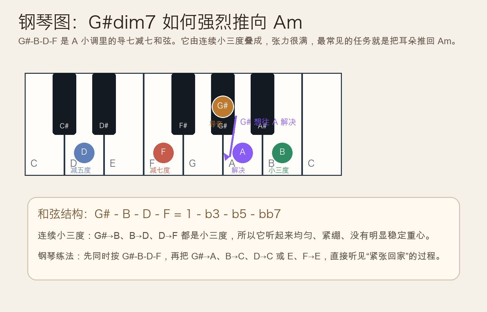
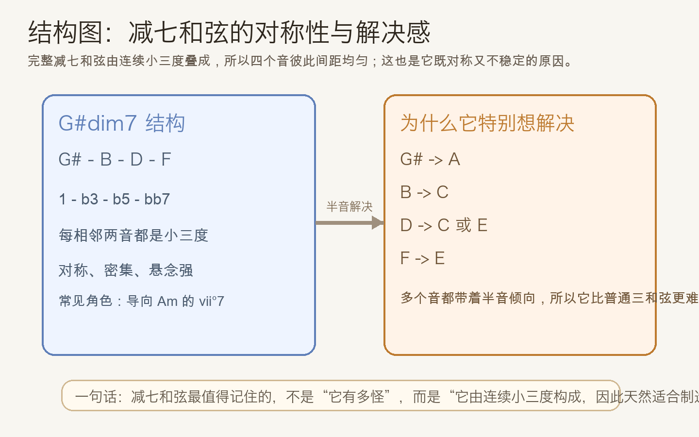
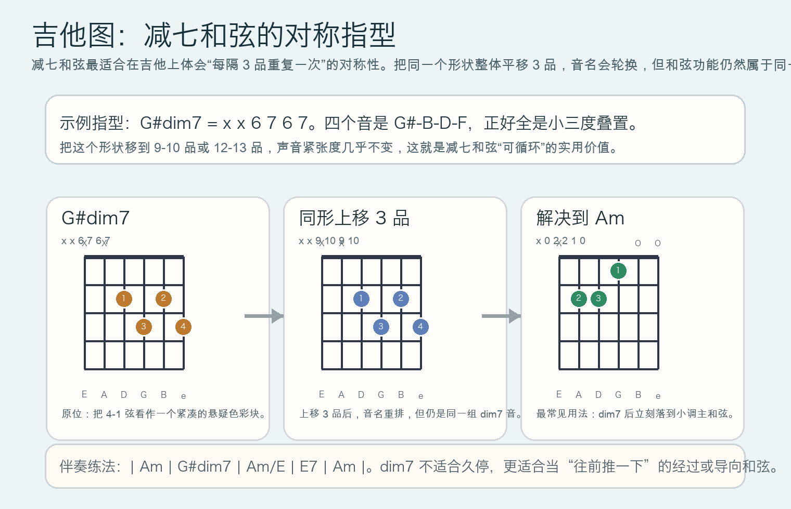

# 2026-05-14：减七和弦 Diminished Seventh Chord

## 今日知识点

今天只讲一个知识点：**什么是完整减七和弦（diminished seventh chord）**。

不要把它和之前学过的“半减七”混在一起。两者最关键的区别在最后一个音：

- 半减七：`1 - b3 - b5 - b7`
- 减七：`1 - b3 - b5 - bb7`

如果继续沿着这几天的小调路线往前走，最自然的例子就是 `A` 小调里的导七和弦：

- `G#dim7` = `G# B D F`

为什么它听起来特别紧？

- `G# -> B`
- `B -> D`
- `D -> F`

这三段全都是**小三度**。也就是说，减七和弦是由连续小三度叠出来的。它很对称，也正因为太对称，所以没有一个音听起来像“真正落稳的家”。

在 `A` 小调里，`G#` 是导音，本来就想往 `A` 走；再加上 `B`、`D`、`F` 也都很容易通过半音或近距离移动解决到稳定音，所以整个和弦会带来一种非常强的“马上要落地”的感觉。





## 钢琴使用场景

钢琴上，减七和弦最常见的用法不是长时间停留，而是**短时间制造高张力，然后快速解决**。

常见场景：

- 小调作品里，准备回到主和弦前的最后一下推动
- 电影配乐或悬疑配乐里，用一个短促、紧绷的声音制造“不安”
- 古典和声练习里，把 `vii°7 -> i` 当作非常标准的导向解决

如果你在钢琴上按下 `G# B D F`，会感觉它不像 `Am` 那样稳定，也不像 `E7` 那样“功能明确但仍有支点”，而是一种更密集、更没有落脚点的紧张。

最值得练耳朵的地方不是单独听 `G#dim7`，而是听它如何解决：

- `G# -> A`
- `B -> C`
- `D -> C` 或 `E`
- `F -> E`

这也是为什么它在钢琴上特别适合做“前一拍先绷紧，后一拍立刻释放”的色彩。

## 吉他使用场景

吉他上，减七和弦最有价值的特点是：**指型高度对称，而且每隔 3 品就可以整体平移一次**。

今天先记一个够用的例子：

- `G#dim7`：`x x 6 7 6 7`

这个形状只用 4 根高音弦，声音集中、锐利，非常适合：

- 小调前奏里的悬疑色彩
- 伴奏中过门或经过和弦
- 爵士、bossa、老歌编配里连接两个稳定和弦

和普通小和弦不同，减七和弦不太适合“长按着陪你唱完整句”，它更像一个把音乐往前一推的机关。



## 可演奏例子

钢琴例子：

```text
例子 1（先听张力再听解决）
右手：G# B D F
下一拍改成：A C E
把每个音都慢慢移动过去，听“紧张 -> 落地”。

例子 2（四小节）
| Am | G#dim7 | E7 | Am |
左手弹根音，右手弹和弦。
重点听第 2 小节怎样把音乐推向第 3、4 小节。
```

吉他例子：

```text
例子 1（和弦连接）
| Am | G#dim7 | Am/E | E7 | Am |
每个和弦弹 4 下，感受 dim7 只短暂停留但张力最满。

例子 2（对称位移练习）
先弹：x x 6 7 6 7
再上移 3 品：x x 9 10 9 10
再上移 3 品：x x 12 13 12 13
听一听为什么它们有“同类颜色”。
```

## 今日练习

1. 在钢琴上分解弹 `G# B D F`，确认每相邻两音都是小三度。
2. 把 `G#dim7 -> Am` 连续弹 8 次，每次都故意慢一点，听清楚每个音的解决方向。
3. 在吉他上练 `x x 6 7 6 7`，然后整体上移 3 品和 6 品，比较三次位置变化后的听感。
4. 用 `| Am | G#dim7 | E7 | Am |` 做一个 4 小节循环，分别在钢琴和吉他上弹一遍。
5. 用一句话回答：为什么减七和弦比普通小三和弦更“站不稳”？

## 一句话总结

减七和弦的核心，不只是“听起来紧张”，而是它由连续小三度构成，因此天然适合制造强烈的导向与解决感。
