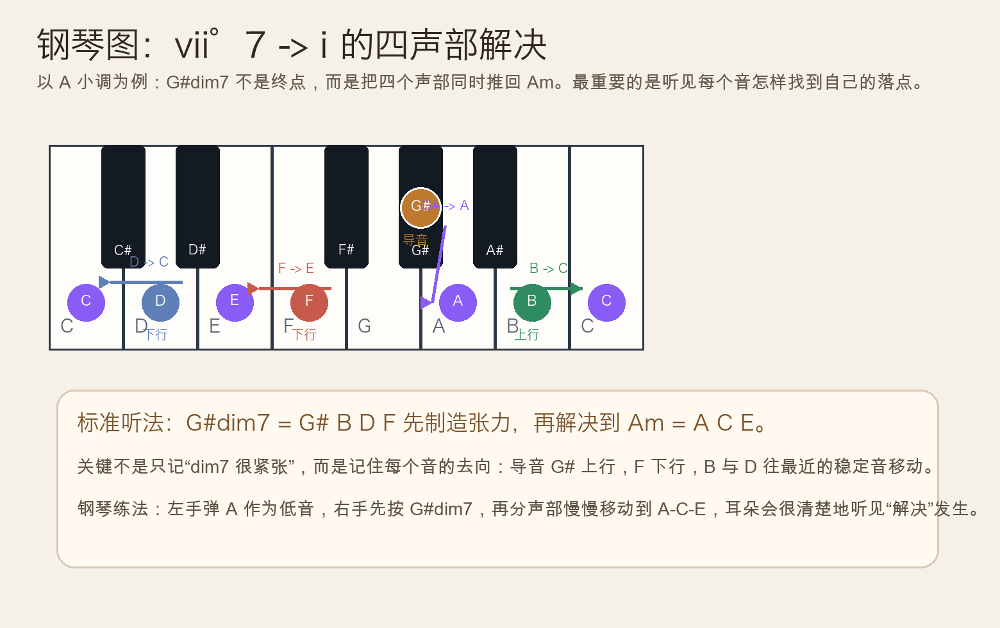
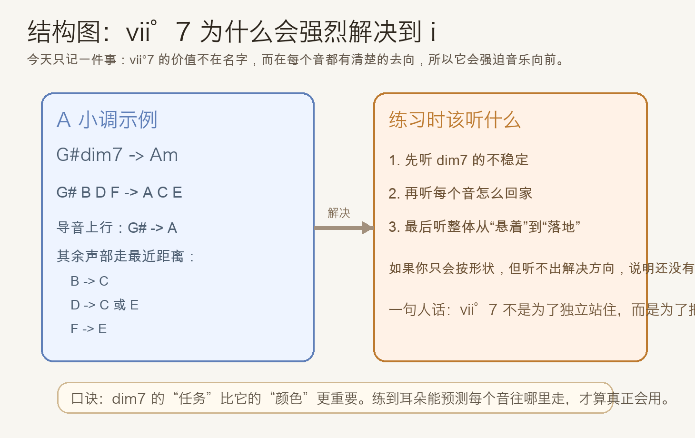
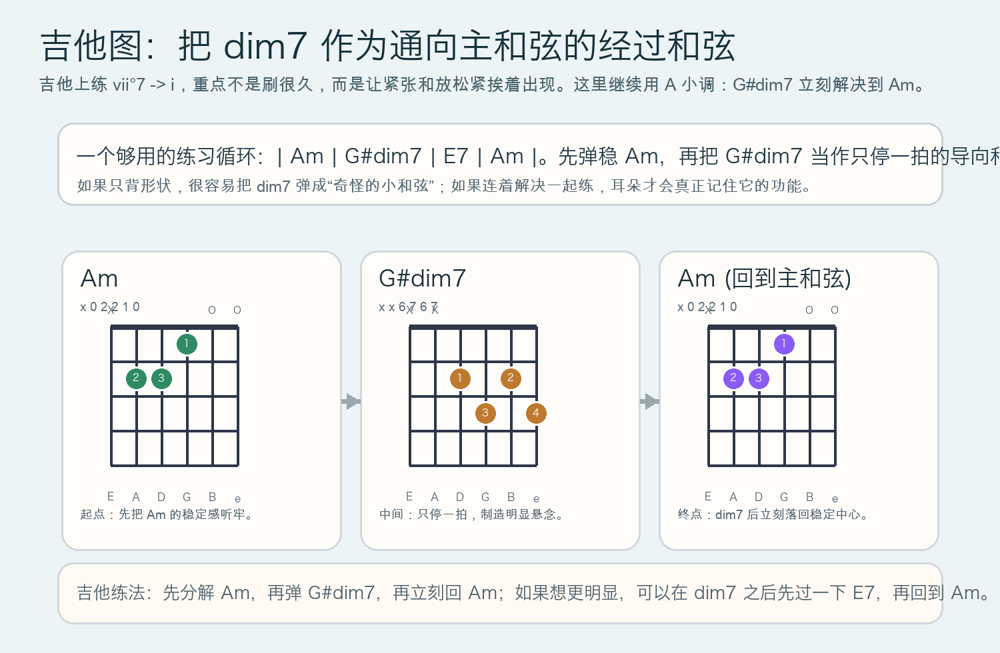

# 2026-05-15：导七和弦 `vii°7 -> i` 的解决 Leading-Tone Seventh Resolution

## 今日知识点

今天只讲一个知识点：**导七和弦 `vii°7` 为什么会强烈地解决到主和弦 `i`**。

昨天我们已经知道，完整减七和弦 `G#dim7 = G# B D F` 由连续小三度叠成，本身非常不稳定。今天进一步往前走一步，不再只问“它是什么”，而是问“它怎么用”。

在 `A` 小调里，最典型的写法就是：

- `G#dim7 -> Am`

为什么它这么有推动力？因为这不是“一个和弦整体跳到另一个和弦”，而是**每个音都在往最近的稳定音解决**：

- `G# -> A`
- `B -> C`
- `D -> C` 或 `E`
- `F -> E`

其中最关键的是 `G# -> A`。`G#` 是导音，离主音 `A` 只差半音，耳朵天然会期待它上行解决。剩下几个音也都各自带着很短的移动距离，所以整个和弦会显得像在“逼着音乐回家”。





## 钢琴使用场景

钢琴上，`vii°7 -> i` 最常见的价值，是在**结束句、转回主和弦、或者做短促的紧张推动**时，让声部进行非常清楚。

常见场景：

- 小调乐句结尾前，先用 `vii°7` 把张力拉满，再落回 `i`
- 古典和声练习里，训练四声部如何用最近距离解决
- 电影配乐、悬疑配乐里，用一个短促的 dim7 制造“门要打开了”的瞬间

钢琴上最值得练的，不是只把 `G#dim7` 同时按下去，而是把它**一条声部一条声部地移到 `Am`**。这样你会真正听见：

- 导音上行的吸引力
- `F -> E` 的下行释放
- 中间声部往 `C` 或 `E` 靠拢后的稳定感

## 吉他使用场景

吉他上，`vii°7 -> i` 常常被当成**经过和弦或导向和弦**来用，而不是一个长时间停留的主角和弦。

今天记住一个最常用的练习组合就够了：

- `Am`：`x 0 2 2 1 0`
- `G#dim7`：`x x 6 7 6 7`
- 再回 `Am`

这个用法很适合：

- 小调伴奏里给一句旋律加一个“快要落地”的瞬间
- 爵士、bossa 或老歌编配里的过门连接
- 自己练耳朵时对比“稳定和弦”和“导向和弦”的差别

重点不是把 `G#dim7` 刷很多拍，而是让它**短暂停留后立刻解决**。停得越久，它越像单独的色彩；解决得越快，你越容易听见它的功能。



## 可演奏例子

钢琴例子：

```text
例子 1（最核心的单次解决）
右手先弹：G# B D F
下一拍改成：A C E
要求：不要一下子糊过去，要听清楚每个音单独往哪里走。

例子 2（四小节练习）
| Am | G#dim7 | E7 | Am |
左手弹低音，右手弹和弦。
第 2 小节只停一拍或两拍，重点听第 4 小节的稳定感为什么特别明显。
```

吉他例子：

```text
例子 1（最短功能练习）
| Am | G#dim7 | Am |
每个和弦弹 4 下。
要求：第 2 小节不要拖，dim7 一出来就准备回到 Am。

例子 2（更完整的和声推动）
| Am | G#dim7 | E7 | Am |
先全用下拨慢练，再换成分解弹。
重点听：G#dim7 比 E7 更像“突然绷紧”的一下。
```

## 今日练习

1. 在钢琴上把 `G# B D F -> A C E` 连续弹 8 次，每次都口头说出每个音的解决方向。
2. 只练两条声部：先听 `G# -> A`，再听 `F -> E`，确认你能单独分辨这两种解决感。
3. 在吉他上做 `| Am | G#dim7 | Am |` 的 3 小节循环，先扫弦 5 轮，再分解弹 5 轮。
4. 把 `| Am | G#dim7 | E7 | Am |` 同时在钢琴和吉他上弹一遍，比较 dim7 和 E7 的张力差别。
5. 用一句话回答：`vii°7` 最重要的，不是它长什么样，而是它在做什么？

## 一句话总结

`vii°7` 最核心的价值，是让每个声部都朝最近的稳定音移动，因此它会非常自然、非常强烈地把音乐推回主和弦 `i`。
