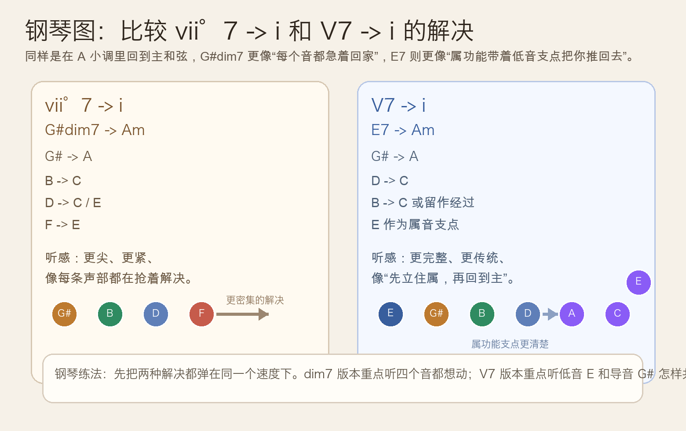
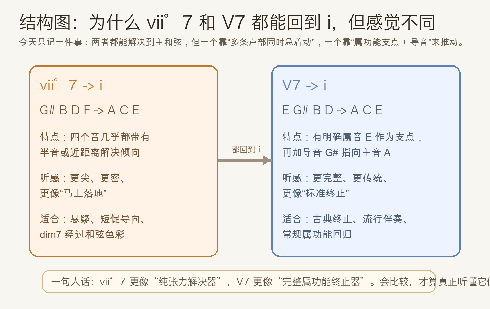
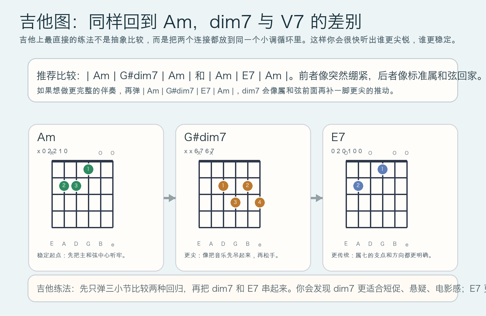

# 2026-05-18：`vii°7` 与 `V7` 的解决对比 Comparing `vii°7 -> i` and `V7 -> i`

## 今日知识点

今天只讲一个知识点：**为什么 `vii°7 -> i` 和 `V7 -> i` 都能回到主和弦，但听感并不一样**。

昨天我们已经单独学过 `vii°7 -> i`。今天往前再走一步，不再只看它自己，而是把它和更常见的 `V7 -> i` 放在一起比较。

仍然用 `A` 小调举例：

- `vii°7 -> i`：`G#dim7 -> Am`
- `V7 -> i`：`E7 -> Am`

它们都能回到 `Am`，共同点是都包含导音 `G#`，所以耳朵都会期待 `G# -> A`。但两者真正的差别在于“张力是怎么组织起来的”：

- `G#dim7 = G# B D F`
  这个和弦里，几乎每个音都带着很强的解决倾向。它更像一个“纯张力集合”，没有明显稳定支点。
- `E7 = E G# B D`
  这个和弦除了导音 `G#` 之外，还有清楚的属音根 `E`。所以它不像 dim7 那样全员悬空，而是更像“属功能已经立住了，再把你送回主和弦”。

简单记忆：

- `vii°7`：更尖、更紧、更像突然吊起来
- `V7`：更完整、更传统、更像标准终止





## 钢琴使用场景

钢琴上，这两个和弦最适合拿来做**终止感强弱的对比训练**。

如果你在一段小调句子结尾前只想要一个标准、清楚、传统的回归，`V7 -> i` 往往更合适，因为：

- 低音 `E` 让属功能非常明确
- 右手只要把 `G#` 和 `D` 解决好，终止感就已经很完整

如果你想要更短促、更神经质、更悬疑一点的推动，`vii°7 -> i` 往往更有效，因为：

- `G# B D F` 里几乎每个音都想立刻移动
- 它不像 `E7` 那样“先站稳属”，而是直接把紧张推到脸上

钢琴上最值得练的是把它们放在同一个速度里连续比较：

- 先弹 `G#dim7 -> Am`
- 再弹 `E7 -> Am`

这样你会清楚听见：

- dim7 版本更像多条声部一起扑向稳定
- V7 版本更像属和弦带着方向感回家

## 吉他使用场景

吉他上，这两个和弦的差别常常体现为**编配气质不同**，而不只是“理论上都能解决”。

今天记住两个最实用的连接：

- `| Am | G#dim7 | Am |`
- `| Am | E7 | Am |`

它们适合的场景不太一样：

- `G#dim7 -> Am`
  更适合做经过和弦、短促悬疑、电影感或老歌里的“突然一紧”
- `E7 -> Am`
  更适合歌伴奏、古典终止、标准和声推动

如果你把它们串起来：

- `| Am | G#dim7 | E7 | Am |`

就会发现 `G#dim7` 很像在 `E7` 前面再提前制造一次尖锐张力，随后再交给 `E7` 完成更完整的终止。



## 可演奏例子

钢琴例子：

```text
例子 1（最核心比较）
先弹：G# B D F -> A C E
再弹：E G# B D -> A C E
要求：两次都用同样速度，比较哪一次更“尖”、哪一次更“稳”。

例子 2（四小节对比）
版本 A：| Am | G#dim7 | Am | Am |
版本 B：| Am | E7 | Am | Am |
要求：左手弹低音，右手弹和弦；听哪一种更像“标准终止”，哪一种更像“突然紧一下”。
```

吉他例子：

```text
例子 1（最短比较）
| Am | G#dim7 | Am |
| Am | E7 | Am |
每个和弦弹 4 下，连续做 5 轮。
重点听：G#dim7 的张力更像短刺，E7 的张力更像完整回归。

例子 2（组合用法）
| Am | G#dim7 | E7 | Am |
先全下拨，再改成分解弹。
重点听：dim7 是否像在 E7 前面额外加了一层更紧的导向。
```

## 今日练习

1. 在钢琴上连续比较 `G#dim7 -> Am` 和 `E7 -> Am` 各 8 次，每次弹完都说出“更尖”还是“更稳”。
2. 单独听两个共同音程的作用：都注意 `G# -> A`，再比较 `E7` 多出来的低音支点 `E` 带来了什么感觉。
3. 在吉他上分别练 `| Am | G#dim7 | Am |` 和 `| Am | E7 | Am |`，每组至少 5 轮。
4. 把 `| Am | G#dim7 | E7 | Am |` 在钢琴和吉他上都弹一遍，确认 dim7 和 V7 不是互相替代，而是张力层级不同。
5. 用一句话回答：`vii°7` 和 `V7` 最大的听感差别，到底来自哪里？

## 一句话总结

`vii°7` 更像“纯张力解决器”，`V7` 更像“完整属功能终止器”。
