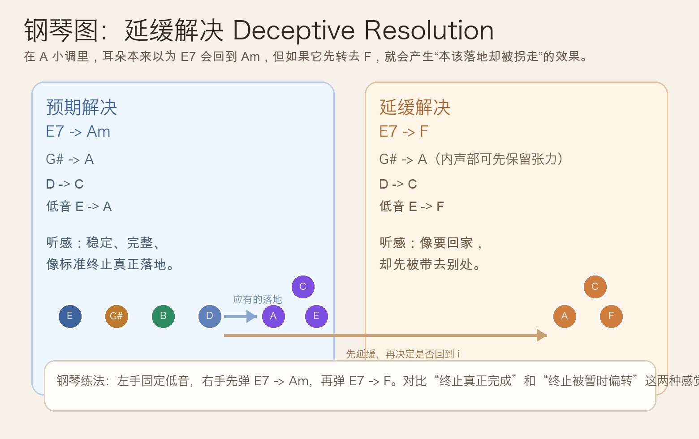
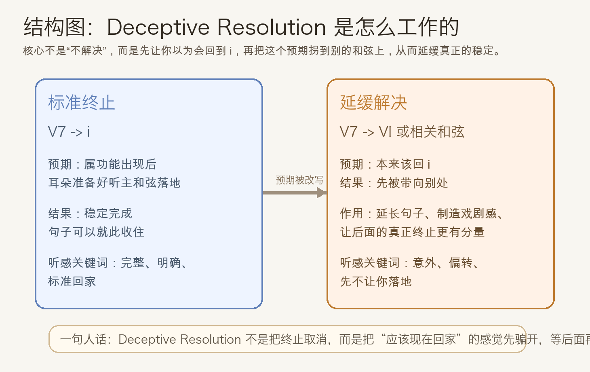
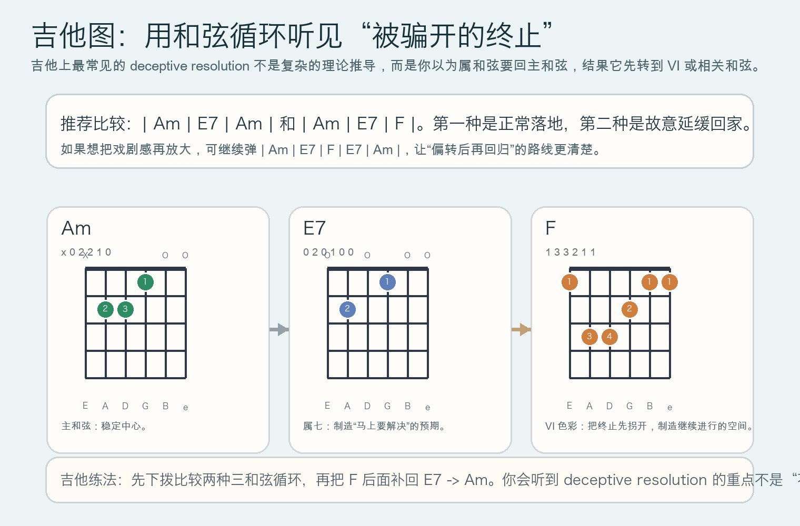

# 2026-05-19：延缓解决 Deceptive Resolution

## 今日知识点

今天只讲一个知识点：**什么是延缓解决（Deceptive Resolution），以及为什么它会让你产生“本来该结束了，却被故意拐开”的感觉**。

前几天我们刚比较过 `vii°7 -> i` 和 `V7 -> i`。那时重点是“这两种张力怎样真正回到主和弦”。今天顺着这个思路再往前走一步，不讲新的终止类型堆砌，而是专门看一种**故意不让终止立刻完成**的写法。

仍然用 `A` 小调举例：

- 预期中的正常解决：`E7 -> Am`
- 今天的延缓解决：`E7 -> F`

为什么 `E7 -> F` 会有戏剧感？

- 当你先听见 `E7`，耳朵通常已经准备好接受 `Am`
- 但作曲者故意不立刻回 `Am`，而是先转到 `F`
- 这样并不是“完全不解决”，而是把原本该出现的稳定感**先延后**

所以今天最重要的一句话是：

**Deceptive Resolution 不是把终止取消，而是把“本该现在落地”的感觉先骗开。**





## 钢琴使用场景

钢琴上，延缓解决最适合拿来做**乐句结尾的预期偏转**。

如果你写一段小调旋律，左手先给出 `E` 的低音，右手再弹出 `E7`，听者大多会觉得下一拍应该回到 `Am`。这时如果你真的回到 `Am`，句子就会显得完整、收束、稳定。

但如果你改成：

- 左手 `E -> F`
- 右手 `E7 -> F`

听感马上会变成：

- 明明已经快落地了
- 却被带去另一个和弦
- 句子因此还想继续往后走

钢琴上它特别适合：

- 小调段落结尾先不完全收住
- 想让下一句接得更自然
- 想制造一点“剧情还没结束”的感觉

最有效的训练不是单独弹 `E7 -> F`，而是把它和 `E7 -> Am` 连着比较。只要在同样速度下对比两次，你就会马上听到“真正落地”和“被暂时拐开”的差别。

## 吉他使用场景

吉他上，延缓解决常见于**伴奏里故意延后主和弦出现**。

最直接的练法就是比较这两条：

- `| Am | E7 | Am |`
- `| Am | E7 | F |`

第一条像正常终止：

- 属七和弦出现
- 主和弦回来
- 情绪收住

第二条像延缓解决：

- 属七和弦已经把期待拉起来
- 结果下一拍不是 `Am`
- 而是先去 `F`
- 这样副歌或下一句进入前，会更有“继续说下去”的空间

它在吉他上尤其适合：

- 民谣或抒情伴奏里制造意外感
- 电影感、叙事感更强的段落
- 本来要回主和弦，却故意多留一口气



## 可演奏例子

钢琴例子：

```text
例子 1（核心比较）
先弹：E G# B D -> A C E
再弹：E G# B D -> F A C
要求：两次都保持相同速度与力度，听一次是真正落地，一次是被拐开。

例子 2（四小节练法）
版本 A：| Am | E7 | Am | Am |
版本 B：| Am | E7 | F  | E7 |
要求：左手弹根音，右手弹和弦。版本 B 重点体会“结尾没有彻底结束”的感觉。
```

吉他例子：

```text
例子 1（最短对比）
| Am | E7 | Am |
| Am | E7 | F  |
每个和弦弹 4 下，连续做 5 轮。
重点听：第二条为什么会让你觉得“还没说完”。

例子 2（偏转后再回归）
| Am | E7 | F | E7 | Am |
先全下拨，再改成分解和弦。
重点听：F 不是最终归宿，它是把“本来立刻发生的终止”先拖后了。
```

## 今日练习

1. 在钢琴上连续比较 `E7 -> Am` 和 `E7 -> F` 各 8 次，每次弹完都说出“落地”还是“延缓”。
2. 练习左手低音移动：先弹 `E -> A`，再弹 `E -> F`，只用低音也感受两种收束感的差别。
3. 在吉他上循环弹 `| Am | E7 | Am |` 与 `| Am | E7 | F |`，每组至少 5 轮。
4. 再把 `| Am | E7 | F | E7 | Am |` 在钢琴和吉他上都弹一遍，体会“先拐开，再真正回家”的路线。
5. 用一句话回答：Deceptive Resolution 的关键，究竟是“不解决”，还是“先不立刻解决”？

## 一句话总结

延缓解决的本质不是取消终止，而是把“本该现在回家的终止感”先故意拖后。
