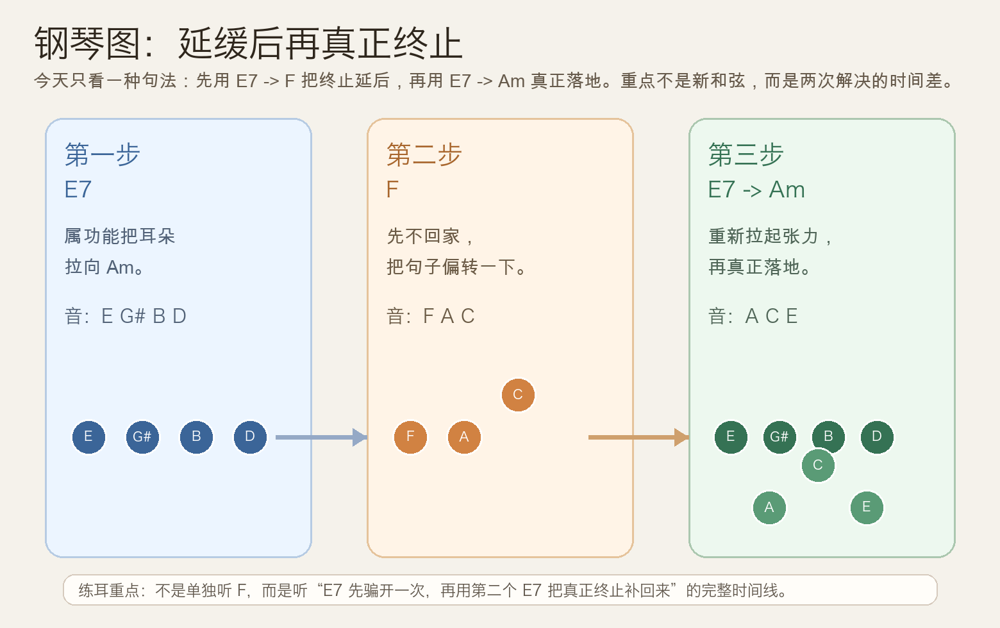
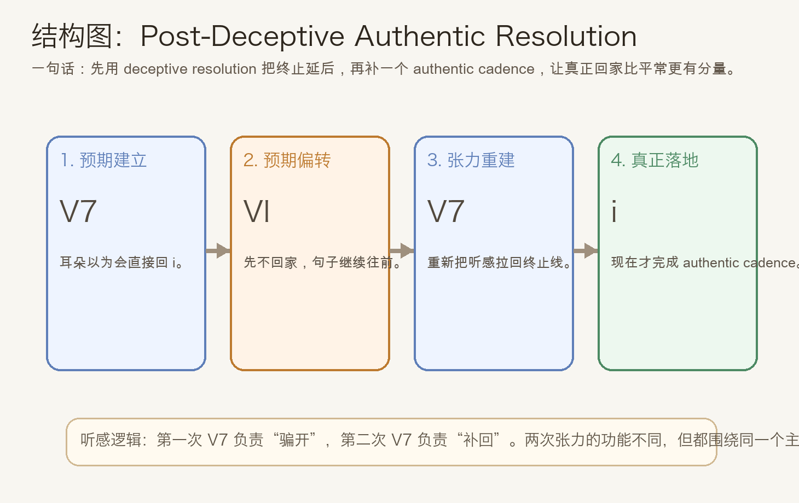
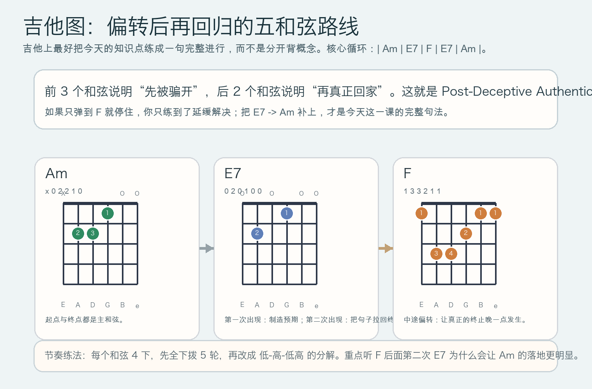

# 2026-05-19：延缓后再真正终止 Post-Deceptive Authentic Resolution

## 今日知识点

今天只讲一个知识点：**延缓解决之后，怎样再补一个真正的正格终止，让“回家”的感觉比直接 `V7 -> i` 更明显。**

上一课我们讲的是 `E7 -> F` 这种延缓解决。它的重点是“本来该回家，却先被拐开”。但音乐往往不会停在这里。很多时候，作曲者会在偏转之后，再补上一个真正的 `V7 -> i`，于是整句会出现两段很清楚的时间线：

- 第一段：`E7 -> F`，先把预期骗开
- 第二段：`E7 -> Am`，再把真正终止补回来

所以今天的核心不是新和弦，而是**同一个属功能在一句话里做两件不同的事**：

- 第一次 `E7` 负责制造“要终止”的预期
- 第二次 `E7` 负责把真正的终止完成

用 `A` 小调写成最短路线，就是：

```text
| Am | E7 | F | E7 | Am |
```

这条进行的听感逻辑非常重要：

1. `E7` 一出来，耳朵以为马上回 `Am`
2. 结果它先去了 `F`
3. 句子没有结束，反而继续推进
4. 后面再来一个 `E7`
5. 这次终于回到 `Am`

因此，今天最该记住的一句话是：

**Post-Deceptive Authentic Resolution 的关键，不是多弹一个和弦，而是把“被骗开”和“真正回家”分成前后两次来完成。**





## 钢琴使用场景

钢琴上，这个知识点非常适合用在**乐句尾声的扩展**。

如果你只弹 `E7 -> Am`，终止会很干脆，句子很快就收束。可如果你写成 `E7 -> F -> E7 -> Am`，感觉就不一样了：

- 第一个 `E7` 已经把终止感拉起来
- `F` 让这个终止感先悬住
- 第二个 `E7` 重新聚焦张力
- `Am` 才真正完成落地

这在钢琴上特别有用，因为你可以很明确地把不同层次分开：

- 左手弹低音路线：`A -> E -> F -> E -> A`
- 右手弹和弦或分解：`Am -> E7 -> F -> E7 -> Am`

这样练时，你会明显听到两件事：

- `E -> F` 是偏转，不是终点
- 第二次 `E -> A` 才是最终的回家

它很适合：

- 想把句尾拉长一点
- 想让真正终止更有戏剧性
- 想在小调里写出“先绕一下，再落地”的叙事感

## 吉他使用场景

吉他上，这个句法最适合做**副歌前后的伴奏推进**，或者做一段结尾时的情绪加码。

如果你只弹：

```text
| Am | E7 | Am |
```

它会显得直接、传统、很快结束。

但如果你改成：

```text
| Am | E7 | F | E7 | Am |
```

就会多出一个很清楚的层次：

- 第一个 `E7` 先把结尾感拉起来
- `F` 把这个结尾往后推迟
- 第二个 `E7` 再次强调“现在真的要结束了”
- `Am` 终于落地

吉他上它尤其适合：

- 民谣伴奏里把尾句写得更有起伏
- 抒情段落里制造“先忍一下，再放下”的情绪
- 让最后一个 `Am` 比平常更显得稳



## 可演奏例子

钢琴例子：

```text
例子 1（最核心）
左手：A -> E -> F -> E -> A
右手：Am -> E7 -> F -> E7 -> Am
要求：每个和弦一小节，踏板轻一点，不要让和声糊成一片。

例子 2（分两次理解）
第一遍只弹：Am -> E7 -> F
第二遍接着弹：F -> E7 -> Am
要求：先确认“被骗开”，再确认“真正回家”。
```

吉他例子：

```text
例子 1（和弦循环）
| Am | E7 | F | E7 | Am |
每个和弦下拨 4 次，连续弹 5 轮。
重点听：第二个 E7 为什么会让最后的 Am 更像真正终点。

例子 2（分解版）
| Am | E7 | F | E7 | Am |
节奏：低音 + 三次高音分解。
重点听：F 不是终点，它只是把终止往后拖了一拍。
```

## 今日练习

1. 在钢琴上把 `Am -> E7 -> F -> E7 -> Am` 连续弹 8 次，嘴里同时说出“预期 - 偏转 - 重建 - 落地”。
2. 单独比较 `E7 -> F` 和 `E7 -> Am`，确认自己能听出“延缓”和“终止完成”的差别。
3. 再把两者串起来，完整弹出 `E7 -> F -> E7 -> Am`，注意第二个 `E7` 的张力不要弹弱。
4. 在吉他上先做全下拨，再改成分解和弦，比较哪一种更容易听清“再终止”的层次。
5. 用一句话回答：今天这个知识点，和昨天最大的区别是什么？

## 一句话总结

延缓后再真正终止的本质，是先用 deceptive resolution 把结尾骗开，再用 authentic cadence 把真正的回家补回来。
