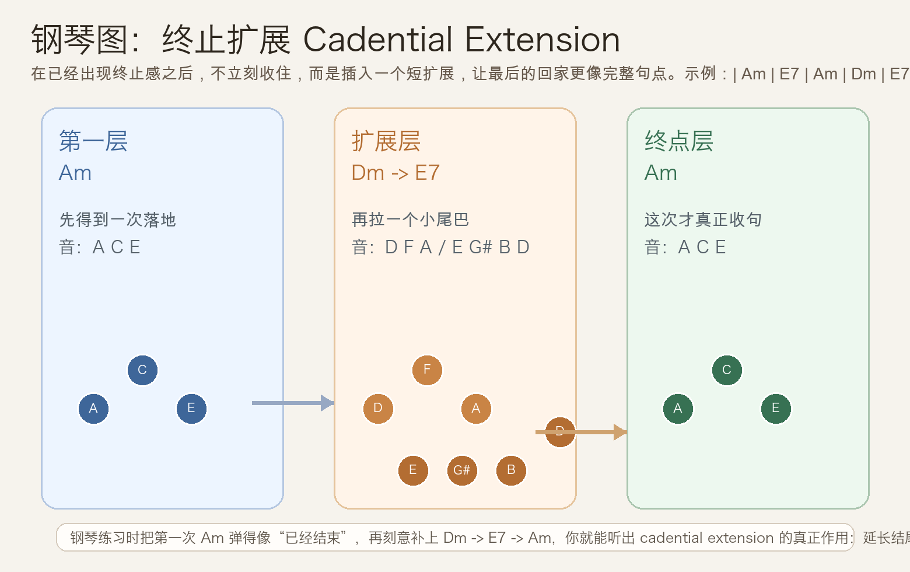
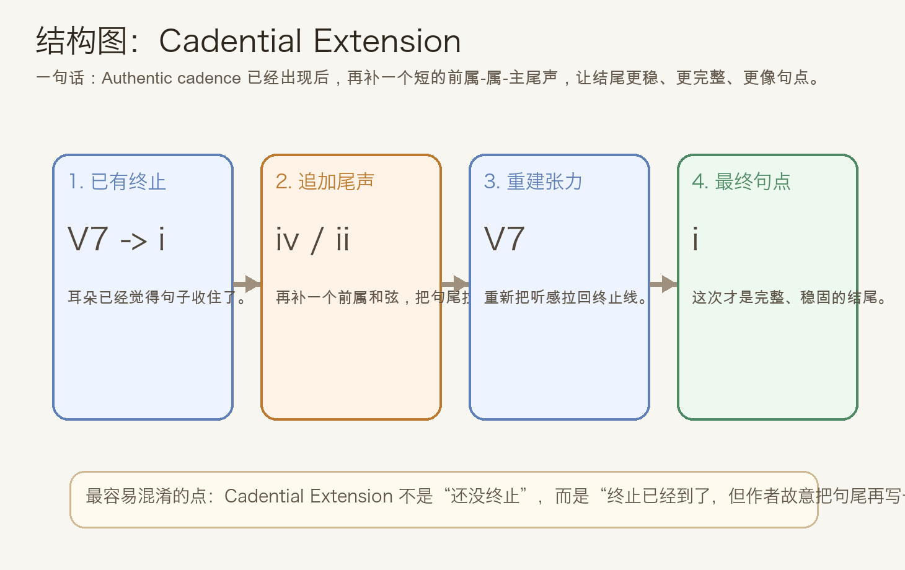
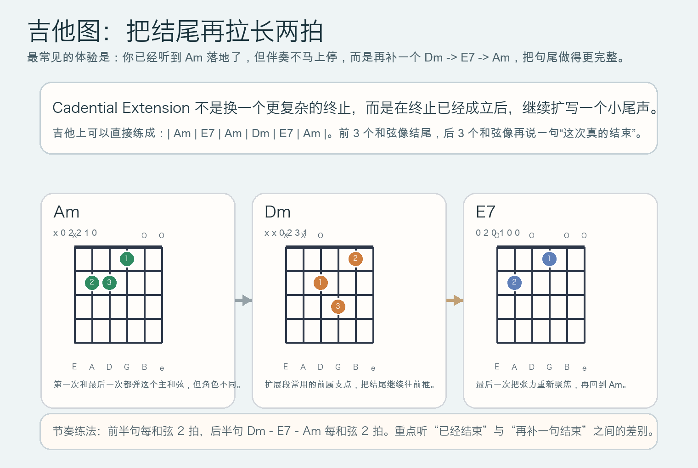

# 2026-05-20：终止扩展 Cadential Extension

## 今日知识点

今天只讲一个知识点：**Cadential Extension，也就是“终止已经出现之后，再把结尾延长一点”。**

昨天我们讲的是 `Am -> E7 -> F -> E7 -> Am` 这种“先偏转、再真正终止”的句法。它的重点在于：第一次属功能先不回家，后面再补一次真正的 `V7 -> i`。

今天再往前一步。现在假设那次真正终止已经完成了，耳朵已经听到“回家”了，但作曲者还是不马上停，而是在结尾后面再补一个很短的尾声，让句子更像完整段落的收束。这就是 **Cadential Extension**。

在 `A` 小调里，可以先用一个最短例子理解：

```text
| Am | E7 | Am | Dm | E7 | Am |
```

这条进行的核心听感是：

1. `Am -> E7 -> Am` 已经构成一次明确终止
2. 但音乐没有立刻停住
3. 它又加了一个 `Dm -> E7 -> Am`
4. 于是最后那个 `Am` 会比前一个 `Am` 更像真正句点

所以今天最该记住的一句话是：

**Cadential Extension 不是“还没终止”，而是“终止已经成立，再额外延长结尾”。**





## 钢琴使用场景

钢琴上，这个知识点最适合用在**乐句最后两到四小节的尾声设计**。

如果你只弹：

```text
| Am | E7 | Am |
```

它会显得很直接，像一句话说完就收住。

但如果你写成：

```text
| Am | E7 | Am | Dm | E7 | Am |
```

感觉就会明显更完整：

- 第一个 `Am` 已经像落地
- `Dm` 把尾声再接出来
- `E7` 重新聚焦张力
- 最后一个 `Am` 成为真正的句点

钢琴上你可以把这个层次练得很清楚：

- 左手弹低音路线：`A -> E -> A -> D -> E -> A`
- 右手弹和弦或分解：`Am -> E7 -> Am -> Dm -> E7 -> Am`

这样弹时，你会直接听到两个不同的“Am”：

- 前一个 `Am` 是“已经回家了”
- 后一个 `Am` 是“现在真的整句结束了”

它很适合：

- 写抒情段落的结尾
- 把乐句尾声拉长一点
- 让最后一个主和弦更稳、更像收尾

## 吉他使用场景

吉他上，Cadential Extension 很适合做**副歌收尾、段落收尾、或者弹唱里最后一轮的尾巴**。

如果只弹：

```text
| Am | E7 | Am |
```

结束感会很干净，但也很短。

改成：

```text
| Am | E7 | Am | Dm | E7 | Am |
```

你会多出一个很自然的尾声层次：

- 前半句先给出结尾
- 后半句再把结尾说完整

吉他上它尤其适合：

- 民谣弹唱最后一句不想太快结束
- 段落尾声想更完整、更有呼吸
- 想让最后一下 `Am` 比前面更重、更稳



## 可演奏例子

钢琴例子：

```text
例子 1（最核心）
左手：A -> E -> A -> D -> E -> A
右手：Am -> E7 -> Am -> Dm -> E7 -> Am
要求：每个和弦一小节，先把第 3 小节的 Am 弹得像“已经结束”，再让最后一小节更稳。

例子 2（对比练法）
先弹：Am -> E7 -> Am
再弹：Am -> E7 -> Am -> Dm -> E7 -> Am
要求：比较短终止和扩展终止的句尾长度差别。
```

吉他例子：

```text
例子 1（和弦循环）
| Am | E7 | Am | Dm | E7 | Am |
每个和弦下拨 4 次，连续弹 5 轮。
重点听：第一个 Am 已经像结束，为什么最后一个 Am 还是更像终点。

例子 2（尾声强化）
前 3 个和弦全下拨，后 3 个和弦改成分解。
重点听：后半句像不像“再说一句结尾”。
```

## 今日练习

1. 在钢琴上连续弹 6 轮 `Am -> E7 -> Am -> Dm -> E7 -> Am`，并刻意区分两个 `Am` 的角色。
2. 单独比较 `Am -> E7 -> Am` 和 `Am -> E7 -> Am -> Dm -> E7 -> Am`，确认自己能听出“正常终止”和“终止扩展”的差别。
3. 在吉他上把后 3 个和弦 `Dm -> E7 -> Am` 单独循环 8 次，练熟这个尾声手感。
4. 试着把今天的结构换到 `C` 大调，弹成 `C -> G7 -> C -> Dm -> G7 -> C`，确认你理解的不是某一个调，而是句法本身。
5. 用一句话回答：为什么 Cadential Extension 里的前一个主和弦不能直接等同于最后一句的终点？

## 一句话总结

终止扩展的本质，是在终止已经成立之后，再补一个短尾声，让最后的主和弦比前一次落地更像真正句点。
