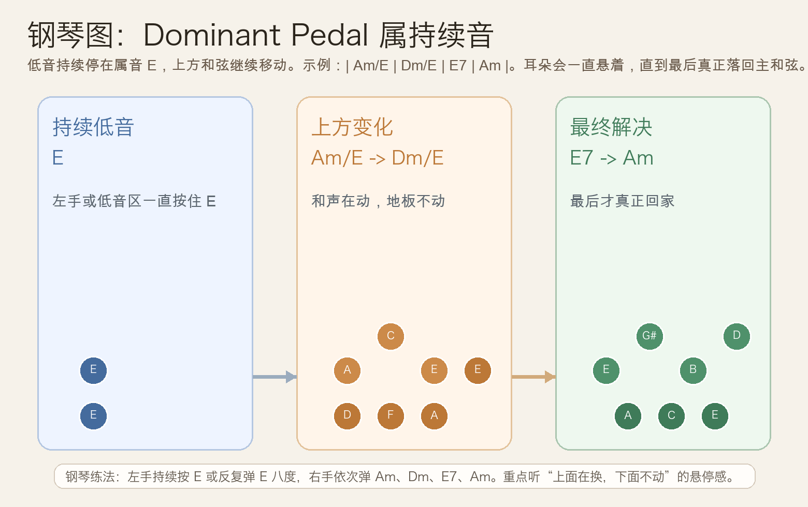
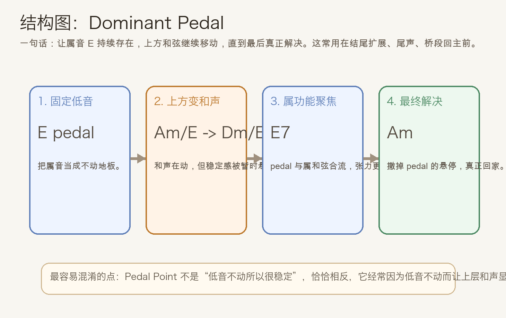
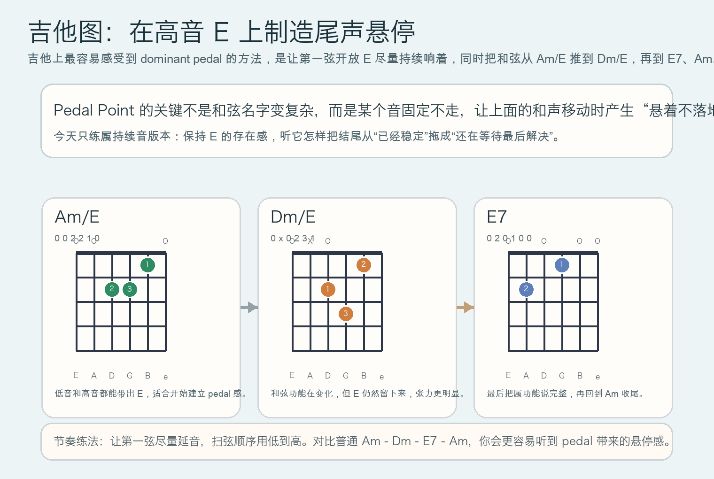

# 2026-05-21：属持续音 Dominant Pedal

## 今日知识点

今天只讲一个知识点：**Dominant Pedal，也就是“属持续音”**。

昨天你学的是 **Cadential Extension**，重点是“终止已经成立之后，再把结尾延长一点”。今天顺着这个思路继续往前走，但只前进一步：**如果尾声里低音一直不走，持续停在属音上，会发生什么？**

在 `A` 小调里，最容易听懂的版本是：

```text
| Am/E | Dm/E | E7 | Am |
```

这里真正的重点，不是每个斜杠和弦的名字，而是：

1. 低音一直围绕 `E` 这个属音
2. 上方和声却在变化
3. 所以耳朵会一直觉得“还悬着、还没完全落地”
4. 直到最后回到 `Am`，解决感才真正出现

这就是 **Dominant Pedal** 的核心作用：

**用一个持续不动的属音，制造长时间的等待感和悬停感。**





## 钢琴使用场景

钢琴上，Dominant Pedal 最常见的用法之一，就是**结尾前后的尾声组织**。

如果你弹的是普通版本：

```text
| Am | Dm | E7 | Am |
```

每个和弦都跟着低音一起移动，听感会比较直接。

但如果改成：

```text
| Am/E | Dm/E | E7 | Am |
```

感觉就会不一样：

- 左手一直维持 `E`
- 右手从 `Am` 变到 `Dm`
- 虽然表面上和弦在换，但底下那块“地板”不动
- 所以音乐会有一种**停在门口、迟迟不进去**的感觉

钢琴上最实用的练法是：

- 左手持续按住 `E`，或者反复弹 `E` 八度
- 右手依次弹 `Am`、`Dm`、`E7`、`Am`

这样你会很直观地听到两种力量同时存在：

- 上层和声在推进
- 底层属音在拖住解决

它很适合：

- 段落尾声想再拉一点张力
- 电影配乐或抒情段落里制造悬停
- 让最后一次回到主和弦显得更珍贵、更像真正结尾

## 吉他使用场景

吉他上，Dominant Pedal 很适合通过**开放弦延音**来做。

今天这个主题最实用的入口，不是先记复杂理论，而是直接感受：**让高音或低音的 `E` 尽量持续响着，同时更换和弦。**

比如你可以练：

```text
| Am/E | Dm/E | E7 | Am |
```

这组和弦的关键体验是：

- `Am/E` 里就已经带着 `E`
- `Dm/E` 会让你明显感觉“不太稳定，但很有味道”
- 到 `E7` 时，属功能终于被明确说出来
- 最后 `Am` 才把之前一直悬着的感觉收住



吉他上它尤其适合：

- 民谣或指弹里让某根开放弦持续当“公共音”
- 副歌尾声不想一下子收干净时
- 编配里想让段落结束前多一点等待感

## 可演奏例子

钢琴例子：

```text
例子 1（基础 Dominant Pedal）
左手：E - E - E - E
右手：Am -> Dm -> E7 -> Am
要求：每个和弦 1 小节，左手不要换音，专门听“属音持续不动”带来的悬停感。

例子 2（和昨天对比）
先弹：Am -> E7 -> Am -> Dm -> E7 -> Am
再弹：Am/E -> Dm/E -> E7 -> Am
要求：比较“终止扩展”和“属持续音”哪一种更像在门口停住不进屋。
```

吉他例子：

```text
例子 1（开放弦保持）
| Am/E | Dm/E | E7 | Am |
每个和弦扫 4 下，尽量让第一弦开放 E 保持延音。

例子 2（分解和弦）
低音先拨 E，再拨和弦高音部分。
顺序：E + Am上层 -> E + Dm上层 -> E7 -> Am
重点听：同一个 E 怎样把不同和弦串成一条“还没真正结束”的线。
```

## 今日练习

1. 在钢琴上连续弹 8 轮 `Am/E -> Dm/E -> E7 -> Am`，左手始终保持 `E` 的存在感。
2. 单独比较 `Am -> Dm -> E7 -> Am` 和 `Am/E -> Dm/E -> E7 -> Am`，确认自己能听出哪一个版本更“悬着”。
3. 在吉他上练 `Am/E` 与 `Dm/E` 的切换，尽量不要让开放弦 `E` 断掉。
4. 把今天的思路搬到 `C` 大调，尝试弹 `C/G -> F/G -> G7 -> C`，理解的是“属持续音”这个句法，而不是只会背 `A` 小调。
5. 用一句话回答：为什么 Pedal Point 里的固定低音，反而常常会增强张力，而不是减弱张力？

## 一句话总结

Dominant Pedal 的本质，是让属音持续不动、上方和声继续前进，从而把结尾的等待感拉长，直到最后真正解决。
