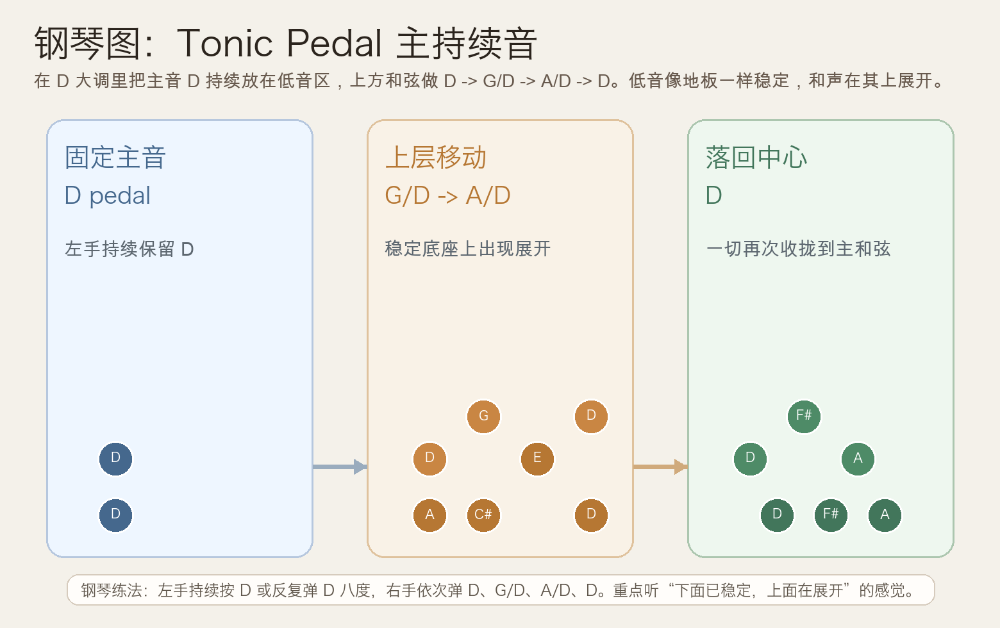
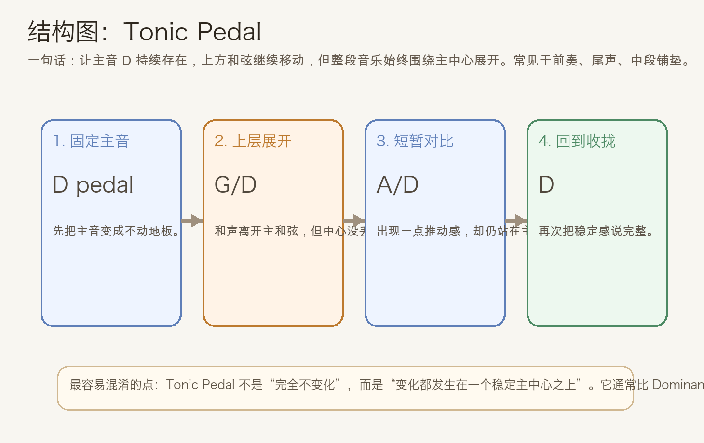
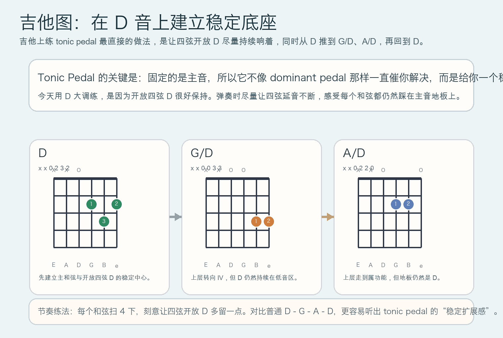

# 2026-05-25：主持续音 Tonic Pedal

## 今日知识点

今天只讲一个知识点：**Tonic Pedal，也就是“主持续音”**。

上次你学的是 **Dominant Pedal**，重点是“属音持续不动，会把结尾的等待感拉长”。今天继续讲 pedal point，但只换一个关键条件：**把固定低音从属音换成主音**。

这样一来，听感会明显不同。

在 `D` 大调里，一个很典型的例子是：

```text
| D | G/D | A/D | D |
```

这里真正要抓住的是：

1. 低音一直围绕 `D` 这个主音
2. 上方和声虽然在变化，但主中心没有丢
3. 所以听感不像 dominant pedal 那样“悬着等解决”
4. 而更像“已经站稳了，只是在这个稳定地板上展开颜色”

这就是 **Tonic Pedal** 的核心作用：

**用一个持续不动的主音，给整段和声提供稳定底座。**





## 钢琴使用场景

钢琴上，Tonic Pedal 很适合用在**前奏、尾声、抒情段的铺底**。

如果你直接弹：

```text
| D | G | A | D |
```

每个和弦都跟着低音一起移动，句子会比较明确地向前推进。

但如果改成：

```text
| D | G/D | A/D | D |
```

感觉就会改变：

- 左手一直保留 `D`
- 右手从 `D` 变到 `G`、`A`
- 表面上和弦在动，但音乐始终像“踩在主和弦地板上”
- 所以整段会更稳，更像在主中心内部展开，而不是离开主中心去冒险

钢琴上最实用的练法是：

- 左手持续按住 `D`，或者反复弹 `D` 八度
- 右手依次弹 `D`、`G`、`A`、`D`

这样你会很直接地听到两层关系：

- 上层和声在移动
- 底层主音在维持归属感

它很适合：

- 歌曲前奏想先建立调性感
- 段落尾声已经稳定，但还想继续延长一点空间
- 配乐里想制造“宽阔、稳定、站住脚”的底色

## 吉他使用场景

吉他上，Tonic Pedal 很适合借助**开放弦延音**来做。

今天选 `D` 大调，是因为开放四弦 `D` 很容易持续保留。一个上手很快的练法是：

```text
| D | G/D | A/D | D |
```

这组和弦的关键体验是：

- `D` 先把主中心说清楚
- `G/D` 让上层变成 IV 功能，但低音仍然站在主音上
- `A/D` 带来一点推动感，可是因为低音没离开 `D`，它不像普通 `A` 那么强烈催你往前
- 回到 `D` 时，会觉得整句一直都在“家里”活动



吉他上它尤其适合：

- 民谣前奏里保持开放弦共鸣
- 指弹伴奏里做稳定的低音踏板
- 副歌结束后不想突然收掉，而是平稳地延长气氛

## 可演奏例子

钢琴例子：

```text
例子 1（基础 Tonic Pedal）
左手：D - D - D - D
右手：D -> G/D -> A/D -> D
要求：每个和弦 1 小节，左手不要换音，专门听“主音一直在场”带来的稳定感。

例子 2（和上次对比）
先弹：D -> G -> A -> D
再弹：D -> G/D -> A/D -> D
要求：比较普通和声进行和 tonic pedal 版本，哪一个更像“始终踩在同一块地板上”。
```

吉他例子：

```text
例子 1（开放四弦保持）
| D | G/D | A/D | D |
每个和弦扫 4 下，尽量让四弦开放 D 持续响着。

例子 2（分解和弦）
先拨四弦 D，再拨和弦高音部分。
顺序：D低音 + D上层 -> D低音 + G上层 -> D低音 + A上层 -> D
重点听：同一个 D 怎样把不同和声都收在主中心里。
```

## 今日练习

1. 在钢琴上连续弹 8 轮 `D -> G/D -> A/D -> D`，左手始终保持 `D` 的存在感。
2. 单独比较 `D -> G -> A -> D` 和 `D -> G/D -> A/D -> D`，确认自己能听出哪一个版本更稳、更像在主和弦内部展开。
3. 在吉他上练 `D`、`G/D`、`A/D` 三个形状，尽量不要让开放四弦 `D` 断掉。
4. 把今天的思路搬到 `C` 大调，尝试弹 `C -> F/C -> G/C -> C`，理解的是“主持续音”这个句法，而不是只会背 `D` 大调。
5. 用一句话回答：为什么主持续音会让和声变化听起来更稳，而不是更乱？

## 一句话总结

Tonic Pedal 的本质，是让主音持续不动、上方和声继续展开，从而让整段音乐始终稳稳地站在同一个主中心上。
