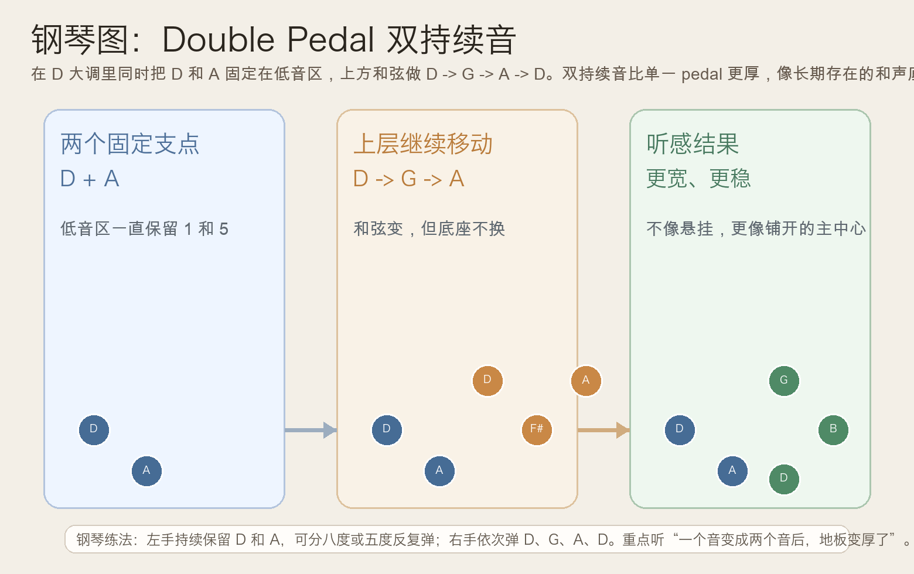
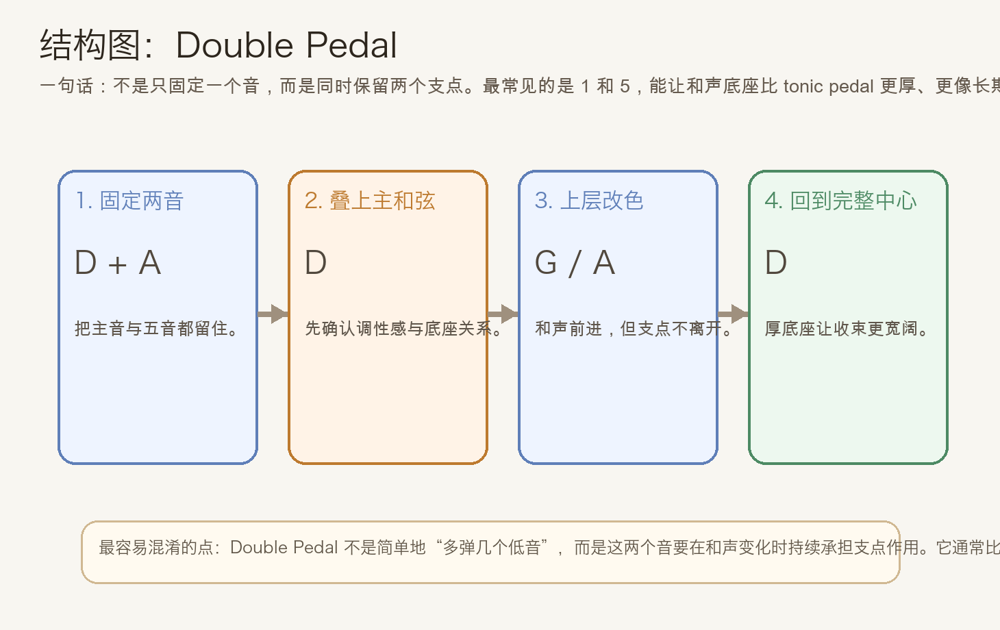
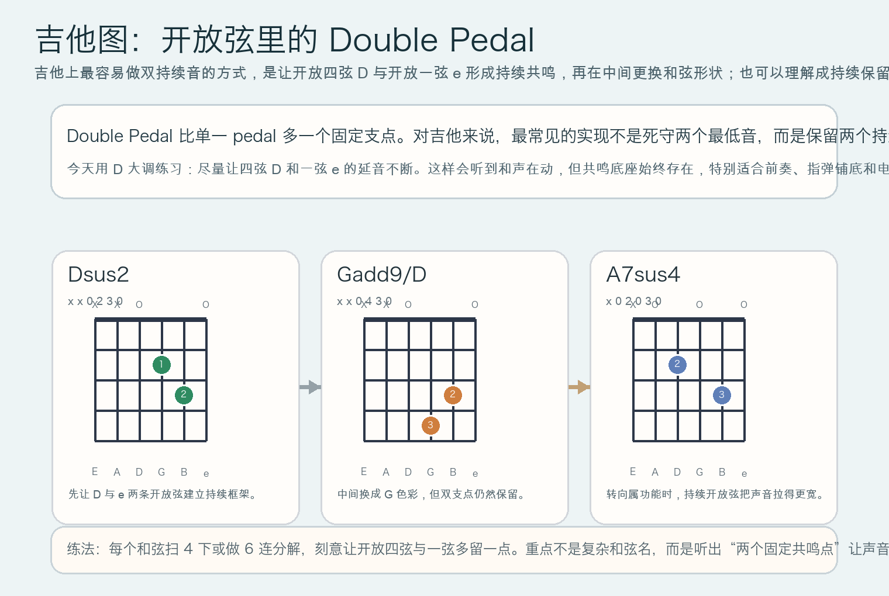

# 2026-05-27：双持续音 Double Pedal

## 今日知识点

今天只讲一个知识点：**Double Pedal，也就是“双持续音”**。

上次你学的是 **Tonic Pedal**，重点是“固定一个主音，让上方和声继续展开”。今天只往前多走一步：**把固定支点从一个音，扩展成两个音**。

最常见的双持续音，是同时保留 **1 级和 5 级**。在 `D` 大调里，就是让 `D` 和 `A` 长时间存在。

一个基础例子可以先这样理解：

```text
低音支点：D + A 持续存在
上层和声：D -> G -> A -> D
```

真正要抓住的是：

1. 固定的不再只是一个音，而是两个互相支撑的音
2. 上层和声虽然继续移动，但底部框架更厚、更稳
3. 所以听感通常不像 dominant pedal 那样紧张，也比单一 tonic pedal 更宽
4. 它很适合做前奏铺底、尾声延展、配乐里的长线背景

这就是 **Double Pedal** 的核心作用：

**用两个持续存在的支点，把和声底座加厚。**





## 钢琴使用场景

钢琴上，Double Pedal 很适合用在**宽阔前奏、电影感尾声、抒情段的大面积铺底**。

如果你只弹单一主持续音：

```text
左手：D
右手：D -> G -> A -> D
```

已经会有稳定感。

但如果改成双持续音：

```text
左手：D + A 持续
右手：D -> G -> A -> D
```

听感会再变一步：

- `D` 负责把主中心站稳
- `A` 让这个主中心多出一个支撑点
- 上方和声即使离开主和弦，也不会像普通低音移动那样“脚下变空”
- 所以整个段落会更像“在同一片地板上铺开”，而不是“一个点撑着所有变化”

钢琴上最实用的练法是：

- 左手持续弹 `D-A` 五度，或分解成 `D-A-D-A`
- 右手依次弹 `D`、`G`、`A`、`D`

它尤其适合：

- 前奏想先把主中心和空间感一起建立出来
- 结尾已经稳定，但还想再拉长一点气氛
- 配乐里需要“底下不走、上面慢慢变色”的大面积和声

## 吉他使用场景

吉他上，Double Pedal 常常不是机械地死守两个最低音，而是**保留两个持续共鸣的开放弦**。

今天选 `D` 大调来练，因为开放四弦 `D` 和开放一弦 `e` 很容易一直响着。一个很顺手的思路是：

```text
| Dsus2 | Gadd9/D | A7sus4 | D |
```

这一组和弦的重点不是名字有多复杂，而是它们都尽量保留了相近的开放弦支点。



吉他上它尤其适合：

- 民谣或指弹前奏里保留开放弦共鸣
- 尾奏不想立刻收干，而想让声音继续铺开
- 影视配乐风格的刷弦或分解，让和声换了但空气感不散

和普通和弦连接相比，Double Pedal 的价值在于：

- 你会更清楚听到“固定框架”
- 和弦变化不会显得太跳
- 声音会更厚、更连贯

## 可演奏例子

钢琴例子：

```text
例子 1（基础双持续音）
左手：D-A | D-A | D-A | D-A
右手：D | G | A | D
要求：每个和弦 1 小节，左手始终不要离开 D 和 A。

例子 2（和上次对比）
先弹：左手只保留 D，右手 D -> G -> A -> D
再弹：左手保留 D+A，右手 D -> G -> A -> D
要求：比较单持续音和双持续音，哪一个更厚、更像整片底座。
```

吉他例子：

```text
例子 1（开放弦保持）
| Dsus2 | Gadd9/D | A7sus4 | D |
每个和弦扫 4 下，尽量让开放四弦 D 和一弦 e 持续共鸣。

例子 2（分解和弦）
先拨低音，再拨中间与高音弦。
顺序：低音支点 -> 和弦内部音 -> 高音开放弦
重点听：和弦在变，但有两条共鸣线一直没走。
```

## 今日练习

1. 在钢琴上连续弹 8 轮 `D/A` 双持续音配 `D -> G -> A -> D`，左手不要让 `D` 和 `A` 同时消失。
2. 对比单一 `Tonic Pedal` 和今天的 `Double Pedal`，写一句你自己听到的区别。
3. 在吉他上练 `Dsus2 -> Gadd9/D -> A7sus4 -> D`，刻意保留开放四弦和一弦的延音。
4. 把今天的思路搬到 `C` 大调，尝试让 `C` 和 `G` 成为双持续音，再配 `C -> F -> G -> C`。
5. 用一句话回答：为什么两个固定支点会比一个固定支点更有“铺底感”？

## 一句话总结

Double Pedal 的本质，是让两个支点同时持续存在，从而把和声底座加厚，让音乐在变化中依然保持宽阔而稳定的中心。
