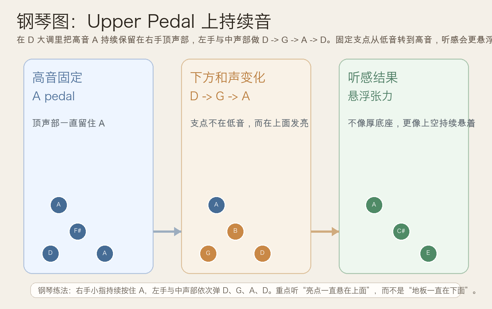
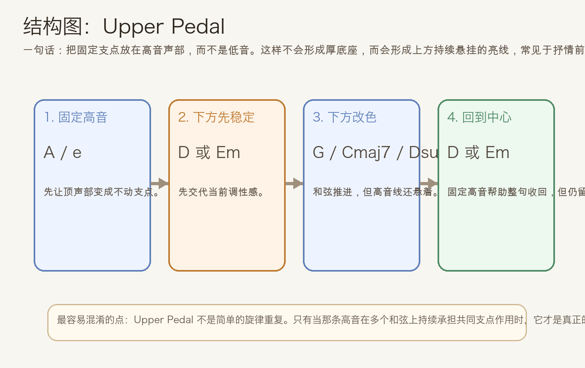
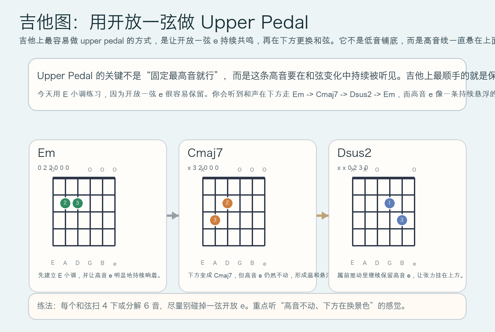

# 2026-05-28：上持续音 Upper Pedal

## 今日知识点

今天只讲一个知识点：**Upper Pedal，也就是“上持续音”**。

上次你学的是 **Double Pedal**，重点是“把一个固定支点扩展成两个固定支点，让底座更厚”。今天继续顺着 pedal point 往前推进，但做一个关键变化：

**把固定支点从低音区，转移到高音区。**

最容易理解的基础模型是：

```text
高音支点：A 持续存在
下方和声：D -> G -> A -> D
```

真正要抓住的是：

1. 固定的音还在，但它不再负责“铺底”，而是负责“悬在上面”
2. 低音和中间声部可以继续变化，高音支点像一条一直亮着的线
3. 所以听感通常不像 tonic pedal 或 double pedal 那样厚，而更像悬浮、发光、带一点持续张力
4. 它很适合抒情前奏、电影配乐、分解和弦织体和尾声里的高音延留

这就是 **Upper Pedal** 的核心作用：

**用一个持续不动的高音，把和声变化统一到同一条上方共鸣线上。**





## 钢琴使用场景

钢琴上，Upper Pedal 很适合用在**右手琶音、抒情慢板、电影感前奏和尾声高音延留**。

如果你把固定音放在低音：

```text
左手：D pedal
右手：D -> G -> A -> D
```

你听到的会是“底下很稳，上面在展开”。

但如果改成上持续音：

```text
右手最高音：A 一直保留
左手与中声部：D -> G -> A -> D
```

听感会变成：

- 低音并不一定固定
- 变化主要发生在下方和声
- 顶声部 A 让整句像被一条高音线串起来
- 即使和声切换，耳朵仍然会被这条上方亮点吸住

钢琴上最实用的练法是：

- 右手小指持续按住 `A`
- 其余手指补出 `D`、`G`、`A`、`D` 的和声
- 左手正常弹低音，不必像 pedal bass 一样一直不动

它尤其适合：

- 旋律还没正式开始前，先制造悬浮气氛
- 结尾不想完全落地，而想留一点“还在空中发亮”的感觉
- 分解和弦伴奏里，让一条高音始终保持存在感

## 吉他使用场景

吉他上，Upper Pedal 最常见的做法不是硬按住一个高把位高音，而是**保留一根高音开放弦作为持续共鸣线**。

今天选 `E` 小调来练，因为开放一弦 `e` 很容易持续响着。一个很顺手的例子是：

```text
| Em | Cmaj7 | Dsus2 | Em |
```

这组和弦的重点不是和弦名字本身，而是：

- 它们都能自然保留高音开放一弦 `e`
- 和弦在下方变化，但最高音线不动
- 这会让声音像一直有一条细亮的线悬在最上面



吉他上它尤其适合：

- 民谣分解和弦里保留高音开放弦
- 指弹前奏里制造空灵、悬浮感
- 配乐型刷弦里让和弦变化更连贯、更有空气感

和普通和弦连接相比，Upper Pedal 的价值在于：

- 高音线有连续性
- 和声虽然在变，但顶部不会“断气”
- 整体听感更像一层罩在上面的共鸣光泽

## 可演奏例子

钢琴例子：

```text
例子 1（基础上持续音）
右手最高音：A - A - A - A
右手内部音：F# -> G -> C# -> F#
左手低音：D -> G -> A -> D
要求：最高音 A 每小节都保留，重点听下方变化与上方不动的对比。

例子 2（和前几天对比）
先弹：左手做 D pedal，右手弹 D -> G -> A -> D
再弹：右手保留 A，左手与中声部做 D -> G -> A -> D
要求：比较“低音固定”与“高音固定”带来的稳定感和张力位置差异。
```

吉他例子：

```text
例子 1（开放一弦保持）
| Em | Cmaj7 | Dsus2 | Em |
每个和弦扫 4 下，尽量让一弦开放 e 一直共鸣。

例子 2（分解和弦）
顺序：低音 -> 中间弦 -> 高音一弦
要求：每次都让最后的一弦 e 明显响出来，听高音线是否像固定在空中。
```

## 今日练习

1. 在钢琴上连续弹 8 轮“高音 A 保持不动，低音做 `D -> G -> A -> D`”，感受高音支点与低音支点的区别。
2. 对比 `Tonic Pedal`、`Double Pedal`、`Upper Pedal`，写一句你听到的差别。
3. 在吉他上练 `Em -> Cmaj7 -> Dsus2 -> Em`，刻意让开放一弦 `e` 每个和弦都清楚响出来。
4. 把今天的思路搬到 `C` 大调，尝试让高音 `G` 成为 upper pedal，再配 `C -> F -> G -> C`。
5. 用一句话回答：为什么 upper pedal 的听感更像“悬浮线条”，而不是“厚底座”？

## 一句话总结

Upper Pedal 的本质，是让高音支点在多个和弦上持续存在，从而把和声变化统一成一条悬在上方、持续发亮的共鸣线。
