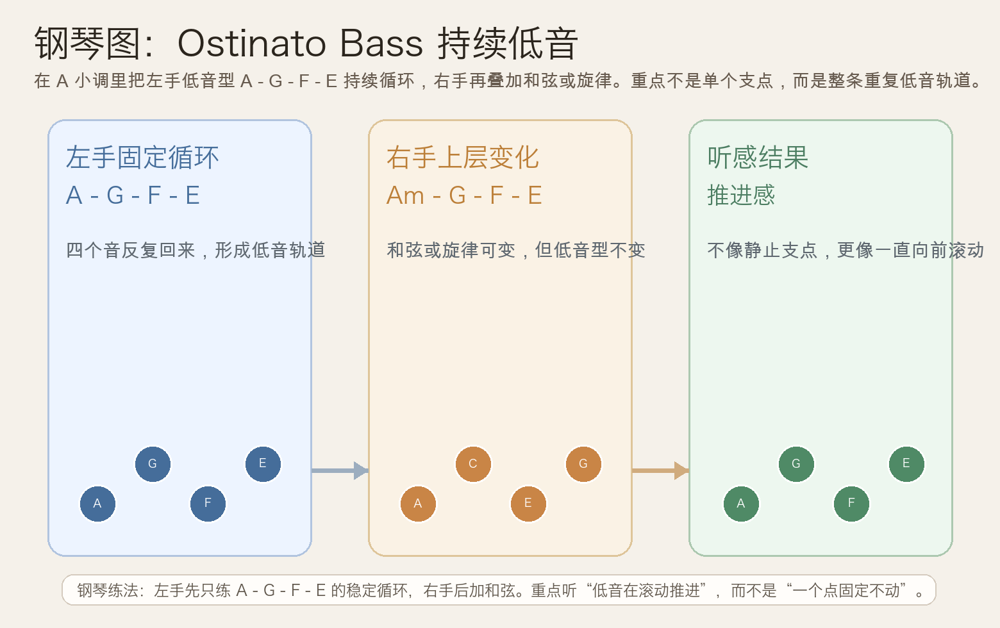
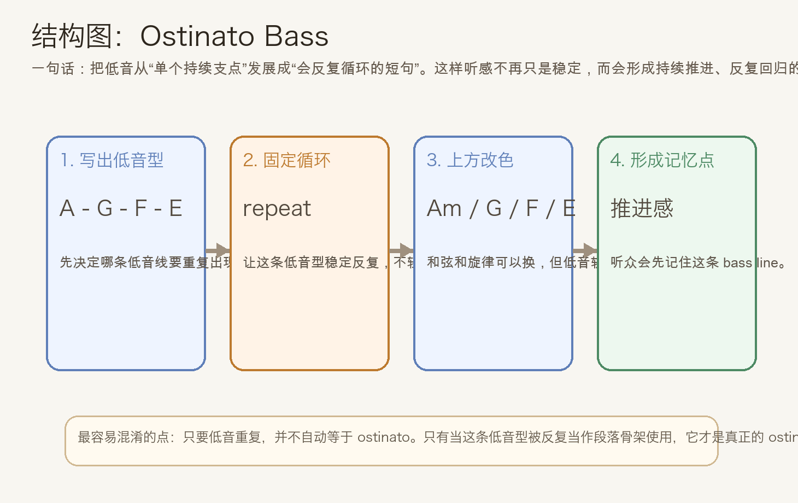
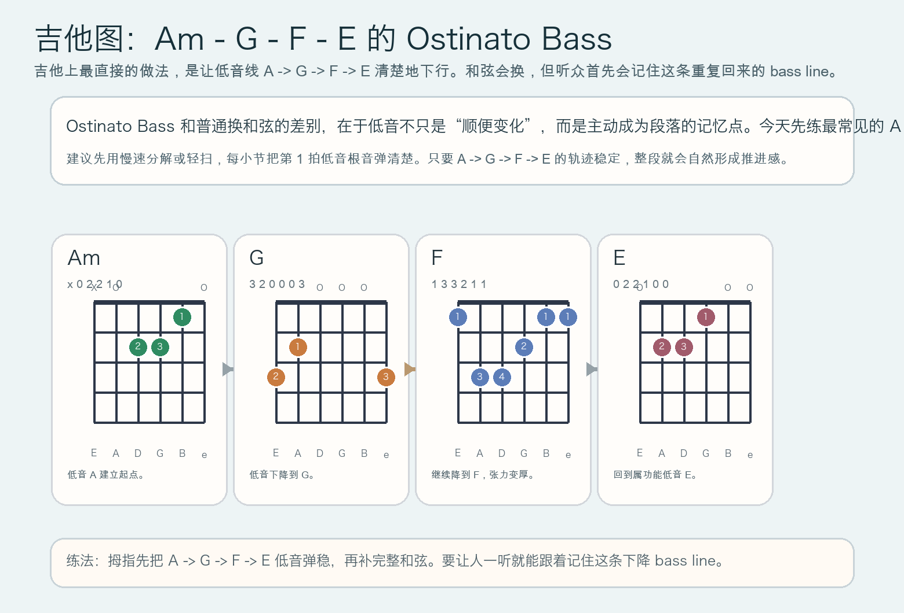

# 2026-05-29：持续低音 Ostinato Bass

## 今日知识点

今天只讲一个知识点：**Ostinato Bass，也就是“持续低音”或“固定重复低音型”**。

上次你学的是 **Upper Pedal**，重点是“让一个高音持续悬在上方”。今天继续顺着“固定支点”往前推进，但再往前走一步：

**固定的不再只是一个音，而是一整个会重复出现的低音动机。**

最容易理解的基础模型是：

```text
低音反复：A - G - F - E
上方和声：Am - G - F - E
```

真正要抓住的是：

1. ostinato 的核心不是“低音很慢”，而是“低音型会反复回来”
2. 这个重复型会给整段音乐建立稳定的推进轨道
3. 上方旋律和和声可以变化，但听众会一直记住这条循环的低音线
4. 它很适合段落推进、流行编曲里的循环伴奏、电影配乐的压迫感，以及巴洛克式反复基础

这就是 **Ostinato Bass** 的核心作用：

**用一个不断重复的低音型，给整段音乐提供持续的前进感和结构黏性。**





## 钢琴使用场景

钢琴上，Ostinato Bass 很常见于**左手反复低音型、流行钢琴伴奏、电影配乐铺垫和极简主义循环织体**。

今天用 `A` 小调练一个最直观的版本：

```text
左手：A - G - F - E（持续循环）
右手：Am - G - F - E 或在其上方写旋律
```

这和 pedal point 最大的不同是：

- pedal point 通常固定一个支点不动
- ostinato bass 会重复一个完整的短句
- 这个短句会让音乐像被轨道带着前进
- 即使上方旋律变化，低音循环仍然会不断提醒听众“这一段的重心还在这里”

钢琴上它尤其适合：

- 左手固定成 4 音或 8 音循环，右手自由写旋律
- 流行歌主歌里制造稳定推进
- 配乐里通过重复制造紧张、执拗、神秘感

最实用的练法是：

- 左手先单音稳定弹 `A - G - F - E`
- 右手先只补整拍和弦 `Am - G - F - E`
- 熟了以后，右手再改成分解和弦或简短旋律

## 吉他使用场景

吉他上，Ostinato Bass 很常见于**交替低音、riff 型伴奏、民谣分解和弦里的固定低音走向**。

今天也用 `A` 小调来练，因为下面这个循环非常直接：

```text
| Am | G | F | E |
低音线：A -> G -> F -> E
```

重点不是只会按四个和弦，而是：

- 每次换和弦时都要把根音走向弹清楚
- 听众会先记住低音线的下降轨迹
- 上方刷弦或分解只是把这个低音骨架“着色”



吉他上它尤其适合：

- 指弹里拇指持续负责低音循环
- 民谣或摇滚编曲里把低音走向做成 hook
- 用固定 bass riff 带动整个段落的推进

和普通和弦连接相比，Ostinato Bass 的价值在于：

- 低音不只是“换和弦顺便变”，而是主动承担段落记忆点
- 重复会让律动更稳，结构更清楚
- 你会明显感觉音乐被某条路径一直向前拉

## 可演奏例子

钢琴例子：

```text
例子 1（基础持续低音）
左手：A - G - F - E，循环 4 次
右手：Am - G - F - E
要求：左手节拍稳定，不要越弹越急，重点听“循环感”。

例子 2（右手加旋律）
左手：A - G - F - E
右手旋律：C - B - A - G
要求：右手可以变化，但左手低音型必须像轨道一样稳定重复。
```

吉他例子：

```text
例子 1（分解和弦）
| Am | G | F | E |
每个和弦弹 4 拍，优先把每小节第 1 拍的低音根音弹得更清楚。

例子 2（交替低音）
Am：A 弦 -> G 弦
G：6 弦 -> 3 弦
F：6 弦 -> 3 弦
E：6 弦 -> 4 弦
要求：让拇指持续给出下降低音线，其他手指补上和弦质感。
```

## 今日练习

1. 在钢琴上连续弹 8 轮左手 `A - G - F - E`，要求每轮速度一致、力度均匀。
2. 右手分别尝试整拍和弦、分解和弦、单音旋律三种写法，体会同一低音循环如何支撑不同上层材料。
3. 在吉他上练 `Am -> G -> F -> E`，每个和弦先慢速扫弦，再改成分解。
4. 把今天的思路搬到 `C` 大调，尝试写一个自己的 4 音 ostinato bass。
5. 用一句话回答：为什么 ostinato bass 比单个 pedal point 更有“向前走”的感觉？

## 一句话总结

Ostinato Bass 的本质，是让一个低音动机持续重复出现，用循环本身把和声、旋律和整段推进牢牢绑在同一条轨道上。
