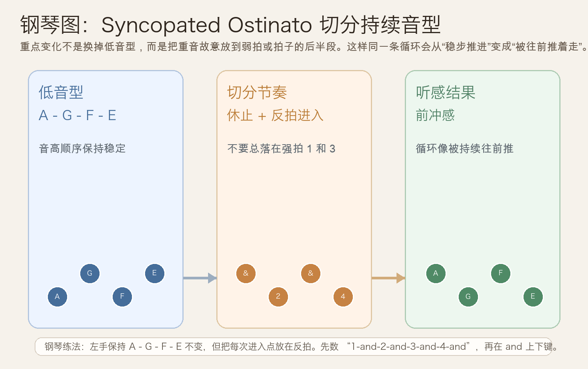
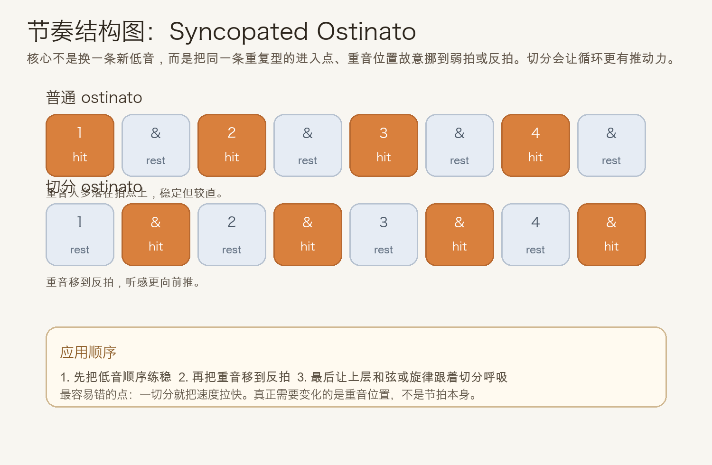
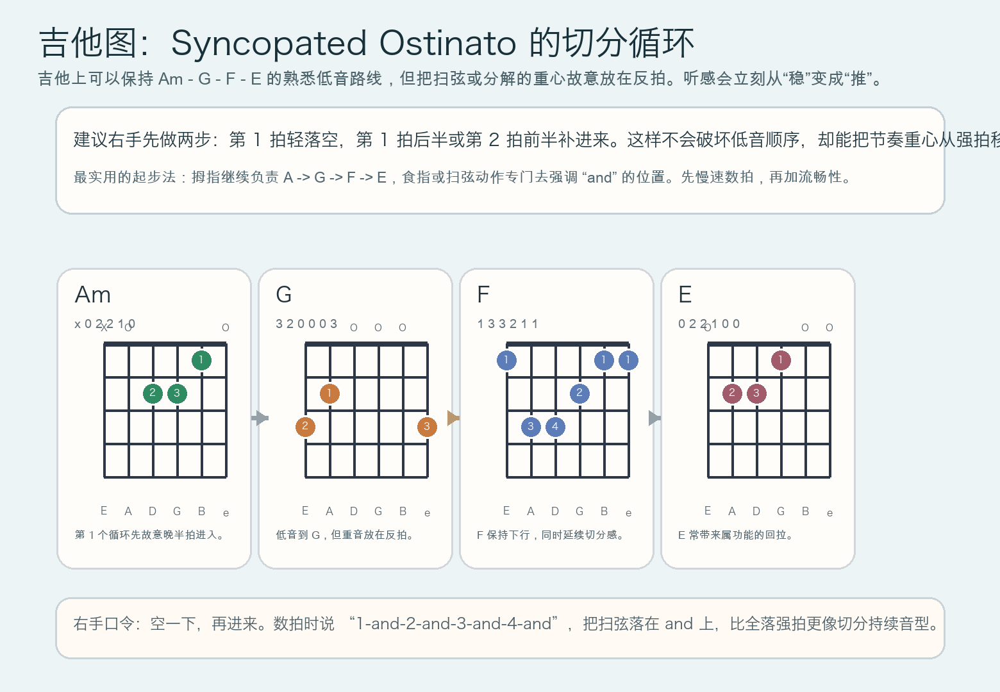

# 2026-05-30：持续音型中的切分重复 Syncopated Ostinato

## 今日知识点

今天只讲一个知识点：**Syncopated Ostinato，也就是“带切分的持续音型”**。

上次你学的是 **Ostinato Bass**，重点是“让一条低音动机不断重复”。今天继续顺着这个思路往前推进，但关键变化不在音高，而在**节奏重心**：

**同一条重复型，如果故意不总是落在强拍，而是落在弱拍或反拍，就会从“稳定循环”变成“被持续往前推的循环”。**

最容易理解的基础模型是：

```text
低音顺序：A - G - F - E
普通进入：1   2   3   4
切分进入：&   2&  3&  4&
```

真正要抓住的是：

1. syncopated ostinato 不是重新写一个 bass line，而是给原本的循环换一个重音逻辑
2. 切分最常见的效果，是让音符晚半拍进入，或者把强调从拍点移到反拍
3. 这样做不会破坏循环的可记忆性，反而会增强它的推动力
4. 它很适合流行、放克、拉丁、电影配乐里那种“明明循环不复杂，但整段一直向前冲”的感觉

这就是 **Syncopated Ostinato** 的核心作用：

**用固定重复型保持结构稳定，再用切分把节奏重心推离强拍，让循环更有前冲感。**





## 钢琴使用场景

钢琴上，Syncopated Ostinato 很常见于**左手切分低音、流行钢琴伴奏、拉丁风格循环、极简重复型里的节奏推进**。

今天继续用 `A` 小调练一个最直观的版本：

```text
左手低音：A - G - F - E（循环）
节奏口令：休止半拍后进入，尽量把音落在 and 上
右手：Am - G - F - E 或短旋律
```

和昨天的普通 ostinato 相比，区别在于：

- 昨天强调“重复回来”
- 今天强调“重复回来时不要老踩在强拍上”
- 低音顺序可以相同，但前冲感会明显增强
- 听众会觉得音乐像被不断往前拽，而不是四平八稳地走

钢琴上它尤其适合：

- 左手保持 4 音循环，右手做切分旋律呼应
- 流行歌副歌前或主歌中段提升推进感
- 配乐里制造“持续运动但不完全落地”的张力

最实用的练法是：

- 左手先照常弹 `A - G - F - E`
- 先边数 `1-and-2-and-3-and-4-and` 边拍手
- 再把左手进入点尽量放在 `and`
- 最后才让右手加入和弦或旋律

## 吉他使用场景

吉他上，Syncopated Ostinato 很常见于**切分扫弦、反拍分解、放克式和弦切片、带低音 hook 的节奏型伴奏**。

今天还是用熟悉的和弦循环：

```text
| Am | G | F | E |
低音线：A -> G -> F -> E
节奏重点：把扫弦或分解的重心放到反拍
```

重点不是多会按和弦，而是：

- 拇指继续把低音走向弹清楚
- 右手不要每次都正正好好落在第 1 拍
- 适当留空再进入，会让律动立刻活起来



吉他上它尤其适合：

- 民谣分解里让低音和上层拨弦错开
- 放克或流行编曲里把和弦重音放在 `and`
- 用很少的和弦变化，做出更强的律动推动

和普通循环伴奏相比，Syncopated Ostinato 的价值在于：

- 结构还是稳定的，但律动不再“板正”
- 低音和重音的错位会带来黏性与推力
- 听众更容易感到“身体被节奏带着往前”

## 可演奏例子

钢琴例子：

```text
例子 1（左手反拍进入）
左手：A - G - F - E
节奏：每个音都在前一拍的 and 进入
右手：先空着
要求：数清 1-and-2-and-3-and-4-and，不要因为切分而抢拍。

例子 2（右手加回应）
左手：A - G - F - E（反拍进入）
右手：Am - G - F - E（整拍或简单旋律）
要求：左手负责推进，右手负责稳定，感受两者对比。
```

吉他例子：

```text
例子 1（切分扫弦）
| Am | G | F | E |
每小节先轻空第 1 拍前半，再在 and 上扫入和弦。

例子 2（低音 + 反拍补和弦）
拇指：A -> G -> F -> E
手指：在各拍的 and 上补高音和弦
要求：低音不要乱，反拍要稳，宁可慢也不要挤拍。
```

## 今日练习

1. 先拍手数 `1-and-2-and-3-and-4-and`，只在 `and` 上拍，连续做 2 分钟。
2. 在钢琴上把 `A - G - F - E` 连续弹 8 轮，要求每次都从反拍进入，速度不飘。
3. 右手分别尝试整拍和弦、切分短音、单音旋律三种叠法，体会哪种最能突出左手的推力。
4. 在吉他上练 `Am -> G -> F -> E`，先正常扫弦，再改成“空一下再扫入”的切分版本，对比听感。
5. 用一句话回答：为什么切分不会破坏 ostinato 的稳定感，反而会增强推进感？

## 一句话总结

Syncopated Ostinato 的本质，是让同一条重复型继续负责结构稳定，同时把重音挪到反拍，用节奏错位把循环持续往前推。
