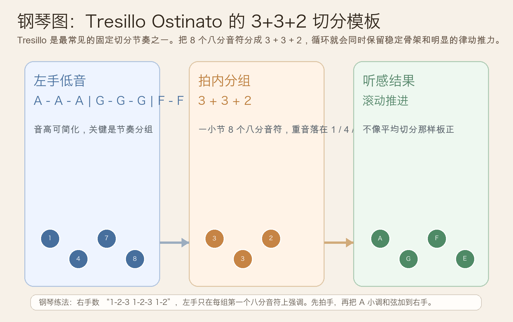
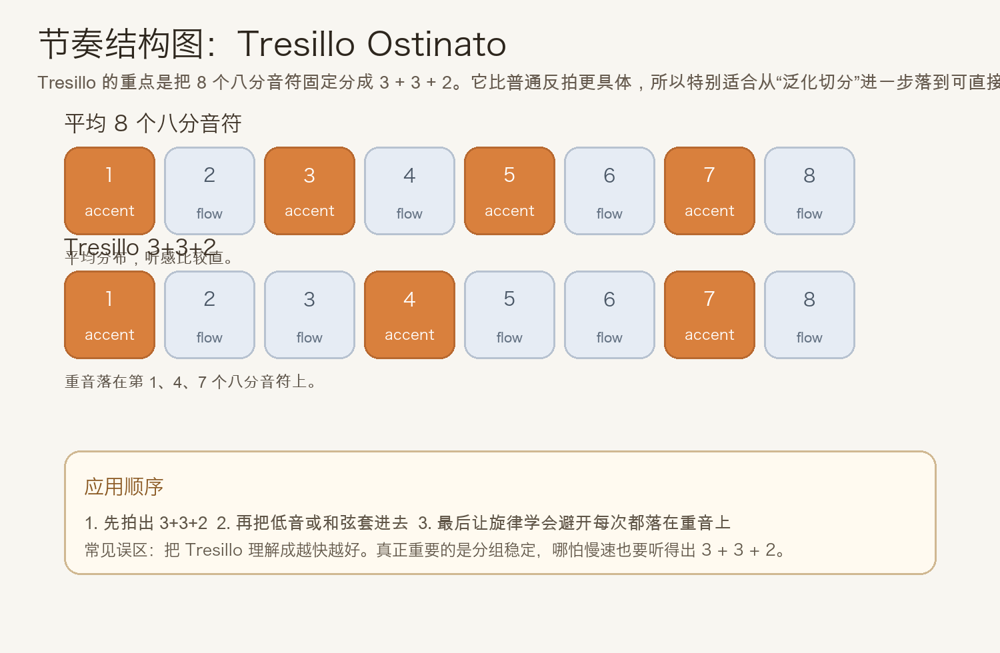
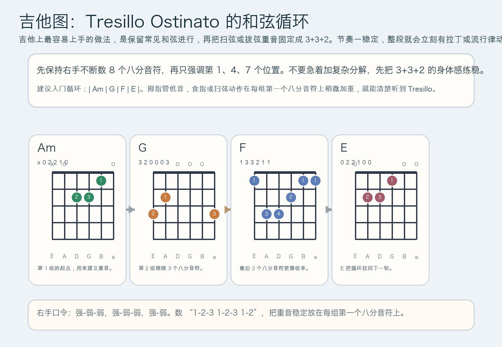

# 2026-06-01：Tresillo Ostinato

## 今日知识点

今天只讲一个知识点：**Tresillo Ostinato，也就是“基于 3+3+2 分组的持续音型”**。

昨天你学的是 **Syncopated Ostinato**，重点是“同一条循环如果把重音移到弱拍或反拍，会更有前冲感”。今天继续往前走，但不再停留在“泛化切分”，而是落到一个最常见、最实用的固定模板：

**把一小节里的 8 个八分音符分成 `3 + 3 + 2`。**

这就是 Tresillo 最容易上手的核心。

你可以先把它理解成：

```text
八分音符编号：1 2 3 4 5 6 7 8
重音位置：    ^     ^     ^
分组方式：    3     3   2
```

它和普通平均切分的区别是：

1. 它不是“每两个八分音符都一样重要”，而是主动做出 `3 + 3 + 2` 的偏移感
2. 它比一般反拍更具体，因为重音位置是固定的
3. 它非常适合做重复型，因为一旦分组稳定，整个循环会立刻有滚动感
4. 在流行、拉丁、配乐、指弹和钢琴伴奏里，它常被用来让简单和弦循环更有身体律动

所以今天真正要抓住的不是“会不会切分”，而是：

**你能不能稳定听到、数到，并弹出 `3 + 3 + 2`。**





## 钢琴使用场景

钢琴上，Tresillo Ostinato 很常见于**左手循环低音、拉丁化流行伴奏、电影配乐中的持续推进、极简重复句型**。

今天先用 `A` 小调做入门版：

```text
左手：A ... A ... A ..（按 3+3+2 分组循环）
右手：Am - G - F - E 或更简单的单音旋律
```

注意这里的关键不是左手一定要弹多少个不同音，而是：

- 让左手稳定数出 `1-2-3 1-2-3 1-2`
- 每组第一个八分音符稍微更清楚
- 不要把它弹成均匀 4 拍重音
- 右手可以更平一点，反而更容易听出左手的 Tresillo 骨架

钢琴上它尤其适合：

- 左手做持续低音，右手唱旋律
- 一段和弦不复杂，但想让伴奏更“会动”
- 在副歌前、桥段里或配乐里制造持续滚动的能量

最实用的起步方式是：

- 先只用一个音拍出 `3+3+2`
- 再改成 `A - G - F - E` 这样的低音循环
- 最后右手才加入和弦或旋律

## 吉他使用场景

吉他上，Tresillo Ostinato 很常见于**拉丁节奏扫弦、固定低音型指弹、流行编曲里的循环伴奏、riff 化和弦推进**。

今天可以直接套一个很实用的和弦循环：

```text
| Am | G | F | E |
右手重音：1 2 3 / 1 2 3 / 1 2
```

关键不是换掉和弦，而是让右手稳定做出这三个分组：

- 第一组 3 个八分音符
- 第二组 3 个八分音符
- 最后一组 2 个八分音符

只要这个分组稳定，哪怕和弦很简单，听感也会立刻从“普通伴奏”变成“有 groove 的循环”。



吉他上它尤其适合：

- 民谣或流行里让单一和弦循环不那么直白
- 指弹时把低音和上层拨弦组织成固定律动
- 拉丁、world music、电影感编配里做持续推进

最容易犯的错是：

- 只记住“有切分”，却没有固定成 `3+3+2`
- 一紧张就回到平均扫弦
- 节奏越来越快，反而听不出分组

## 可演奏例子

钢琴例子：

```text
例子 1（单音练节奏）
左手：连续弹 A
节奏：1-2-3 1-2-3 1-2
右手：先不加
要求：让每组第一个音更清楚，但整体速度不要乱。

例子 2（低音循环版）
左手：A - G - F - E
节奏：每个低音都按 Tresillo 重音组织
右手：Am - G - F - E
要求：右手和弦可以弹平一点，让左手的 3+3+2 更明显。
```

吉他例子：

```text
例子 1（扫弦版）
| Am | G | F | E |
右手连续数 8 个八分音符，只在第 1、4、7 个位置加重。

例子 2（低音 + 高音版）
拇指：A -> G -> F -> E
手指：在每组的起点补上高音和弦
要求：先把低音顺序弹稳，再让高音和节奏贴住 3+3+2。
```

## 今日练习

1. 先离开乐器，拍手数 `1-2-3 1-2-3 1-2`，连续 3 分钟，直到身体能自然感觉出三组。
2. 在钢琴上只用一个音练 Tresillo，确认每组第一个音都清楚，再换成 `A - G - F - E`。
3. 右手加最简单的和弦或单音旋律，检查自己有没有被右手带回平均重音。
4. 在吉他上用 `Am -> G -> F -> E` 连续扫 8 轮，保持 3+3+2 不变，不追求速度。
5. 用一句话回答：Tresillo 和“普通切分”相比，为什么更容易直接拿来做循环伴奏？

## 一句话总结

Tresillo Ostinato 的本质，是把持续音型从“泛化切分”进一步固定成 `3 + 3 + 2`，让简单循环也能立刻拥有稳定又鲜明的律动推进。
