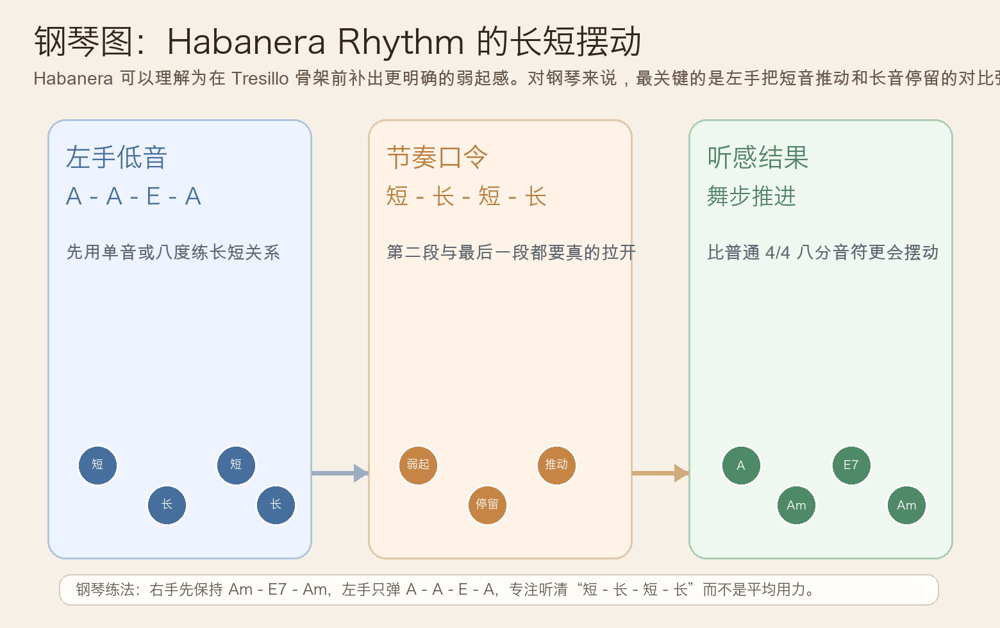
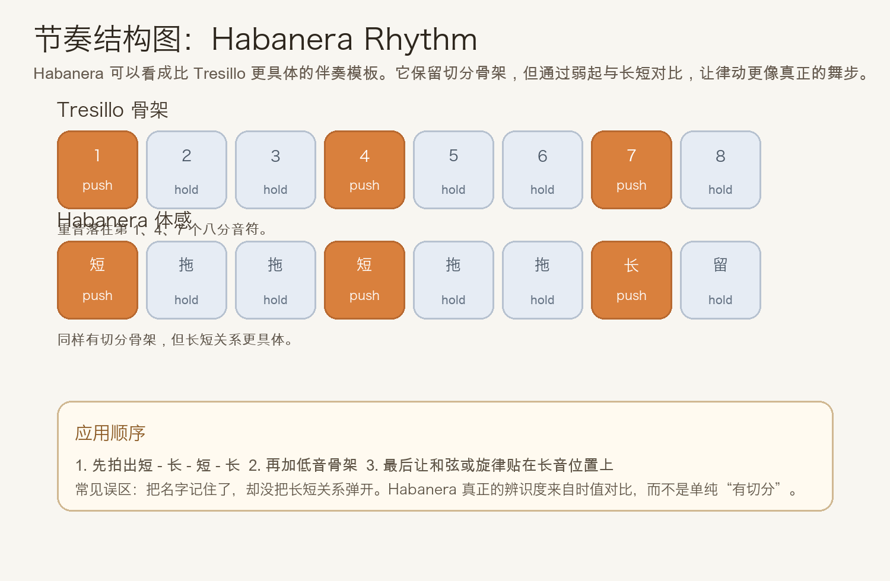
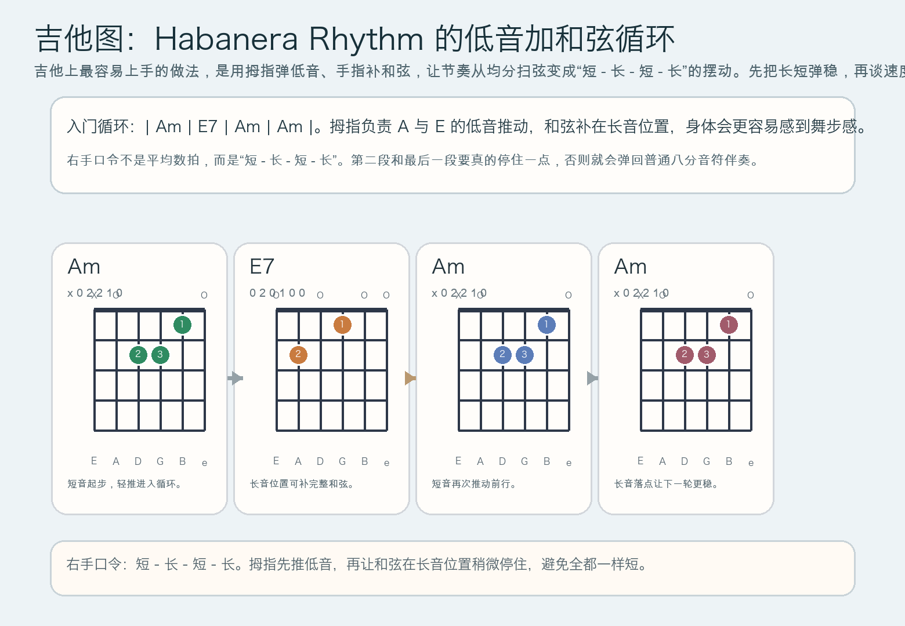

# 2026-06-03：Habanera Rhythm

## 今日知识点

今天只讲一个知识点：**Habanera Rhythm，也就是“在 Tresillo 前补一个弱起后的经典伴奏节奏型”**。

上一课你学的是 **Tresillo Ostinato**，核心是把 8 个八分音符稳定分成 `3 + 3 + 2`。今天继续沿着这条节奏线往前走，但不再只停留在“重音分组”，而是进入一个更具体、历史上也非常常见的固定模板：

**先出现一个短弱起，再接一个 Tresillo 骨架。**

如果用 4/4 里 8 个八分音符来粗略理解，可以把它想成：

```text
弱起 + 长音 + 弱起 + 长音
或更直观地数：
短 - 长 - 短 - 长
```

它和 Tresillo 的关系是：

1. Tresillo 更像“3+3+2 的骨架”
2. Habanera 则是在这个骨架前面补出更明确的起伏
3. 它会让节奏不只是“有切分”，而是带有一种拉丁、舞曲、行进感很强的摆动
4. 很多伴奏里你会听到它像“先挑一下，再往前拖着走”

所以今天要抓住的重点不是历史名词，而是：

**你能不能稳定弹出“短 - 长 - 短 - 长”的重心变化，并听出它和普通平均八分音符伴奏完全不同。**





## 钢琴使用场景

钢琴上，Habanera Rhythm 很适合放在**左手低音伴奏、拉丁风格流行编配、电影配乐里的慢速推进、带舞步感的固定伴奏型**里。

今天用 `A` 小调做一个最直观的入门：

```text
左手：A(短) - A(长) - E(短) - A(长)
右手：Am - E7 - Am
```

这里最重要的不是左手用了多少个音，而是：

- 第一拍先有一个短的起点
- 第二段拖长，形成“被往前拉”的感觉
- 中间再补一个短音，最后回到较稳定的长音
- 右手可以先弹简单和弦，不要抢掉左手的节奏轮廓

钢琴上它尤其适合：

- 左手做单音或八度低音，右手保持和弦或旋律
- 一段和声不复杂，但你想让它立刻有舞步感
- 慢板、中板里制造“贴地前进”的律动，而不是飘着的切分

最实用的练法是：

- 先只弹一个音，把 Habanera 的长短关系练稳
- 再换成 `A - E - A` 这样的低音骨架
- 最后才让右手加和弦或旋律

## 吉他使用场景

吉他上，Habanera Rhythm 很常见于**分解和弦伴奏、低音加和弦的指弹型、拉丁或探戈味道的扫弦组织、配乐型循环 riff**。

今天可以直接套一个很实用的和弦感：

```text
| Am | E7 | Am | Am |
低音组织：A(短) - 和弦(长) - E(短) - 和弦(长)
```

吉他上它的关键不是和弦多复杂，而是右手要稳定做出：

- 一个较短的起点
- 一个拖长的回答
- 再一次短促推动
- 最后一个更稳定的落点

只要这四段的长短关系稳定，哪怕和声很简单，听感也会立刻更像“会走路的伴奏”，而不是普通 4/4 均分扫弦。



吉他上它尤其适合：

- 指弹里用拇指固定低音、手指补中高音和弦
- 想把简单小调循环做出探戈或拉丁色彩
- 写伴奏时避免一直平均地下扫八分音符

最常见的错误是：

- 只记得“有一点切分”，但没有真的拉开长短
- 第二个长音太短，整个律动就塌掉
- 速度一快就弹回平均八分音符

## 可演奏例子

钢琴例子：

```text
例子 1（单音节奏版）
左手：连续弹 A
节奏：短 - 长 - 短 - 长
右手：先不加
要求：让第二段和最后一段明显比短音更有延展感。

例子 2（低音 + 和弦版）
左手：A - A - E - A
右手：Am - E7 - Am
要求：右手保持平稳，左手把 Habanera 的长短对比弹清楚。
```

吉他例子：

```text
例子 1（低音 + 和弦）
拇指：A(5弦) -> E(6弦或4弦)
手指：在长音位置补 Am 或 E7 和弦
要求：短音轻推，长音稍微停住，不要全都一样长。

例子 2（扫弦版）
| Am | E7 | Am | Am |
右手口令：短 - 长 - 短 - 长
要求：先慢速，确认每次长音都真的拉开，再逐渐连成循环。
```

## 今日练习

1. 先离开乐器，拍手念 `短 - 长 - 短 - 长`，连续 3 分钟，不求快，只求长短区别稳定。
2. 在钢琴上只用一个 `A` 练 Habanera Rhythm，然后再换成 `A - E - A` 的低音骨架。
3. 右手加最简单的 `Am - E7 - Am`，检查自己有没有把左手重新弹平均。
4. 在吉他上先用拇指单独练低音，再加和弦，保持第二段和最后一段的延展感。
5. 用一句话回答：Habanera Rhythm 相比 Tresillo，多出来的“弱起感”为什么会让律动更像舞步？

## 一句话总结

Habanera Rhythm 的本质，是在 Tresillo 骨架前补出更明确的弱起和长短对比，让持续循环从“会滚动”进一步变成“会走路、会摆动”的伴奏节奏型。
