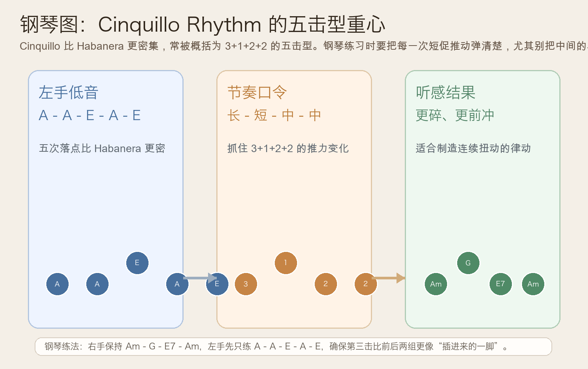
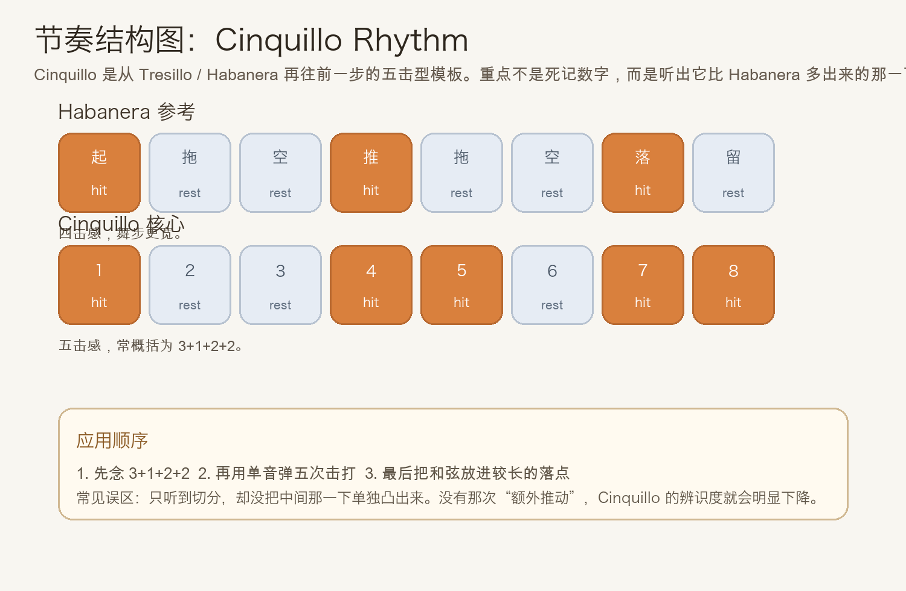
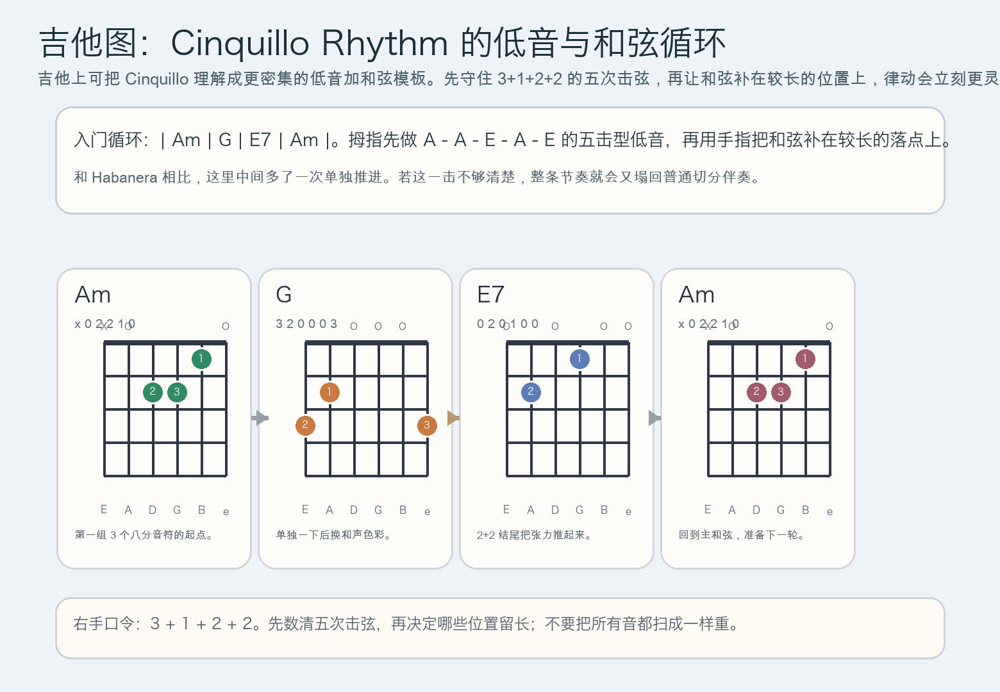

# 2026-06-04：Cinquillo Rhythm

## 今日知识点

今天只讲一个知识点：**Cinquillo Rhythm，也就是在 4/4 的八分音符网格里形成五次击打重心的经典拉丁节奏模板。**

上一课你学的是 **Habanera Rhythm**。它已经把 Tresillo 的 `3+3+2` 骨架推进成更具体的“短 - 长 - 短 - 长”舞步感。今天继续沿着这条线往前走，但节奏会再密一点：

**在同样 8 个八分音符的时间里，出现 5 次更紧凑的击打。**

最常见的粗略记法可以理解成：

```text
3 + 1 + 2 + 2
```

这不是说你一定要死记数字，而是提醒你：

1. 前面先有一个较长的跨度
2. 中间突然补进一次单独推动
3. 后面再接两组更短、更紧的前冲
4. 所以它听起来会比 Habanera 更碎、更灵活，也更容易让伴奏“扭起来”

今天真正要抓住的重点是：

**你能不能把 Cinquillo 里“比 Habanera 多出来的那一下”清楚弹出来。**





## 钢琴使用场景

钢琴上，Cinquillo Rhythm 很适合放在 **左手固定低音型、拉丁风格伴奏、电影或游戏里需要持续扭动感的 ostinato、节奏先行的和声铺底** 里。

今天用 `A` 小调做一个容易上手的版本：

```text
左手：A - A - E - A - E
右手：Am - G - E7 - Am
```

这里的关键不是左手音很多，而是五次落点的重心要明确：

- 第一组先拉开一个较长跨度
- 中间那一下要像“突然插进来”的推动
- 后面两组更短，形成连续前冲
- 右手和弦先简单，别让和声盖掉节奏轮廓

钢琴上它尤其适合：

- 左手做单音或八度低音，右手只给稳定和弦
- 一段和声本身不复杂，但想让律动更细、更会扭动
- 从 Habanera 再往前一步，练更密集的拉丁感伴奏

最实用的练法是：

- 先只弹一个 `A`，把 5 次击打练稳
- 再换成 `A - A - E - A - E` 的低音骨架
- 最后才让右手加 `Am - G - E7 - Am`

## 吉他使用场景

吉他上，Cinquillo Rhythm 很常见于 **指弹低音循环、拉丁流行伴奏、带切分感的分解和弦、需要更密集律动的 riff 型伴奏**。

今天可以直接套这个入门循环：

```text
| Am | G | E7 | Am |
低音组织：A - A - E - A - E
```

吉他上最关键的是右手别把它弹回平均八分音符，而要真正做出：

- 前面一段较长的等待
- 中间突然补进的一下
- 后面两组短促而连续的推动
- 最后落回主和弦，准备下一轮



吉他上它尤其适合：

- 拇指负责五次低音击打，手指只在较长位置补和弦
- 把简单小调循环弹得比 Habanera 更活、更密
- 在不提高速度的前提下增加律动复杂度

最常见的错误是：

- 只记得“比 Habanera 多一个音”，但没有把那一下单独凸出来
- 所有音都一样重，听起来就只剩普通切分
- 速度一快，五次击打会塌成四次模糊的扫弦

## 可演奏例子

钢琴例子：

```text
例子 1（单音节奏版）
左手：连续弹 A
节奏：3 + 1 + 2 + 2
右手：先不加
要求：把中间“+1”那一下弹得像单独插进来的推动。

例子 2（低音 + 和弦版）
左手：A - A - E - A - E
右手：Am - G - E7 - Am
要求：右手保持均匀，左手五次击打的层次要清楚。
```

吉他例子：

```text
例子 1（低音 + 和弦）
拇指：A -> A -> E -> A -> E
手指：在较长位置补 Am、G、E7
要求：先数清五击型，再把和弦补进去，不要一开始就扫乱。

例子 2（分解伴奏版）
| Am | G | E7 | Am |
右手口令：3 + 1 + 2 + 2
要求：中间那一下更短、更像推动，结尾两组要连续但别抢拍。
```

## 今日练习

1. 先离开乐器，拍手数 `3 + 1 + 2 + 2`，连续 3 分钟，只求重心稳定。
2. 在钢琴上只用一个 `A` 练五次击打，再换成 `A - A - E - A - E`。
3. 右手加入 `Am - G - E7 - Am`，检查自己有没有把中间那一下弹没了。
4. 在吉他上先用拇指单独练低音，确认五击型清楚后再补和弦。
5. 用一句话回答：Cinquillo 比 Habanera 多出来的那一下，为什么会让律动更“扭”、更前冲？

## 一句话总结

Cinquillo Rhythm 的本质，是在 Habanera 的舞步感基础上再补出一次额外推动，让 8 个八分音符里的重心从四击感变成更密集的五击感。
