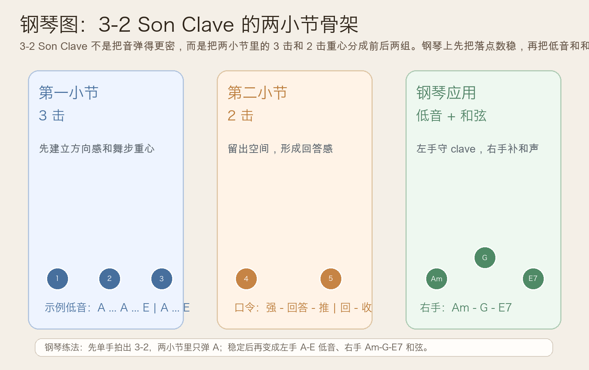
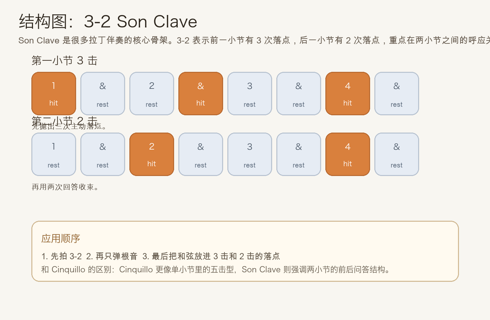
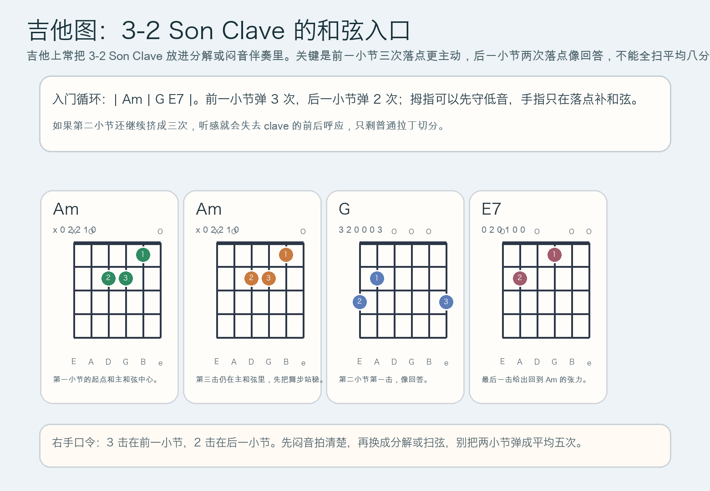

# 2026-06-05：3-2 Son Clave

## 今日知识点

今天只讲一个知识点：**3-2 Son Clave，也就是把两小节的节奏重心组织成“前一小节 3 击、后一小节 2 击”的 clave 骨架。**

上一课你学的是 **Cinquillo Rhythm**。它强调的是**单小节里更密集的五击型推动**。今天继续顺着拉丁节奏线往前走，但重点从“更密”转成“更像问答”：

**3-2 Son Clave 的核心，不是五次都很忙，而是两小节之间的前后呼应。**

你可以先把它理解成：

```text
第 1 小节：3 次落点
第 2 小节：2 次落点
```

这意味着：

1. 第一小节先把律动方向抛出来
2. 第二小节减少一次落点，形成回答感
3. 所以它听起来比 Cinquillo 更“开阔”，但骨架更鲜明
4. 很多拉丁流行、萨尔萨、Afro-Cuban 伴奏，背后都能找到这种 clave 思维

今天真正要抓住的重点是：

**你能不能把“前 3 后 2”的问答关系弹清楚，而不是只是数到五下。**





## 钢琴使用场景

钢琴上，3-2 Son Clave 很适合放在 **左手低音型、拉丁风格伴奏、需要两小节律动呼吸感的 vamp、乐队排练时给出稳定节奏骨架** 里。

今天用 `A` 小调做一个容易上手的版本：

```text
左手：A ... A ... E | A ... E
右手：Am ... Am ... G | E7 ... Am
```

这里最重要的不是把音弹多，而是把两小节的角色分开：

- 第一小节 3 次落点更主动，像把舞步先抛出去
- 第二小节 2 次落点更像回答，留出一点空间
- 左手先守住 clave，右手和弦只做支持
- 如果两小节都弹得一样满，clave 的前后层次就没了

钢琴上它尤其适合：

- 左手只弹根音或八度，右手维持简单三和弦/属七
- 一段和声不复杂，但需要更明确的两小节呼吸
- 从单小节切分进入更完整的拉丁伴奏骨架

最实用的练法是：

- 先只拍手数两小节的 3-2
- 再用左手只弹 `A`
- 最后才换成 `A ... A ... E | A ... E` 的低音骨架，并让右手加入 `Am - G - E7`

## 吉他使用场景

吉他上，3-2 Son Clave 很常见于 **分解伴奏、闷音刷弦、拉丁流行节奏吉他、需要前后呼应的 riff 型循环**。

今天可以直接套这个入门循环：

```text
| Am | G E7 |
前一小节 3 击，后一小节 2 击
```

吉他上最关键的是右手别把它重新扫成均匀八分音符，而要真正做出：

- 第一小节三次落点的主动感
- 第二小节两次落点的收束感
- 中间的空白要敢留，不要因为手忙就补满
- 最后一击给出 `E7 -> Am` 的回归预期



吉他上它尤其适合：

- 拇指先守低音，手指只在 clave 落点补和弦
- 用闷音先练骨架，再放开成分解或轻扫弦
- 给简单和声循环加上明确的“两小节问答”

最常见的错误是：

- 只记得有 5 次落点，却没分清前 3 和后 2
- 所有落点一样重，听起来就像普通切分
- 第二小节手一紧张又补出第三下，clave 会立刻塌掉

## 可演奏例子

钢琴例子：

```text
例子 1（单音骨架版）
左手：连续弹 A
节奏：第 1 小节 3 击，第 2 小节 2 击
右手：先不加
要求：两小节之间要听出“先主动、后回答”的区别。

例子 2（低音 + 和弦版）
左手：A ... A ... E | A ... E
右手：Am ... Am ... G | E7 ... Am
要求：右手保持简单，clave 轮廓由左手主导。
```

吉他例子：

```text
例子 1（闷音节奏版）
右手：先全闷音，只打出 3-2
要求：确认第二小节真的只有两次落点。

例子 2（低音 + 和弦版）
和弦：| Am | G E7 |
低音：A ... A ... E | A ... E
要求：先让拇指把两小节骨架弹稳，再补和弦，不要把空白填满。
```

## 今日练习

1. 先离开乐器，拍手数两小节的 `3-2`，连续 3 分钟，只求落点稳定。
2. 在钢琴上只弹一个 `A`，把“前 3 后 2”的问答感练出来。
3. 再加入 `A ... A ... E | A ... E` 和 `Am - G - E7 - Am`，检查右手有没有盖掉 clave。
4. 在吉他上先全闷音打 3-2，再换成 `| Am | G E7 |`。
5. 用一句话回答：3-2 Son Clave 和 Cinquillo 最大的区别，为什么不是“多一个音或少一个音”而是“两小节角色不同”？

## 一句话总结

3-2 Son Clave 的本质，是把节奏重心组织成前一小节 3 击、后一小节 2 击的问答关系，让伴奏从单小节切分推进到更完整的两小节骨架。
