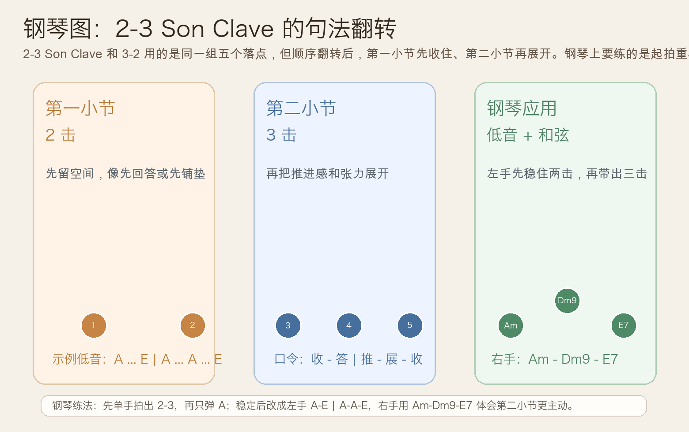
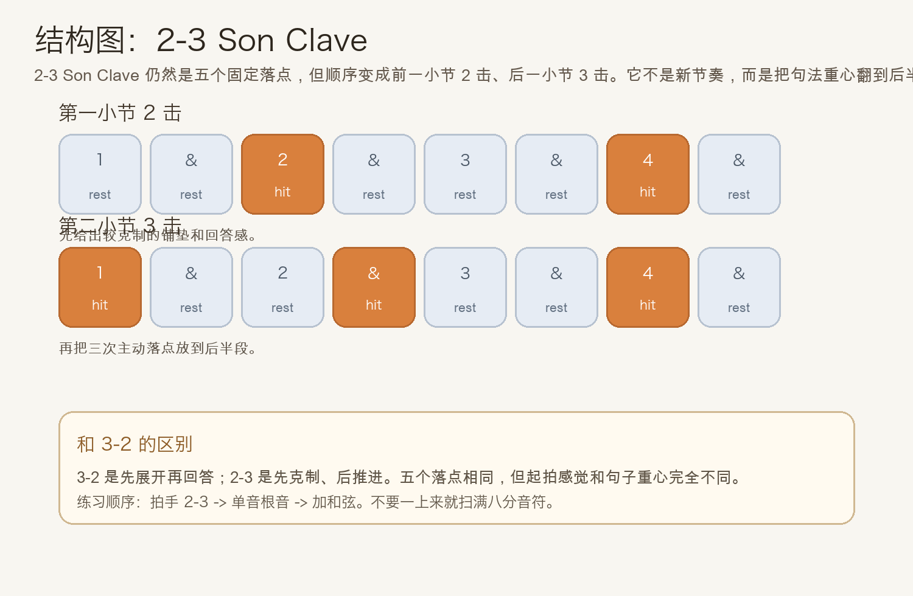
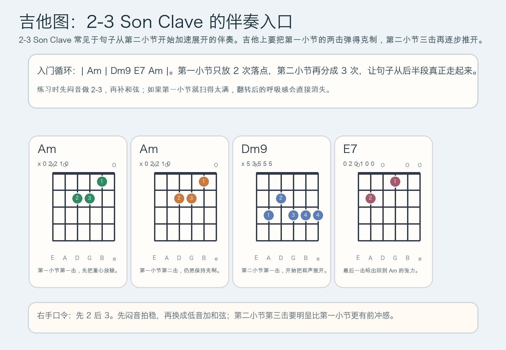

# 2026-06-08：2-3 Son Clave

## 今日知识点

今天只讲一个知识点：**2-3 Son Clave，也就是把两小节的 clave 骨架组织成“前一小节 2 击、后一小节 3 击”的句法翻转。**

上一课你学的是 **3-2 Son Clave**。那一课的重点，是前一小节先给出 3 次主动落点，后一小节再用 2 次回答。今天不换材料，只换重心：

**2-3 Son Clave 用的是同一组五个落点，但把“先说话的人”从第一小节换到了第二小节。**

你可以先把它理解成：

```text
第 1 小节：2 次落点
第 2 小节：3 次落点
```

这意味着：

1. 第一小节会更克制，像铺垫或先收住
2. 第二小节才把推进感真正展开
3. 所以它听起来不像 3-2 那样“先抛出去”，而更像“后半句才发力”
4. 很多拉丁流行、萨尔萨、Afro-Cuban 伴奏在句子切入点不同的时候，会优先用 2-3 而不是 3-2

今天真正要抓住的重点是：

**你能不能听出“先 2 后 3”的起拍重心变化，而不是只知道五个落点没变。**





## 钢琴使用场景

钢琴上，2-3 Son Clave 很适合放在 **句子从后半段开始展开的左手低音型、拉丁风格 vamp、先留空再推进的伴奏设计、乐队排练里需要把重心放到第二小节的 groove** 里。

今天用 `A` 小调做一个容易上手的版本：

```text
左手：A ... E | A ... A ... E
右手：Am ...    | Dm9 ... E7 ... Am
```

这里最重要的是把两小节的角色明确区分：

- 第一小节只有两次落点，像先把地板铺好
- 第二小节三次落点才真正把舞步往前推
- 左手先守住 2-3，右手只在第二小节稍微打开和声
- 如果第一小节也弹得很满，2-3 和 3-2 的差别就会被自己抹平

钢琴上它尤其适合：

- 左手先用根音或八度做 2-3，右手晚一点再加和弦
- 一段伴奏想从“留白”进入“展开”时
- 同样是两小节循环，但希望张力在第二小节抬升

最实用的练法是：

- 先只拍手数 `2-3`
- 再用左手只弹 `A`
- 最后换成 `A ... E | A ... A ... E`，再让右手加入 `Am - Dm9 - E7 - Am`

## 吉他使用场景

吉他上，2-3 Son Clave 很常见于 **拉丁流行分解伴奏、先闷后开的刷弦、从后半句增强推动力的 riff 循环、需要让第二小节更有存在感的节奏吉他**。

今天可以直接套这个入门循环：

```text
| Am | Dm9 E7 Am |
前一小节 2 击，后一小节 3 击
```

吉他上最关键的是右手不要一上来就扫满，而要真正做出：

- 第一小节两次落点的克制感
- 第二小节三次落点的展开感
- 中间空白先保留，让后半句自然变强
- 最后一击把 `E7 -> Am` 的回归方向讲清楚



吉他上它尤其适合：

- 先用全闷音练 2-3，再换成低音 + 和弦
- 拇指先守低音，手指只在 clave 落点补和弦
- 用同一个和声循环体会“把推力放到第二小节”是什么意思

最常见的错误是：

- 只记得“也是五次”，却没分清第一小节只该有 2 次
- 第二小节三次落点没有明显变得更主动
- 第一小节为了不空，手会下意识补拍，结果整条 clave 又变回平均切分

## 可演奏例子

钢琴例子：

```text
例子 1（单音骨架版）
左手：连续弹 A
节奏：第 1 小节 2 击，第 2 小节 3 击
右手：先不加
要求：听出第二小节比第一小节更有“往前走”的感觉。

例子 2（低音 + 和弦版）
左手：A ... E | A ... A ... E
右手：Am ... | Dm9 ... E7 ... Am
要求：右手的和声推进放到第二小节，不要第一小节就弹满。
```

吉他例子：

```text
例子 1（闷音节奏版）
右手：先全闷音，只打出 2-3
要求：确认第一小节真的只有两次落点。

例子 2（低音 + 和弦版）
和弦：| Am | Dm9 E7 Am |
低音：A ... E | A ... A ... E
要求：先让拇指把后半句的三次推进弹稳，再补和弦，不要提前扫满。
```

## 今日练习

1. 先离开乐器，拍手数两小节的 `2-3`，连续 3 分钟，只求第一小节不要手痒补第三下。
2. 在钢琴上只弹一个 `A`，练出“前面更克制、后面更展开”的差别。
3. 再加入 `A ... E | A ... A ... E` 和 `Am - Dm9 - E7 - Am`，检查第二小节是否真的更主动。
4. 在吉他上先全闷音打 2-3，再换成 `| Am | Dm9 E7 Am |`。
5. 用一句话回答：2-3 Son Clave 和 3-2 Son Clave 最大的区别，为什么不是“换了一个节奏”，而是“同一骨架的句法翻转”？

## 一句话总结

2-3 Son Clave 的本质，是把同一组五个 clave 落点翻成前一小节 2 击、后一小节 3 击，让律动的推动力从“先展开”变成“后展开”。
