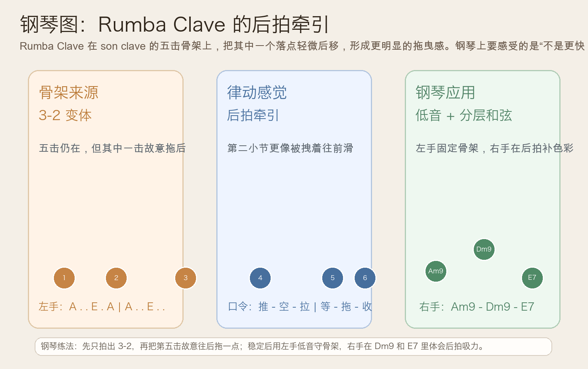
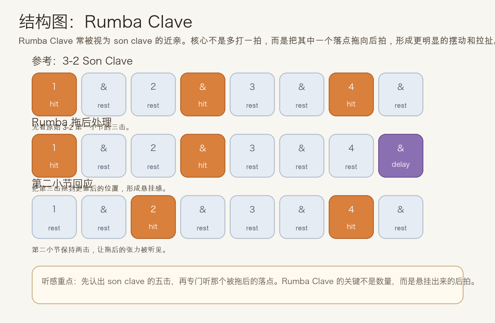
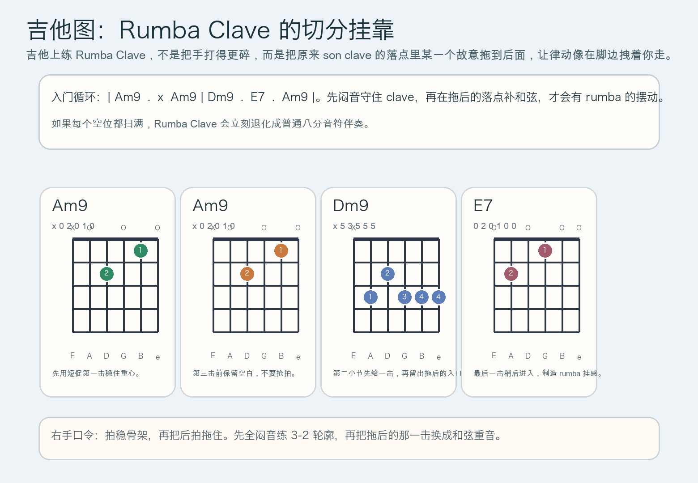

# 2026-06-09：Rumba Clave

## 今日知识点

今天只讲一个知识点：**Rumba Clave，也就是在 son clave 五击骨架的基础上，把其中一个落点故意拖向后拍，让律动多出更明显的悬挂和拉扯。**

上一课你已经学过 **2-3 Son Clave**。那一课的重点，是同一组五个落点如何通过“先 2 后 3”改变句法重心。今天继续沿着 clave 这条线往前走，但不是再换一种“前后顺序”，而是进入更细的层面：

**Rumba Clave 的重点，是你开始听见同样五击骨架里，某一个落点被故意拖后的后拍吸力。**

你可以先把它理解成：

```text
先认出 son clave 的骨架
再专门听一个落点如何比原版更靠后
```

这意味着：

1. 它不是“多打一拍”，也不是“随便更碎”
2. 骨架仍然来自你已经认识的 son clave 家族
3. 真正变化的是其中一击的落点位置与挂拍感
4. 所以它听起来会比 son clave 更有拖曳、更像被后拍拽着往前走

今天真正要抓住的重点是：

**你能不能把“骨架没散”和“其中一击被拖后”这两件事同时听见。**





## 钢琴使用场景

钢琴上，Rumba Clave 很适合放在 **Afro-Cuban 风格 vamp、左手低音固定而右手做后拍补色、需要比 son clave 更黏更晃的两小节循环、乐队排练里需要把律动从“骨架正确”推进到“真正会摆”** 的场景里。

今天用 `A` 小调做一个容易上手的版本：

```text
左手：A . . E . A | A . . E . .
右手：Am9 . . . . . | Dm9 . E7 . Am9 . .
```

这里最重要的是把三件事分清：

- 左手先把五击骨架守住
- 其中一个落点要故意比普通 son clave 更晚一点进入
- 右手不要把所有空位补满，而是把色彩更多放在拖后的感觉附近

钢琴上它尤其适合：

- 左手先用单音或八度固定 clave，右手后拍补 `Dm9`、`E7`
- 同样是两小节循环，但希望律动从“清楚”变成“会晃”
- 编配里已经有低音和打击乐时，用钢琴专门强调拖后的那一下

最实用的练法是：

- 先拍出普通 3-2 son clave
- 再只把其中一击轻微后移
- 最后让左手守骨架，右手加 `Am9 - Dm9 - E7`

## 吉他使用场景

吉他上，Rumba Clave 很常见于 **拉丁吉他伴奏、先闷后开的切分刷弦、低音加和弦的双层 groove、需要把同一条 clave 骨架弹得更有身体摆动感的节奏吉他**。

今天可以直接套这个入门循环：

```text
| Am9 . x Am9 | Dm9 . E7 . Am9 |
```

吉他上最关键的是右手不要把它当作“更密的扫弦”，而要真正做出：

- 先有 son clave 的轮廓
- 再让其中一击故意拖后
- 空白必须保留，不然挂拍感会消失
- 最后一击最好能给出 `E7 -> Am9` 的回归方向



吉他上它尤其适合：

- 先全闷音把拖后的那一下练出来
- 拇指守低音，手指只在 clave 落点补和弦
- 和 conga、bass 合奏时，用吉他专门把后拍拖感说清楚

最常见的错误是：

- 只顾着“更花”，结果骨架丢掉
- 所有空位都被补满，拖后的效果听不出来
- 右手每次都平均落下，听感就会退回普通切分伴奏

## 可演奏例子

钢琴例子：

```text
例子 1（拍手转单音版）
左手：连续弹 A
节奏：先弹 3-2 son clave，再把其中一击轻微拖后
右手：先不加
要求：听出“骨架没变，但后拍更会拉人”的感觉。

例子 2（低音 + 和弦版）
左手：A . . E . A | A . . E . .
右手：Am9 . . . . . | Dm9 . E7 . Am9 . .
要求：右手只在关键后拍补色彩，不要把每个空位都填满。
```

吉他例子：

```text
例子 1（闷音挂拍版）
右手：先全闷音，弹出 son clave 骨架，再把拖后的那一下故意放晚
要求：确认拖后之后，整体仍然稳，不会散拍。

例子 2（低音 + 和弦版）
和弦：| Am9 . x Am9 | Dm9 . E7 . Am9 |
低音：A . . E . A | A . . E . .
要求：后拍那一下要明显“挂住”，而不是更用力地提前扫弦。
```

## 今日练习

1. 先离开乐器，连续拍 2 分钟普通 3-2 son clave，再拍 2 分钟把其中一击拖后，体会差别。
2. 在钢琴上只弹一个 `A`，练到拖后之后仍然不乱拍。
3. 再加入 `Am9 - Dm9 - E7`，检查右手是不是只在关键点补色彩。
4. 在吉他上先全闷音做骨架，再换成 `| Am9 . x Am9 | Dm9 . E7 . Am9 |`。
5. 用一句话回答：Rumba Clave 和 Son Clave 的核心区别，为什么不是“更多音”，而是“某一击更靠后”？

## 一句话总结

Rumba Clave 的本质，是在 son clave 的五击骨架里把其中一击拖向后拍，让同样的节奏框架出现更强的悬挂、摆动和拉扯感。
