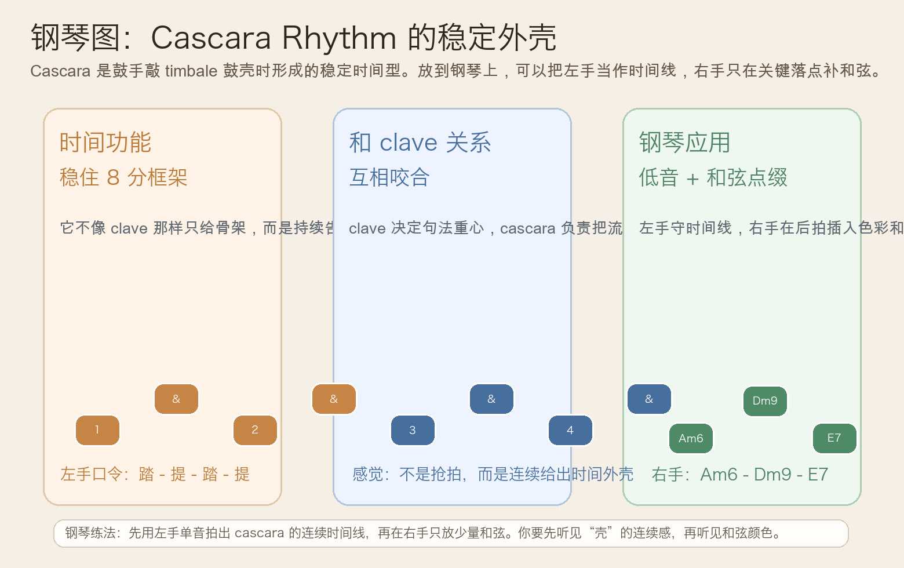
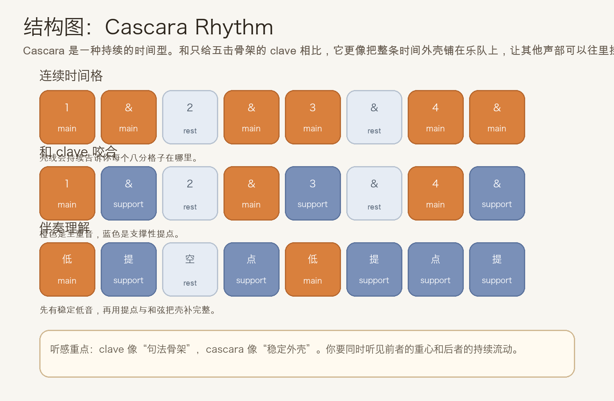
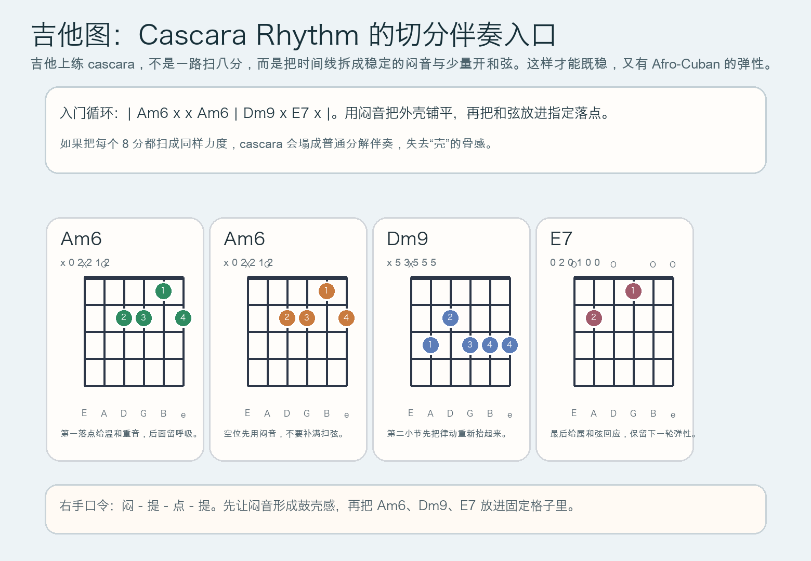

# 2026-06-10：Cascara Rhythm

## 今日知识点

今天只讲一个知识点：**Cascara Rhythm，也就是 Afro-Cuban 音乐里常见的一种“时间外壳”节奏型。**

如果说前几天学的 **3-2 Son Clave、2-3 Son Clave、Rumba Clave** 更像是在讲“句子的骨架重心在哪里”，那么今天的 Cascara 要解决的是另一个问题：

**当 clave 已经决定了句法，乐队内部靠什么持续维持流动感、让每个八分格子都被感受到？**

答案之一就是 cascara。它最初来自 timbales 鼓手敲击鼓壳时形成的时间型，所以你可以把它先理解成：

```text
clave 负责句法骨架
cascara 负责把时间外壳铺出来
```

这意味着：

1. 它不是新的 clave 变体，而是和 clave 咬合的持续型伴奏框架
2. 它比单纯五击骨架更连续，更像“把时间线一直亮着”
3. 它常用来让整个 groove 更稳，同时保留切分弹性
4. 学会 cascara 之后，你会更容易分清“谁在给骨架，谁在给流动”

今天真正要抓住的重点是：

**你要能听见它不是在“多打几个音”，而是在持续标出时间外壳，让其他声部可以往里挂靠。**





## 钢琴使用场景

钢琴上，Cascara Rhythm 很适合放在 **Afro-Cuban vamp、左手做固定时间线、右手做 sparse comping、乐队排练中需要把 groove 先稳住再谈花样、编曲里想让 clave 之外多一层连续时间感** 的场景里。

今天用 `A` 小调做一个入门版：

```text
左手：A . A . | A . A .
时值感：提 - 空 - 点 - 提 的连续八分外壳
右手：Am6 . . . | Dm9 . E7 . 
```

钢琴上最关键的是分清两层：

- 左手不是只管低音高低，而是在扮演“时间外壳”
- 右手不要把每个空位都填满，而是在固定格子里补色彩
- 当左手时间线已经稳了，右手少一点反而更像真正的 cascara 配法

它尤其适合：

- 左手单音或八度持续给出时间线，右手只在后拍点 `Am6`、`Dm9`、`E7`
- 排练时先不求复杂 voicing，只求每轮都稳
- 和 bass、conga 一起练时，让钢琴负责“把壳维持住”

最实用的练法是：

- 先只用左手单音练连续外壳
- 再把右手只放进 2 到 3 个和弦点
- 最后才考虑加装饰音或更密的切分

## 吉他使用场景

吉他上，Cascara Rhythm 很常见于 **拉丁节奏吉他、闷音加开和弦的分层伴奏、需要兼顾打击感与和声感的循环、双吉他编配里一把负责时间型、一把负责和弦扩展** 的场景里。

今天可以直接套这个入门循环：

```text
| Am6 x x Am6 | Dm9 x E7 x |
```

这里的 `x` 不只是“没声音”，而是右手维持鼓壳感的闷音动作。吉他上最关键的是：

- 闷音本身就是时间型的一部分
- 开和弦只放在关键格子，不要平均扫满
- 手腕动作要连续，不能只有和弦时才动
- 这样听起来才会像 cascara，而不是普通扫弦



吉他上它尤其适合：

- 先全闷音把时间线练稳，再把 `Am6`、`Dm9`、`E7` 换进去
- 一把吉他负责 cascara，另一把吉他再叠更松的 comping
- 主唱或旋律乐器已经很多时，用更克制的时间型支持整首歌

最常见的错误是：

- 把所有八分扫成同样力度，结果没有“壳”的骨感
- 只顾和弦，不顾闷音与提点的连续动作
- 开和弦太多，导致 clave 与 cascara 的分工听不出来

## 可演奏例子

钢琴例子：

```text
例子 1（左手时间线版）
左手：A . A . | A . A .
口令：踏 - 提 - 空 - 点 | 踏 - 提 - 点 - 提
右手：先不加
要求：只用左手把连续外壳弹稳，不要忽快忽慢。

例子 2（低音 + 和弦版）
左手：A . A . | A . A .
右手：Am6 . . . | Dm9 . E7 .
要求：右手只负责点色彩，不要破坏左手的稳定时间线。
```

吉他例子：

```text
例子 1（全闷音版）
右手：连续做闷音切分动作
要求：每个八分格子的身体动作都在，但真正出声的重音位置不同。

例子 2（闷音 + 和弦版）
和弦：| Am6 x x Am6 | Dm9 x E7 x |
要求：闷音和开和弦力度分层明显，听起来像鼓壳 + 和弦的组合，而不是整齐扫弦。
```

## 今日练习

1. 先离开乐器，用拍手或桌面敲击把 cascara 的连续外壳打 3 分钟，确认自己不会在空位停手。
2. 在钢琴上只用左手单音 `A` 做两小节循环，稳定后再加入 `Am6 - Dm9 - E7`。
3. 在吉他上先全闷音练右手动作，再把 `| Am6 x x Am6 | Dm9 x E7 x |` 放进去。
4. 和昨天的 Rumba Clave 对比练：先打一轮 clave，再打一轮 cascara，确认自己能分辨“骨架”与“外壳”的不同角色。
5. 用一句话回答：为什么 cascara 不是“更密的 clave”，而是“持续标出时间外壳”的伴奏型？

## 一句话总结

Cascara Rhythm 的核心，不是多几个重音，而是把时间外壳稳定铺出来，让 clave 负责句法、让伴奏负责持续流动。
