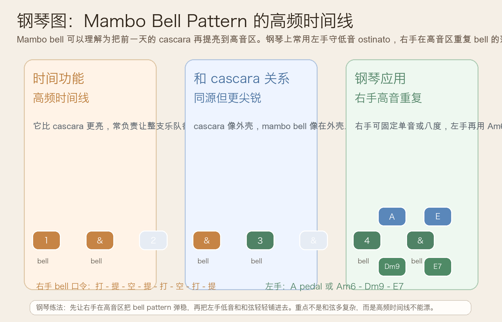
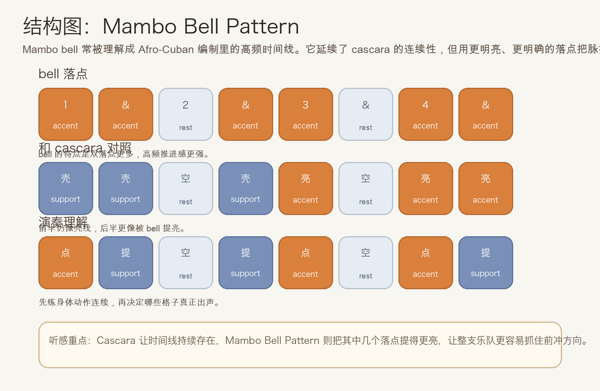
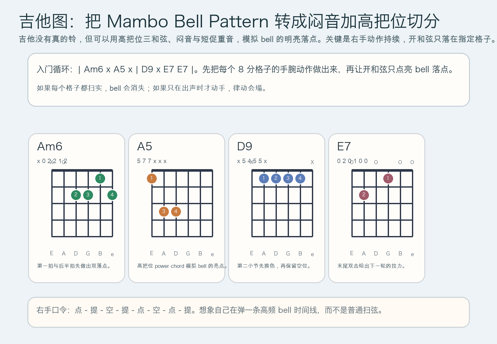

# 2026-06-11：Mambo Bell Pattern

## 今日知识点

今天只讲一个知识点：**Mambo Bell Pattern，也就是 Afro-Cuban 编制里常见的高频铃声时间线。**

昨天的 **Cascara Rhythm** 已经让你知道，什么叫“把时间外壳稳定铺出来”。今天往前只推进半步：

**如果把同样的连续时间感从鼓壳移到更亮、更尖锐的铃声层，会发生什么？**

答案就是 mambo bell。你可以先把它理解成：

```text
cascara 负责铺出外壳
mambo bell 负责把外壳里的关键亮点举高
```

它的重要性在于：

1. 它不是单独的“花哨加法”，而是更明确的高频时间线
2. 它比 cascara 更容易让整支乐队都抓住前冲方向
3. 它常和 clave、cascara、低音 ostinato 一起分层工作
4. 学会它之后，你会更清楚 Afro-Cuban 伴奏为什么能一边密、一边稳

今天真正要抓住的重点是：

**你要能听见 bell 不是“多打一层”，而是把连续时间型里最关键的几个格子提得更亮。**





## 钢琴使用场景

钢琴上，Mambo Bell Pattern 很适合放在 **Afro-Cuban vamp、右手高音区做重复时间线、左手保持 pedal 或 ostinato、乐队排练里需要让高频脉搏更明确、编曲里想让 groove 从“稳”进一步变成“亮”** 的场景里。

今天用 `A` 小调做一个入门版：

```text
右手 bell：1 & . & | 3 . 4 &
左手低音：A . . . | A . . .
和声点缀：Am6 . A5 . | Dm9 . E7 E7
```

钢琴上最关键的是分三层：

- 右手高音区负责 bell 的亮点，不要弹成平均八分
- 左手低音只要稳，不用急着加太多花样
- 和弦是补色彩，不是抢掉 bell 的时间功能

它尤其适合：

- 右手固定弹单音 `E` 或双音 `E-A`，左手维持 `A` pedal
- 右手保持 bell，左手再把 `Am6 - Dm9 - E7` 轻轻串起来
- 乐队排练时用钢琴先把高频时间线立住，让其他乐器更容易锁进 groove

最实用的练法是：

- 先只用右手单音把 bell 打稳
- 再加入左手 `A` pedal
- 最后才加入右手或左手的和弦点缀

## 吉他使用场景

吉他上，Mambo Bell Pattern 很常见于 **拉丁流行、salsa 风格 comping、双吉他编配里一把负责高位切分、一把负责低位和弦、需要用闷音模拟打击乐时间线** 的场景里。

今天可以直接套这个入门循环：

```text
| Am6 x A5 x | D9 x E7 E7 |
```

这里的关键不只是和弦本身，而是：

- 闷音维持身体里的连续格子
- 开和弦只点在 bell 的关键亮点
- 高把位短促出声，比大面积扫弦更像 bell
- 末尾双击 `E7` 会自然把你推回下一轮



吉他上它尤其适合：

- 先用全闷音练右手动作，再替换进 `Am6`、`A5`、`D9`、`E7`
- 用高把位 A5 模拟铃声的“亮点”
- 主唱、铜管或键盘已经很满时，用短促切分把高频时间线补清楚

最常见的错误是：

- 每个八分都扫实，结果只剩普通节奏吉他
- 只在出声时动手，导致 bell 的连续感断掉
- 和弦延音太长，盖住了本来应该短而亮的时间线

## 可演奏例子

钢琴例子：

```text
例子 1（右手单音版）
右手：E E . E | E . E E
左手：先不加
要求：右手全部用同一音高，先把 bell 的落点稳定下来。

例子 2（右手 bell + 左手 pedal）
右手：E E . E | E . E E
左手：A . . . | A . . .
要求：左手像地板，右手像天花板，先把上下两层时间关系弹清楚。

例子 3（加入和声点缀）
右手：E E . E | E . E E
左手/和声：Am6 . A5 . | Dm9 . E7 E7
要求：和弦只补颜色，不要破坏 bell 的高频主线。
```

吉他例子：

```text
例子 1（全闷音版）
右手：点 - 提 - 空 - 提 - 点 - 空 - 点 - 提
要求：所有格子都有手腕动作，但只有指定格子真正出声。

例子 2（闷音 + 和弦版）
和弦：| Am6 x A5 x | D9 x E7 E7 |
要求：A5 与 E7 出声短而亮，像 bell，不要拖成长扫弦。
```

## 今日练习

1. 先离开乐器，用拍手把 `1 & . & | 3 . 4 &` 打 3 分钟，确认自己能稳定保持空位而不停顿。
2. 在钢琴上只用右手一个音 `E` 练 bell pattern，稳定后再加入左手 `A` pedal。
3. 在吉他上先全闷音练右手动作，再把 `| Am6 x A5 x | D9 x E7 E7 |` 放进去。
4. 把昨天的 Cascara Rhythm 和今天的 Mambo Bell Pattern 连着练，感受“外壳”与“高频亮点”在同一 groove 里的分工。
5. 用一句话回答：为什么 bell 不是把节奏打得更满，而是把关键落点提得更亮？

## 一句话总结

Mambo Bell Pattern 的核心，不是更密，而是把连续时间线里的关键亮点抬到高频层，让整个 groove 更清楚、更前冲。
