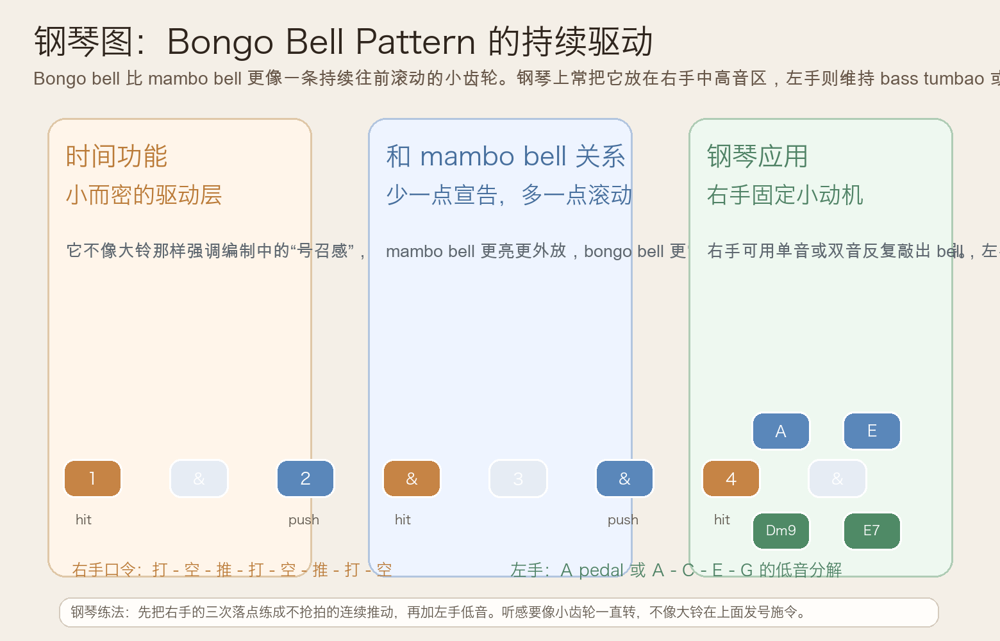
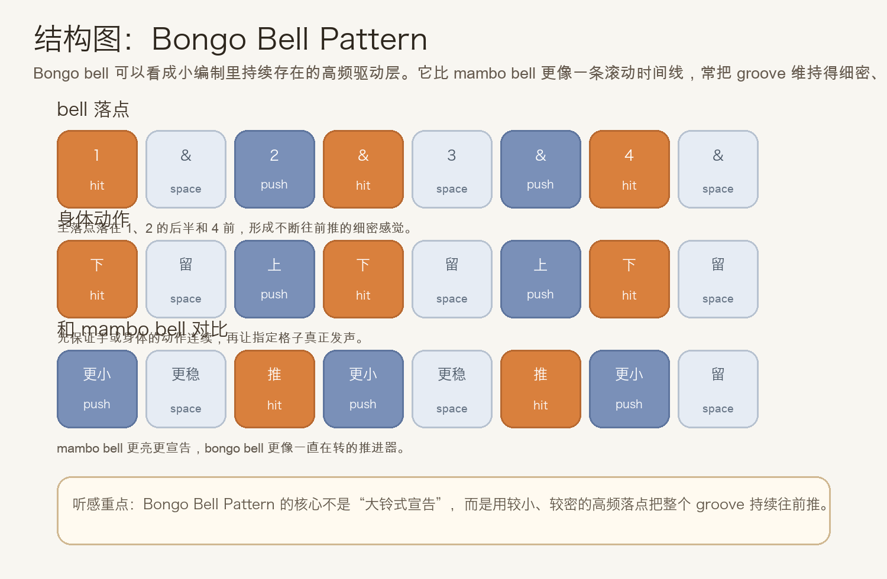
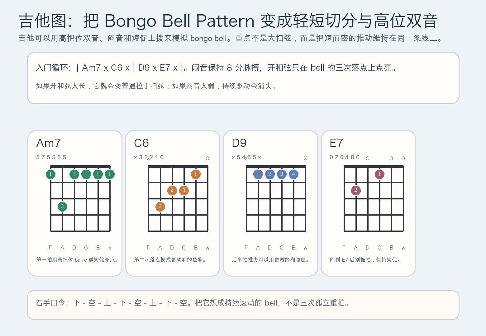

# 2026-06-12：Bongo Bell Pattern

## 今日知识点

今天只讲一个知识点：**Bongo Bell Pattern，也就是 Afro-Cuban groove 里更小、更密、更持续的 bell 驱动层。**

昨天的 **Mambo Bell Pattern** 已经让你知道，bell 可以把时间线里的关键亮点提到高频层。今天继续往前只推进半步：

**如果 bell 不再像大铃那样强调“亮点宣告”，而是变成一条一直滚动的小推进器，会发生什么？**

答案就是 bongo bell。你可以先把它理解成：

```text
mambo bell 更像把乐队往前喊
bongo bell 更像让 groove 一直自己转
```

它的重要性在于：

1. 它常比 mambo bell 更细、更短、更持续
2. 它不是抢占主角，而是把整个律动拧得更紧
3. 它很适合和 clave、低音 tumbao、钢琴 montuno 一起形成分层
4. 学会它之后，你会更容易听懂“拉丁 groove 为什么明明不大声，却一直很向前”

今天真正要抓住的重点是：

**你要能听见 bongo bell 的作用不是“打更重”，而是“用短促高频落点持续推动”。**





## 钢琴使用场景

钢琴上，Bongo Bell Pattern 很适合放在 **Afro-Cuban vamp、右手中高音区做固定时间线、左手维持 pedal 或 tumbao 化低音、需要让 groove 更紧但不想变得太吵、编曲里想把持续推进感藏在高频细节里** 的场景中。

今天用 `A` 小调做一个入门版：

```text
右手 bell：1 . & 2 | . & 4 .
左手低音：A . C . | E . G .
和声点缀：Am7 . C6 . | Dm9 . E7 .
```

钢琴上最关键的是三件事：

- 右手的每次出声都要短，不要踩成长音
- 左手不用密，给右手留出高频空间
- 右手听起来应该像“齿轮转动”，不是像在弹旋律

它尤其适合：

- 右手固定单音 `E`，先把节奏滚动感练出来
- 右手改成双音 `E-A`，让 bell 更亮一点
- 左手用 `A-C-E-G` 这样的低音型，把 bongo bell 放进完整 groove

最实用的练法是：

- 先只练右手一个音的 bell pattern
- 再加入左手分解低音
- 最后才让和弦点缀出现在正确格子里

## 吉他使用场景

吉他上，Bongo Bell Pattern 很常见于 **拉丁流行 comping、小编制 salsa 伴奏、高把位双音切分、需要用闷音和短促上拨模拟打击乐层** 的场景里。

今天可以直接套这个入门循环：

```text
| Am7 x C6 x | D9 x E7 x |
```

这里的重点不只是和弦名，而是：

- 闷音负责维持连续 8 分脉搏
- 开和弦只落在 bell 的关键格子
- 出声要短，最好像“点一下就离开”
- 高把位更容易接近 bell 的明亮感



吉他上它尤其适合：

- 先全闷音练右手的下、上、下动作
- 再把 `Am7`、`C6`、`D9`、`E7` 插入指定格子
- 和钢琴或贝斯合练时，用高位短促出声补足高频驱动

最常见的错误是：

- 每次落点都扫太满，结果只剩普通和弦伴奏
- 只顾着重拍，忽略了后半拍的推动
- 闷音太弱，导致连续感断掉

## 可演奏例子

钢琴例子：

```text
例子 1（右手单音版）
右手：E . E E | . E E .
左手：先不加
要求：所有音都短，听起来像固定时间线，不像旋律句。

例子 2（右手 bell + 左手低音）
右手：E . E E | . E E .
左手：A . C . | E . G .
要求：左手只负责地板感，右手负责小而密的推进。

例子 3（加入和声点缀）
右手：E . E E | . E E .
左手/和声：Am7 . C6 . | Dm9 . E7 .
要求：和弦只补颜色，bell 的持续驱动不能被压掉。
```

吉他例子：

```text
例子 1（全闷音版）
右手：下 - 空 - 上 - 下 | 空 - 上 - 下 - 空
要求：先把动作练顺，再决定哪些格子真正出声。

例子 2（闷音 + 和弦版）
和弦：| Am7 x C6 x | D9 x E7 x |
要求：所有开和弦都短而亮，像 bell，不要拖成长扫弦。
```

## 今日练习

1. 先离开乐器，用拍手或桌面敲击把 `下 - 空 - 上 - 下 | 空 - 上 - 下 - 空` 循环 3 分钟。
2. 在钢琴上只用右手一个音 `E` 练 bongo bell，稳定后再加入左手 `A-C-E-G`。
3. 在吉他上先全闷音练，再把 `| Am7 x C6 x | D9 x E7 x |` 套进去。
4. 把昨天的 Mambo Bell Pattern 和今天的 Bongo Bell Pattern 连着练，体会“宣告型亮点”和“持续型推进”之间的差别。
5. 用一句话回答：为什么 bongo bell 听起来更像“转动”而不是“喊话”？

## 一句话总结

Bongo Bell Pattern 的核心，不是更响，而是用短促、持续的高频落点把 groove 一直往前拧紧。
