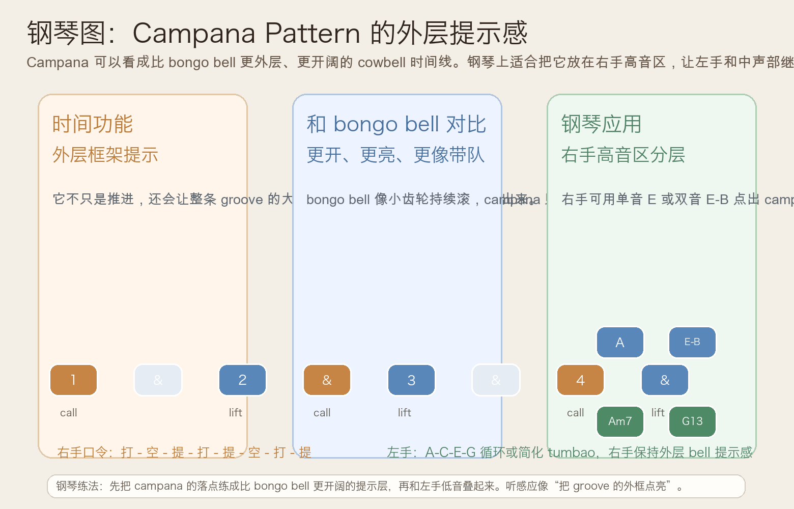
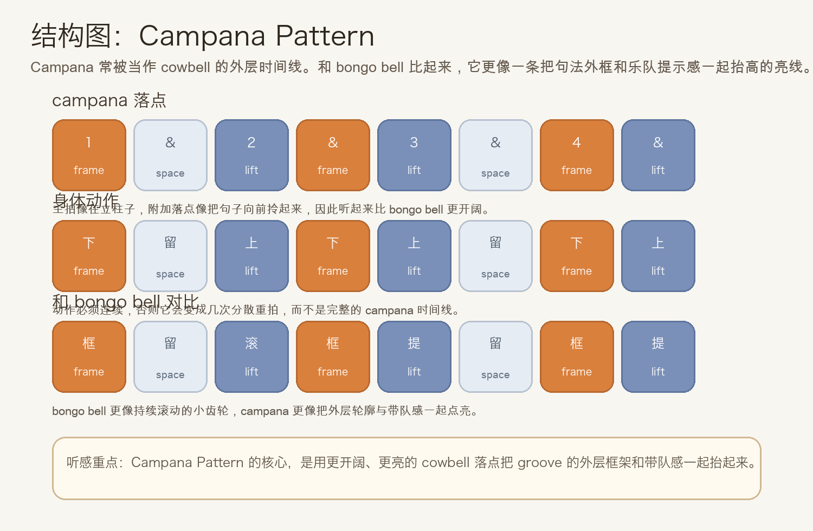
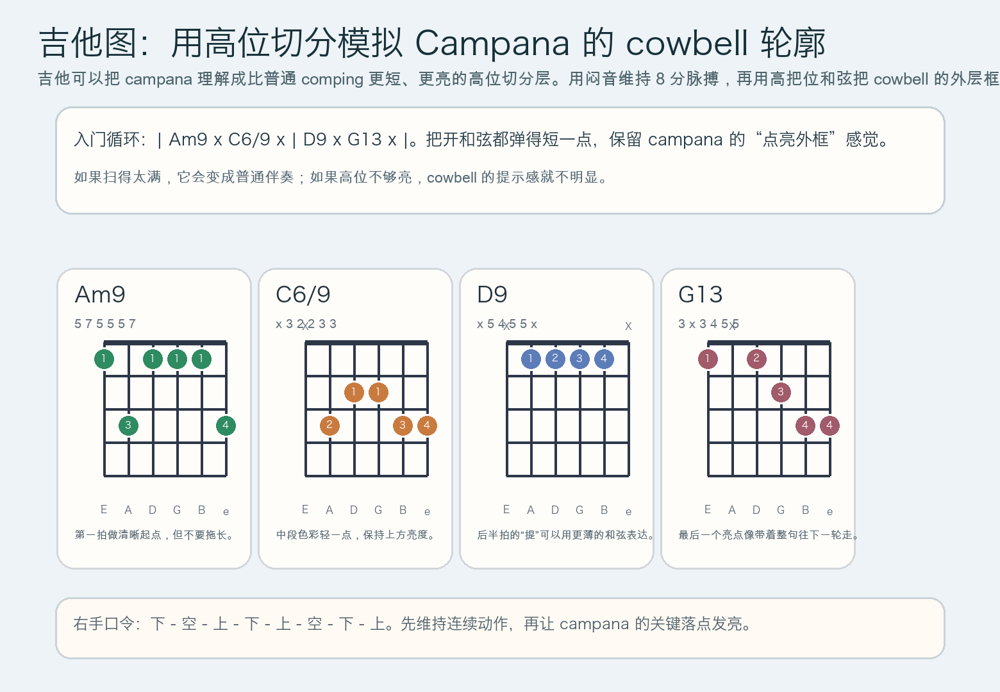

# 2026-06-15：Campana Pattern

## 今日知识点

今天只讲一个知识点：**Campana Pattern，也就是 Afro-Cuban groove 里更完整、更外层的 cowbell 时间线。**

前几天你已经学过：

- `Cascara Rhythm`：像时间线的骨架外壳
- `Mambo Bell Pattern`：把高频亮点提到前面
- `Bongo Bell Pattern`：让 groove 用更细密的方式持续转动

今天继续往前只推进半步：

**如果 bell 不只是“持续推进”，而是开始承担更明显的“外层提示”和“带队感”，会发生什么？**

答案就是 campana。你可以先把它理解成：

```text
bongo bell 更像小齿轮一直滚
campana 更像把整条 groove 的外框点亮
```

它的重要性在于：

1. 它比 bongo bell 更有“外层提示感”
2. 它常把编制里更大的句法轮廓提出来
3. 它很适合和 clave、cascara、钢琴 montuno、低音 tumbao 分层配合
4. 学会它之后，你会更容易听懂为什么同样是 bell，campana 听起来更像“带着乐队往前走”

今天真正要抓住的重点是：

**你要能听见 campana 的作用不是把每一拍都打满，而是用更开阔、更亮的落点把 groove 的外层框架立起来。**





## 钢琴使用场景

钢琴上，Campana Pattern 很适合放在 **Afro-Cuban montuno、高音区固定 bell 提示层、左手保持 pedal 或 tumbao 化低音、编曲里想让 groove 更清楚分层、需要在不加大音量的情况下让句法更明显** 的场景中。

今天用 `A` 小调做一个入门版：

```text
右手 campana：1 . & 2 & . 4 &
左手低音：A . C . | E . G .
和声点缀：Am7 . C6/9 . | D9 . G13 .
```

钢琴上最关键的是三件事：

- 右手要像 cowbell 一样短而亮，不要拖成长音
- 左手继续稳定，不要和右手抢提示功能
- 右手的落点要让人感觉到“句子外框被点出来”，不是在弹一条旋律

它尤其适合：

- 右手先固定单音 `E`，把 campana 的框架感练出来
- 右手再加双音 `E-B`，让高频更像 bell
- 左手保持 `A-C-E-G`，体会 campana 如何悬在 groove 上方发光

## 吉他使用场景

吉他上，Campana Pattern 很常见于 **salsa 或 Latin funk comping、高把位双音切分、短促亮和弦模拟 cowbell、需要把律动外层框架从普通扫弦里分离出来** 的场景里。

今天可以直接套这个入门循环：

```text
| Am9 x C6/9 x | D9 x G13 x |
```

这里的重点不只是和弦名，而是：

- 闷音负责维持连续 8 分脉搏
- 开和弦只在 campana 的关键落点上点亮
- 出声必须短，最好像“亮一下就离开”
- 高把位更容易接近 cowbell 的明亮轮廓



吉他上它尤其适合：

- 先全闷音练右手 `下 - 空 - 上 - 下 - 上 - 空 - 下 - 上`
- 再把 `Am9`、`C6/9`、`D9`、`G13` 插到指定格子
- 和钢琴或贝斯合练时，让吉他负责把外层框架举起来

最常见的错误是：

- 每次都扫得太满，结果只剩普通拉丁伴奏
- 只顾重拍，忽略附加落点的“提”感
- 高音区不够亮，campana 的提示层就听不出来

## 可演奏例子

钢琴例子：

```text
例子 1（右手单音版）
右手：E . E E E . E E
左手：先不加
要求：所有音都短，听起来像外层 bell，不像旋律句。

例子 2（右手 campana + 左手低音）
右手：E . E E E . E E
左手：A . C . | E . G .
要求：左手只负责地板感，右手负责把 groove 的外框点亮。

例子 3（加入和声点缀）
右手：E . E E E . E E
左手/和声：Am7 . C6/9 . | D9 . G13 .
要求：和声只补色彩，campana 的亮线不能被压住。
```

吉他例子：

```text
例子 1（全闷音版）
右手：下 - 空 - 上 - 下 - 上 - 空 - 下 - 上
要求：先让动作连续，再让指定格子真正出声。

例子 2（闷音 + 和弦版）
和弦：| Am9 x C6/9 x | D9 x G13 x |
要求：所有开和弦都短而亮，像 cowbell 的提示层，不要变成长扫弦。
```

## 今日练习

1. 先离开乐器，用拍手把 `打 - 空 - 提 - 打 - 提 - 空 - 打 - 提` 循环 3 分钟。
2. 在钢琴上只用右手一个音 `E` 练 campana，稳定后再加入左手 `A-C-E-G`。
3. 在吉他上先全闷音练右手动作，再把 `| Am9 x C6/9 x | D9 x G13 x |` 套进去。
4. 把昨天的 Bongo Bell Pattern 和今天的 Campana Pattern 连着练，体会“细密推进”与“外层提示”之间的差别。
5. 用一句话回答：为什么 campana 听起来比 bongo bell 更像“把整条 groove 提起来”？

## 一句话总结

Campana Pattern 的核心，不是打得更多，而是用更开阔、更亮的 cowbell 落点把 groove 的外层框架与带队感一起点亮。
