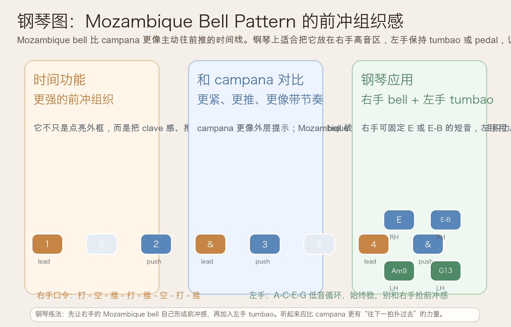
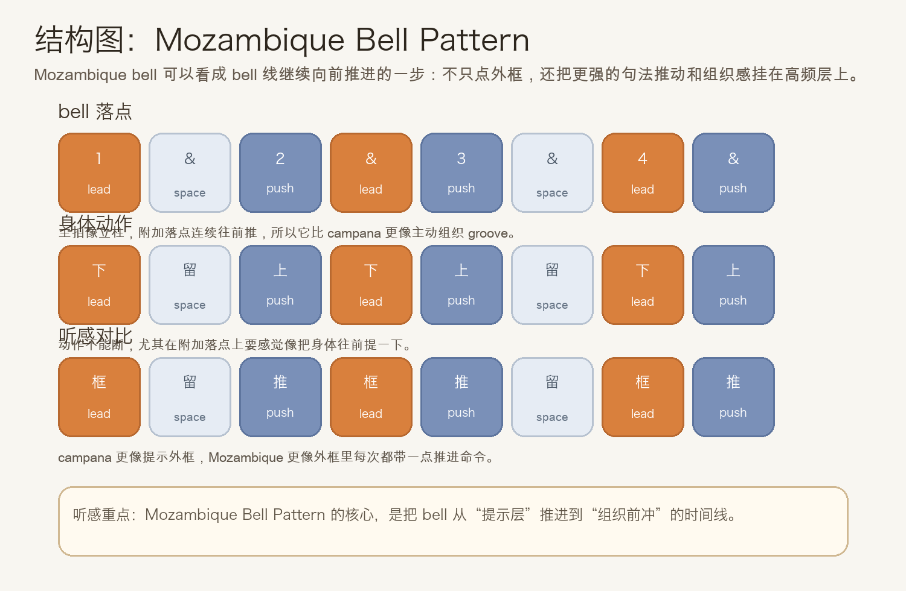
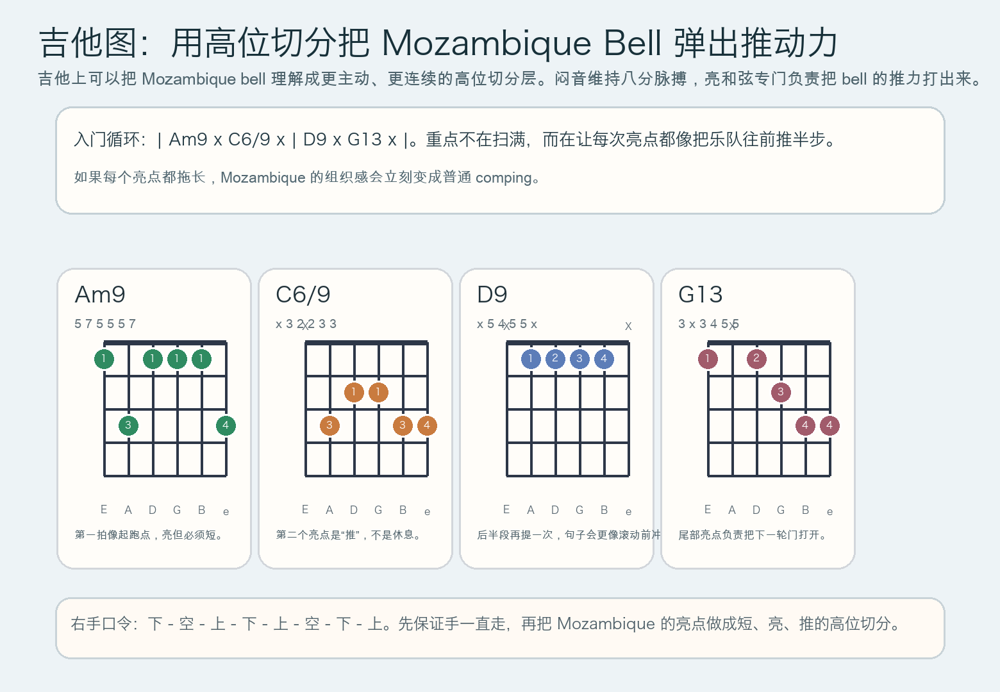

# 2026-06-16：Mozambique Bell Pattern

## 今日知识点

今天只讲一个知识点：**Mozambique Bell Pattern，也就是在 Afro-Cuban groove 里比 campana 更有前冲组织感的一条 bell 时间线。**

前几天你已经走到这里：

- `Mambo Bell Pattern`：先把高频亮点提起来
- `Bongo Bell Pattern`：把 groove 的细密推进持续转起来
- `Campana Pattern`：把整条 groove 的外层框架点亮

今天继续往前只推进半步：

**如果 bell 不只是“提示外框”，而是开始更明显地带着句子往下一拍冲，会发生什么？**

答案就是 Mozambique bell。你可以先把它理解成：

```text
campana 更像把框架点亮
mozambique 更像把框架点亮后继续往前推
```

它的重要性在于：

1. 它比 campana 更有“主动往前拽”的感觉
2. 它会把 bell 从提示层推进到组织层
3. 它很适合和 clave、低音 tumbao、钢琴 montuno 做更紧的分层
4. 学会它之后，你会更容易听懂为什么有些 bell 听起来像“直接带着乐队跑”

今天真正要抓住的重点是：

**你要能听见 Mozambique 的作用不是打更多，而是让每个关键落点都带着“下一步马上要来”的推力。**





## 钢琴使用场景

钢琴上，Mozambique Bell Pattern 很适合放在 **Afro-Cuban vamp、右手高音区 bell 分层、左手保持 tumbao 或 pedal、编曲里想把 groove 从“亮”进一步推成“向前卷”、排练时需要让整条律动更快锁紧** 的场景里。

今天用 `A` 小调做一个入门版：

```text
右手 bell：1 . & 2 & . 4 &
左手低音：A . C . | E . G .
和声点缀：Am9 . C6/9 . | D9 . G13 .
```

钢琴上最关键的是三件事：

- 右手所有音都要短，像 bell，不像旋律句
- 左手继续稳，负责地板，不负责前冲提示
- 右手附加落点要真的有“推过去”的感觉，不能只是机械重复

它尤其适合：

- 右手先固定单音 `E`，把 Mozambique 的推进感练出来
- 右手再加双音 `E-B`，让高频更像真实 cowbell
- 左手保持 `A-C-E-G` 或简化 tumbao，体会 bell 如何持续把句子往下一拍拉

## 吉他使用场景

吉他上，Mozambique Bell Pattern 很适合放在 **salsa、Latin funk、双吉他分层、高把位亮和弦切分、需要比普通 comping 更明显的组织感** 的场景里。

今天可以直接套这个入门循环：

```text
| Am9 x C6/9 x | D9 x G13 x |
```

这里的重点不只是和弦名，而是：

- 闷音负责维持连续八分动作
- 开和弦只在 Mozambique 的关键落点上亮出来
- 每次亮点都要短、亮、推，像 bell 在指挥下一格
- 高把位比低把位更容易接近 cowbell 的轮廓



吉他上它尤其适合：

- 先全闷音练右手 `下 - 空 - 上 - 下 - 上 - 空 - 下 - 上`
- 再把 `Am9`、`C6/9`、`D9`、`G13` 插到指定格子
- 和钢琴、贝斯合练时，让吉他负责把高频前冲感抬出来

最常见的错误是：

- 每次出声都拉太长，结果只剩普通扫弦
- 只会打主拍，附加落点没有“推”的性质
- 右手动作不连续，整个 pattern 就失去组织感

## 可演奏例子

钢琴例子：

```text
例子 1（右手单音版）
右手：E . E E E . E E
左手：先不加
要求：所有音都短，重点听附加落点是不是在“往前推”。

例子 2（右手 bell + 左手低音）
右手：E . E E E . E E
左手：A . C . | E . G .
要求：左手像地板，右手像主动拽着 groove 往前走的高频线。

例子 3（加入和声点缀）
右手：E . E E E . E E
左手/和声：Am9 . C6/9 . | D9 . G13 .
要求：和声只补颜色，bell 的组织感不能被压住。
```

吉他例子：

```text
例子 1（全闷音版）
右手：下 - 空 - 上 - 下 - 上 - 空 - 下 - 上
要求：先保证动作不断，再让 Mozambique 的指定格子发亮。

例子 2（闷音 + 和弦版）
和弦：| Am9 x C6/9 x | D9 x G13 x |
要求：每次开和弦都像短促的 bell 提示，并且要把下一拍往前带。
```

## 今日练习

1. 先离开乐器，用拍手把 `打 - 空 - 推 - 打 - 推 - 空 - 打 - 推` 循环 3 分钟。
2. 在钢琴上只用右手一个音 `E` 练 Mozambique bell，稳定后再加入左手 `A-C-E-G`。
3. 在吉他上先全闷音练右手动作，再把 `| Am9 x C6/9 x | D9 x G13 x |` 套进去。
4. 把昨天的 Campana Pattern 和今天的 Mozambique Bell Pattern 连着练，体会“提示外框”与“主动前冲组织”之间的差别。
5. 用一句话回答：为什么 Mozambique 听起来比 campana 更像“带着乐队往前冲”？

## 一句话总结

Mozambique Bell Pattern 的核心，不是更满，而是让高频 bell 的关键落点持续带着 groove 往下一拍前冲。
