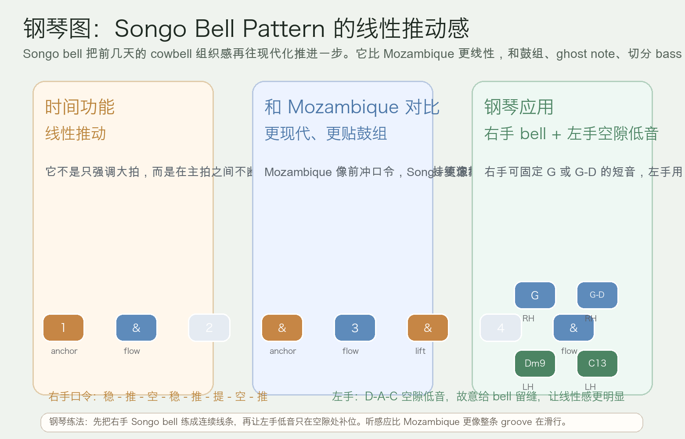
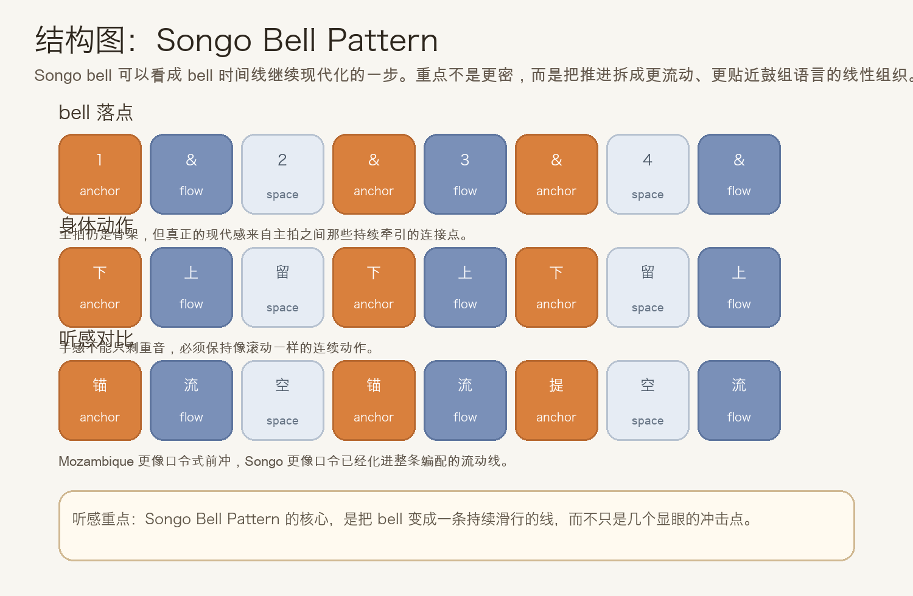
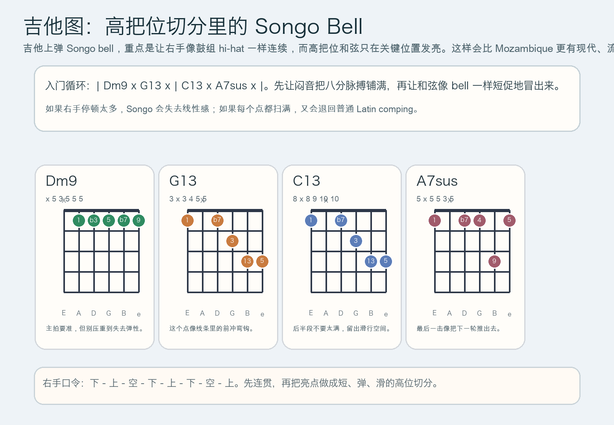

# 2026-06-17：Songo Bell Pattern

## 今日知识点

今天只讲一个知识点：**Songo Bell Pattern，也就是把前几天的 Afro-Cuban bell 时间线继续推进到更现代、更线性的 groove 组织方式。**

前几天这条线是这样走过来的：

- `Campana Pattern`：把乐队外层框架点亮
- `Mozambique Bell Pattern`：让 bell 更主动地往前冲

今天只再往前推进半步：

**如果 bell 不只是“冲”，而是开始和鼓组、ghost note、切分 bass 一起形成一条持续滑行的线，会发生什么？**

这就是 Songo bell 的核心。

你可以先把它理解成：

```text
Mozambique 更像明确喊口令
Songo 更像把口令拆进整条律动织体
```

它的重要性在于：

1. 它比 Mozambique 更线性，主拍之间的连接感更强。
2. 它更容易和现代鼓组、bass 空隙、键盘切分一起锁成一体。
3. 它会让 bell 从“显眼的前冲点”变成“持续带着 groove 滑行的上层轨道”。
4. 学会它之后，你会更容易听懂为什么有些现代 Cuban groove 听起来像一直在滚，而不是只在几个点上撞击。

今天真正要抓住的重点是：

**Songo Bell Pattern 的价值，不是打得更满，而是把推动感分散进整条八分线里。**





## 钢琴使用场景

钢琴上，Songo Bell Pattern 很适合放在 **现代 Afro-Cuban vamp、右手高音区 bell 分层、左手空隙低音、和鼓组配合更紧的 loop、想让 groove 保持滑行感而不是只靠重拍推进** 的场景里。

今天用 `D` 小调做一个入门版：

```text
右手 bell：1 & . & 3 & . &
左手低音：D . A C | . D . A
和声点缀：Dm9 . G13 . | C13 . A7sus .
```

钢琴上最关键的是三件事：

- 右手要像 bell 一样短，但不能像断开的口号
- 左手不要铺满，要给右手留下“线性滑行”的空间
- 主拍要稳，附加落点要像自然流过，而不是生硬补拍

它尤其适合：

- 右手先固定单音 `G`，只练线性感
- 再把右手扩成双音 `G-D`，更接近真实 bell 的亮度
- 左手只在空隙处补 `D-A-C` 低音，体会“bell 在上面滑，低音在下面留缝”的现代层次

## 吉他使用场景

吉他上，Songo Bell Pattern 很适合放在 **Latin funk、现代 salsa、鼓组+贝斯+吉他三件套的高位 comping、想让右手更像 hi-hat 与 bell 混合层** 的场景里。

今天可以直接套这个入门循环：

```text
| Dm9 x G13 x | C13 x A7sus x |
```

这里的重点不只是和弦名，而是：

- 闷音负责维持连续八分动作
- 开和弦只在 Songo 的关键滑行点上亮出来
- 每次亮点都要短、弹、滑，不能变成普通扫弦
- 高把位比低把位更容易做出 bell 的金属轮廓



吉他上它尤其适合：

- 先全闷音练右手 `下 - 上 - 空 - 下 - 上 - 下 - 空 - 上`
- 再把 `Dm9`、`G13`、`C13`、`A7sus` 插到指定格子
- 和鼓手合练时，让自己更像在补 bell 线，而不是另起一层扫弦伴奏

最常见的错误是：

- 只顾着重拍，主拍之间完全没有线性感
- 每个出声点都拖太长，结果整个 pattern 变钝
- 右手动作一停，Songo 就会失去“持续滑行”的现代感

## 可演奏例子

钢琴例子：

```text
例子 1（右手单音版）
右手：G G . G G G . G
左手：先不加
要求：让每个音都短，但听感仍像一整条线在向前滑。

例子 2（右手 bell + 左手空隙低音）
右手：G G . G G G . G
左手：D . A C | . D . A
要求：左手故意少一点，右手负责把 groove 的线性感拉出来。

例子 3（加入和声点缀）
右手：G G . G G G . G
左手/和声：Dm9 . G13 . | C13 . A7sus .
要求：和声只补颜色，别盖住 bell 的滑行感。
```

吉他例子：

```text
例子 1（全闷音版）
右手：下 - 上 - 空 - 下 - 上 - 下 - 空 - 上
要求：把动作先练成连续滚动，再决定哪些位置发亮。

例子 2（闷音 + 和弦版）
和弦：| Dm9 x G13 x | C13 x A7sus x |
要求：每次开和弦都像 bell 的短促亮点，并且和闷音脉搏连成一条线。
```

## 今日练习

1. 先离开乐器，用拍手把 `稳 - 推 - 空 - 稳 - 推 - 提 - 空 - 推` 循环 3 分钟。
2. 在钢琴上只用右手一个音 `G` 练 Songo bell，稳定后再加入左手 `D-A-C` 空隙低音。
3. 在吉他上先全闷音练右手动作，再把 `| Dm9 x G13 x | C13 x A7sus x |` 套进去。
4. 把昨天的 Mozambique Bell Pattern 和今天的 Songo Bell Pattern 连着练，体会“前冲口令感”与“持续滑行感”之间的差别。
5. 用一句话回答：为什么 Songo 听起来比 Mozambique 更像整条 groove 在滚动？

## 一句话总结

Songo Bell Pattern 的核心，不是更密，而是把 bell 的推动力拆进整条线性 groove 里，让音乐持续向前滑行。
