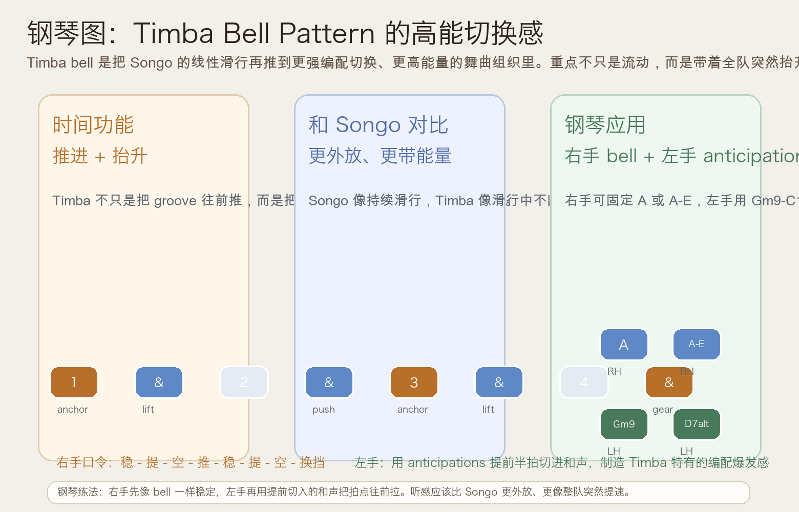
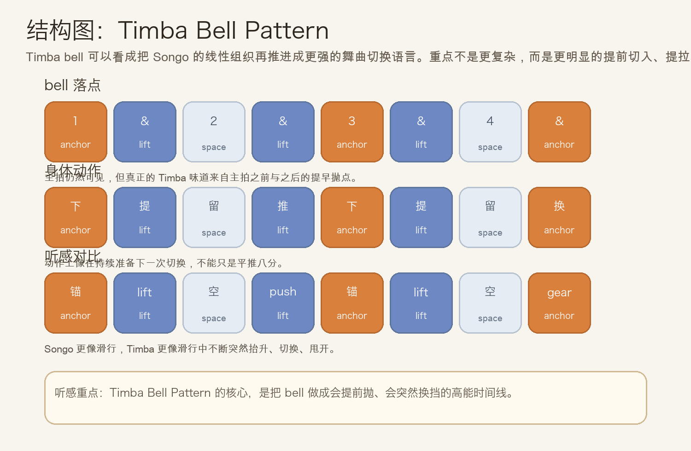
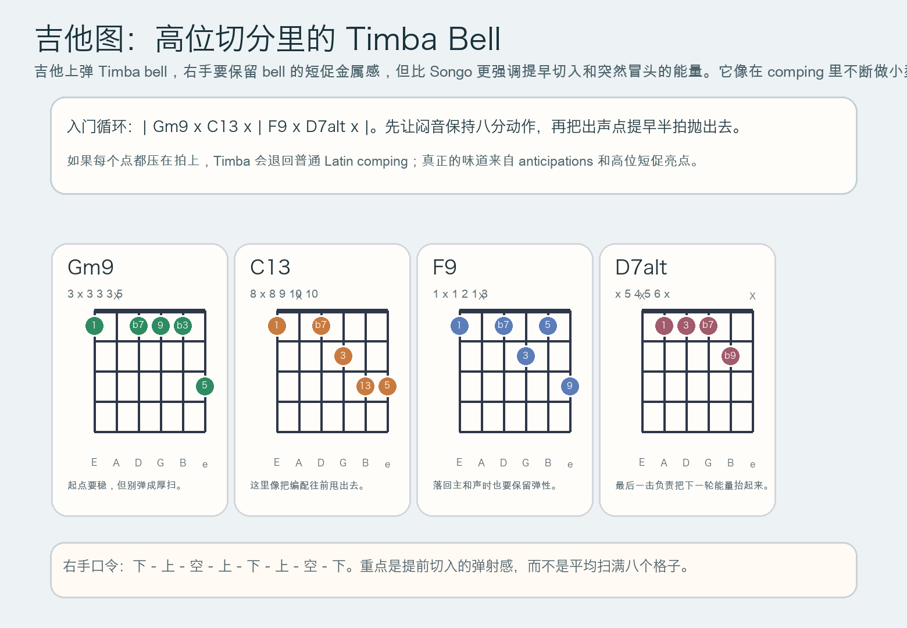

# 2026-06-22：Timba Bell Pattern

## 今日知识点

今天只讲一个知识点：**Timba Bell Pattern，也就是把昨天已经掌握的 Songo 式线性 bell，再推进到更强编配切换感、更高能量的现代古巴舞曲 bell 语言。**

昨天的 `Songo Bell Pattern` 强调的是：

- bell 不只是打点，而是整条 groove 持续滑行
- 它和鼓组、ghost note、切分 bass 咬得更紧

今天只往前再推一步：

**如果 bell 不只是“滑行”，而是开始带着整队乐手一起换挡、抬升、突然甩出去，会发生什么？**

这就是 Timba bell 的核心。

你可以先把它理解成：

```text
Songo 更像持续滑行
Timba 更像滑行中不断提速、抬升、换挡
```

它的重要性在于：

1. 它比 Songo 更强调 anticipations，也就是提前半拍切进来的推力。
2. 它常常不只是伴奏层，而像一个会带动整队编配切换的高频指挥轨道。
3. 它会让 groove 听起来更“炸”、更“甩”，而不是只是稳稳地滚动。
4. 学会它之后，你会更容易分辨现代 Timba 为什么比一般 Latin groove 更有突发的能量抬升感。

今天真正要抓住的重点是：

**Timba Bell Pattern 的价值，不是更花，而是把 bell 做成带有提前切入和换挡感的高能时间线。**





## 钢琴使用场景

钢琴上，Timba Bell Pattern 很适合放在 **更高能量的 Afro-Cuban 舞曲 vamp、montuno 需要突然抬起来的段落、编配里有明显 gear change、想让右手高音 bell 带着整队乐手冲进下一层能量** 的场景里。

今天用 `G` 小调做一个入门版：

```text
右手 bell：1 & . & 3 & . &
左手低音/和声：Gm9 . C13 . | F9 . D7alt .
动作重点：在几个关键点提早半拍切入，而不是全都压在正拍上
```

钢琴上最关键的是三件事：

- 右手要短、亮、准，像 bell 一样立刻弹开
- 左手不要总在正拍落下，要学会用 anticipations 抢在拍前把和声推出来
- 整体听感应该像“整队突然抬升”，而不只是把 Songo 打得更用力

它尤其适合：

- 右手先固定单音 `A`，只练 bell 的抛射感
- 再把右手扩成双音 `A-E`，更接近真实金属亮点
- 左手用 `Gm9 - C13 - F9 - D7alt` 的短和声去做提前切入，体会 gear change 的拉扯

## 吉他使用场景

吉他上，Timba Bell Pattern 很适合放在 **Timba、Latin funk、舞曲化 salsa、鼓组和贝斯都比较现代的高位 comping、想让吉他听起来像 bell 与鼓组层的混合体** 的场景里。

今天可以直接套这个入门循环：

```text
| Gm9 x C13 x | F9 x D7alt x |
```

这里的重点不只是和弦名，而是：

- 闷音维持连续动作，让右手始终像在准备下一次抛射
- 开和弦不要扫满，要像突然冒出来的 bell 亮点
- 几个关键点尽量提前半拍切入，做出 Timba 的前扑感
- 高把位比低把位更容易保住那种硬、亮、短的金属轮廓



吉他上它尤其适合：

- 先全闷音练右手 `下 - 上 - 空 - 上 - 下 - 上 - 空 - 下`
- 再把 `Gm9`、`C13`、`F9`、`D7alt` 插到对应亮点
- 和鼓手、贝斯手合练时，刻意让自己承担“抬能量”和“换挡提示”的角色

最常见的错误是：

- 只会在正拍落点，结果听起来只是普通 Latin comping
- 每个和弦都拉太长，整条 bell 线会立刻变钝
- 右手动作不连续，Timba 那种准备随时抬升的张力就没了

## 可演奏例子

钢琴例子：

```text
例子 1（右手单音版）
右手：A A . A A A . A
左手：先不加
要求：把第二个、第四个、最后一个亮点都弹得像要把下一拍抛出去。

例子 2（右手 bell + 左手 anticipations）
右手：A A . A A A . A
左手：Gm9 . C13 . | F9 . D7alt .
要求：左手和声尽量短，并且尝试提前切入半拍，制造“往前甩”的感觉。

例子 3（加入段落能量变化）
右手：先轻后重，第二轮整体更亮
左手：第二轮在 D7alt 处更主动
要求：感受 Timba 不是只重复，而是会推动段落突然抬升。
```

吉他例子：

```text
例子 1（全闷音版）
右手：下 - 上 - 空 - 上 - 下 - 上 - 空 - 下
要求：保持右手连续动作，让每次亮点都像从闷音里弹出来。

例子 2（闷音 + 和弦版）
和弦：| Gm9 x C13 x | F9 x D7alt x |
要求：把 C13 和 D7alt 的出声点做得更像“提前切入的换挡提示”，不要只是平均扫弦。
```

## 今日练习

1. 先离开乐器，用拍手把 `稳 - 提 - 空 - 推 - 稳 - 提 - 空 - 换挡` 循环 3 分钟。
2. 在钢琴上只用右手一个音 `A` 练 Timba bell，稳定后再加入左手 `Gm9 - C13 - F9 - D7alt`。
3. 在吉他上先全闷音练右手动作，再把 `| Gm9 x C13 x | F9 x D7alt x |` 套进去。
4. 把昨天的 `Songo Bell Pattern` 和今天的 `Timba Bell Pattern` 连着练，比较“持续滑行感”和“高能换挡感”。
5. 用一句话回答：为什么 Timba 会比 Songo 更像整队突然抬起来？

## 一句话总结

Timba Bell Pattern 的核心，不是更满，而是用提前切入和换挡感，把 bell 变成整队编配的高能推进器。
