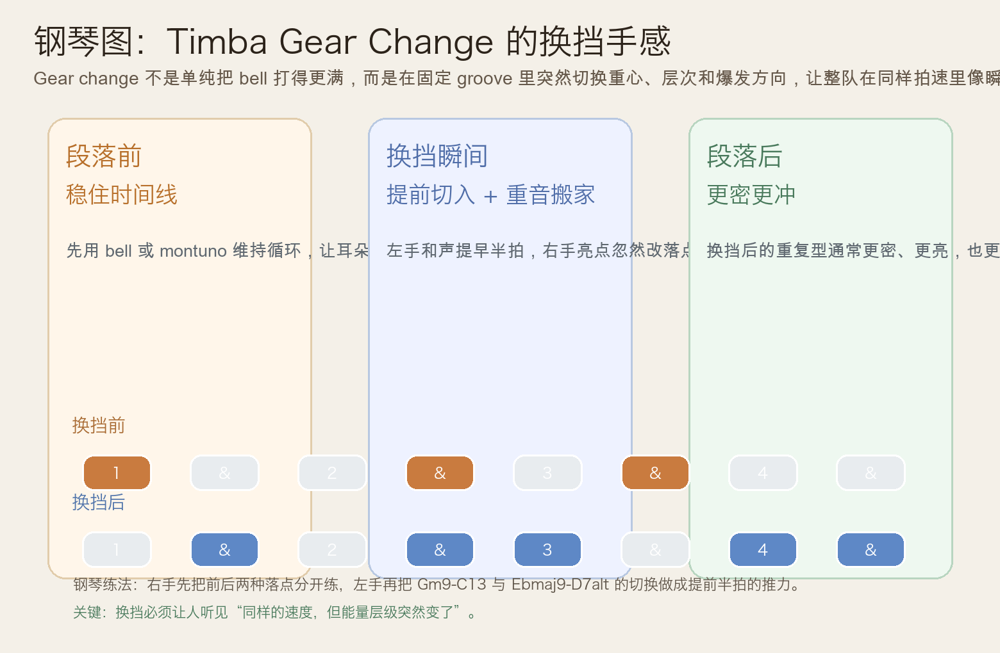
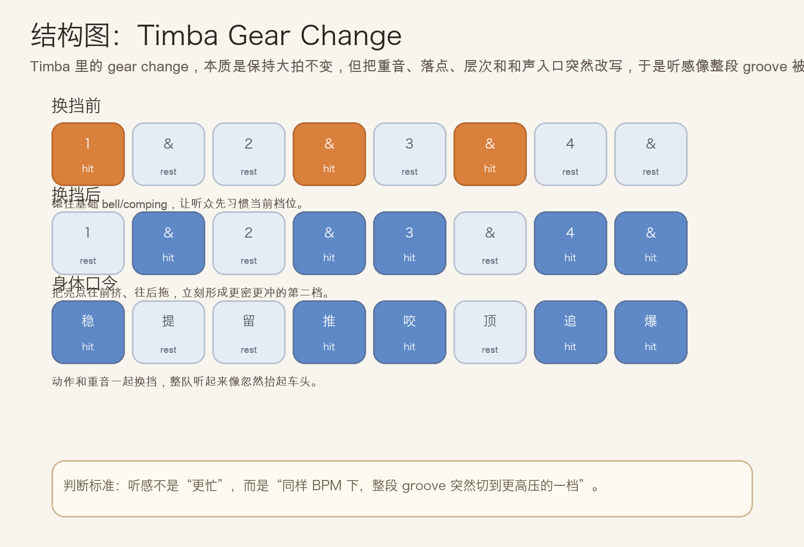
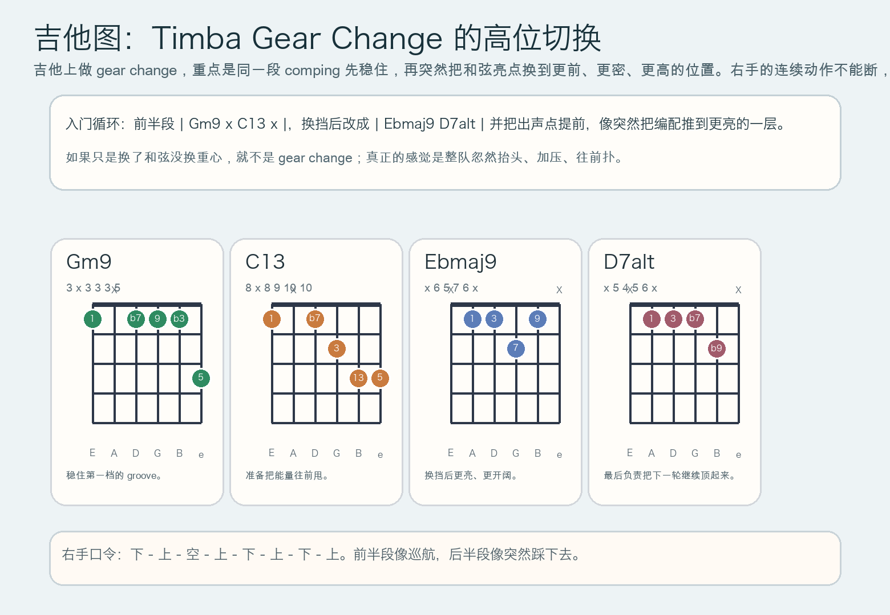

# 2026-06-23：Timba Gear Change

## 今日知识点

今天只讲一个知识点：**Timba Gear Change，也就是在 Timba groove 里保持大拍不变，但突然把重音、落点、和声入口和编配层次一起切到“下一档”的组织方式。**

昨天的 `Timba Bell Pattern` 已经讲到：bell 不只是持续滑行，而是会主动带着乐队抬升能量。

今天只再往前推进一步：

**如果不只是 bell 更有冲劲，而是整个伴奏层都像突然切进更高压的一档，会发生什么？**

这就是 `gear change`。

你可以先把它理解成：

```text
Timba Bell Pattern：bell 本身更会推、更会抬
Timba Gear Change：整段 groove 在同样拍速里突然进入下一档
```

它的关键不是“越来越密就行”，而是：

1. 大拍没变，但重音位置重新分配了。
2. 和声常常会提前半拍切入，让人感觉整队往前扑。
3. 右手或高频层会突然更亮、更短、更密，像把编配开关拨到更猛烈的一侧。
4. 听感像“同样速度下瞬间加压”，而不是简单的加速。

今天真正要抓住的是：

**Timba Gear Change 的核心，不是更多音，而是同样速度里突然切换能量档位。**





## 钢琴使用场景

钢琴上，`Timba Gear Change` 很适合放在 **montuno 已经稳住、舞池能量准备继续抬升、编曲需要从“巡航”突然切到“爆发”、铜管或歌手要进下一层段落** 的场景里。

今天用 `G` 小调做一个入门版：

```text
换挡前：| Gm9 . C13 . |
换挡后：| Ebmaj9 . D7alt . |
右手：先用较疏的 bell / 双音，换挡后把亮点往前挤、让高音更亮更短
左手：和声尽量提前半拍切入，制造“整队往前冲”的拉力
```

钢琴上最关键的是三件事：

- 换挡前先把 groove 站稳，不然听众听不出“档位变化”
- 换挡后右手不要只是更大声，而要更短、更亮、更像突然冒出来的 bell
- 左手要学会把和声入口前移，让编配像被瞬间拽进下一段

它尤其适合这样练：

- 第一轮右手只弹单音 `A`
- 第二轮右手改成双音 `A-E`，并把几个亮点往前推
- 左手从 `Gm9 - C13` 切到 `Ebmaj9 - D7alt`，体会从“稳住”到“顶起来”的段落差

## 吉他使用场景

吉他上，`Timba Gear Change` 很适合放在 **高位 comping、和鼓组互相顶拍、需要从常规切分突然切到更高压的舞曲层、乐队想让副歌前或 breakdown 后的回归更炸** 的场景里。

今天可以直接套这个两段式循环：

```text
换挡前：| Gm9 x C13 x |
换挡后：| Ebmaj9 D7alt |
```

吉他上的重点不只是换和弦，而是：

- 右手闷音动作要一直连续，像发动机没熄火
- 前半段保留空间，后半段把亮点拉得更前、更密
- 高位短促出声比低位厚扫更容易做出 Timba 的“换挡”感
- `D7alt` 末尾要像把下一轮直接顶起来，而不是普通收尾



吉他上它尤其适合：

- 先全闷音练右手 `下 - 上 - 空 - 上 - 下 - 上 - 下 - 上`
- 再把 `Gm9`、`C13`、`Ebmaj9`、`D7alt` 放进对应亮点
- 和鼓、贝斯合练时，故意把后半段弹得更像“整队突然抬头”

最常见的错误是：

- 只有音量变化，没有落点变化，结果听起来只是“更用力”
- 换挡前就已经太满，后面没有空间可以再抬
- 每个和弦都扫太长，bell 感和齿轮切换感都会变钝

## 可演奏例子

钢琴例子：

```text
例子 1（先分前后两档）
第一轮右手：A . . A . A . .
第二轮右手：. A . A A . A A
要求：第二轮必须明显更像“往前咬住拍子”。

例子 2（加入左手和声）
第一轮左手：Gm9 . C13 .
第二轮左手：Ebmaj9 . D7alt .
要求：第二轮左手入口尝试提前半拍，让换挡感更强。

例子 3（完整两轮）
第一轮：稳住 groove
第二轮：更亮、更短、更密
要求：听起来像同一台机器突然切到更高档，而不是换了一首歌。
```

吉他例子：

```text
例子 1（纯右手动作）
前半段：下 - 上 - 空 - 上
后半段：下 - 上 - 下 - 上
要求：后半段像突然踩下去，动作连续但压力更高。

例子 2（闷音 + 和弦）
和弦：| Gm9 x C13 x | Ebmaj9 D7alt |
要求：前半段保留空间，后半段把出声点做得更短、更前、更亮。
```

## 今日练习

1. 先拍手练两轮对比：第一轮 `稳 - 空 - 推 - 空`，第二轮 `提 - 推 - 咬 - 爆`，循环 3 分钟。
2. 在钢琴上只用右手一个音 `A` 练前后两种档位，再加入左手 `Gm9 - C13 - Ebmaj9 - D7alt`。
3. 在吉他上先全闷音练右手动作，再把 `| Gm9 x C13 x | Ebmaj9 D7alt |` 套进去。
4. 把昨天的 `Timba Bell Pattern` 和今天的 `Timba Gear Change` 连着练，比较“bell 更主动”和“整段编配突然换挡”的差别。
5. 用一句话回答：为什么 gear change 听起来像加速，但实际上速度没变？

## 一句话总结

Timba Gear Change 的核心，是在同样拍速里突然重排落点和能量层次，让整段 groove 像被一把推进下一档。
