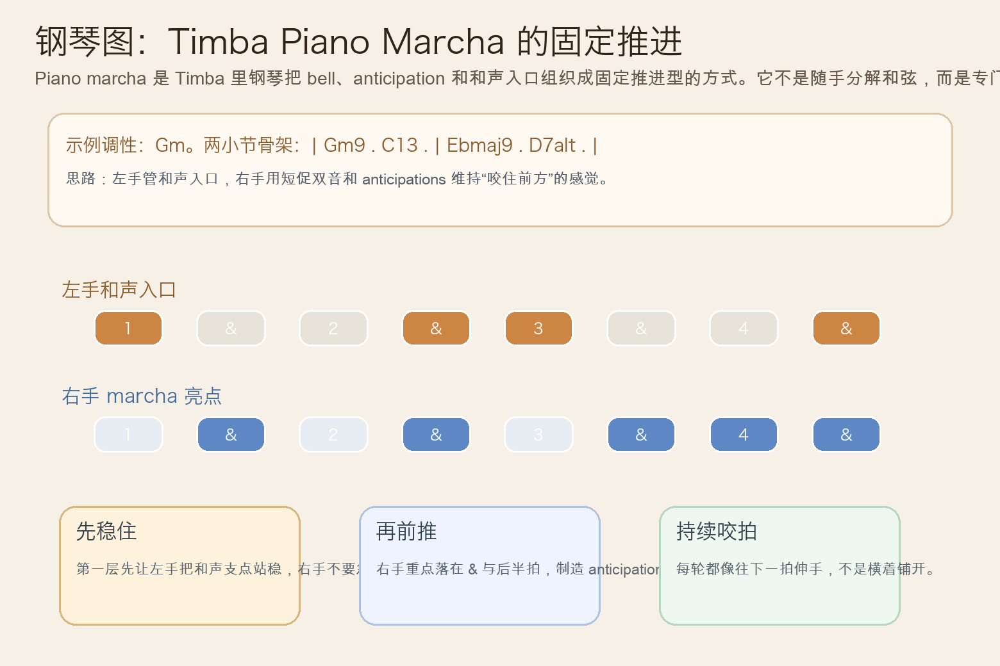
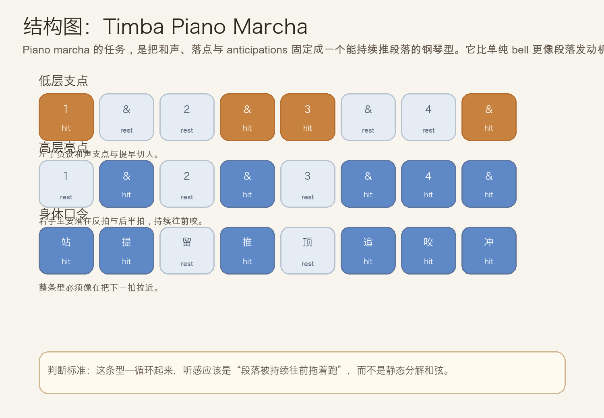
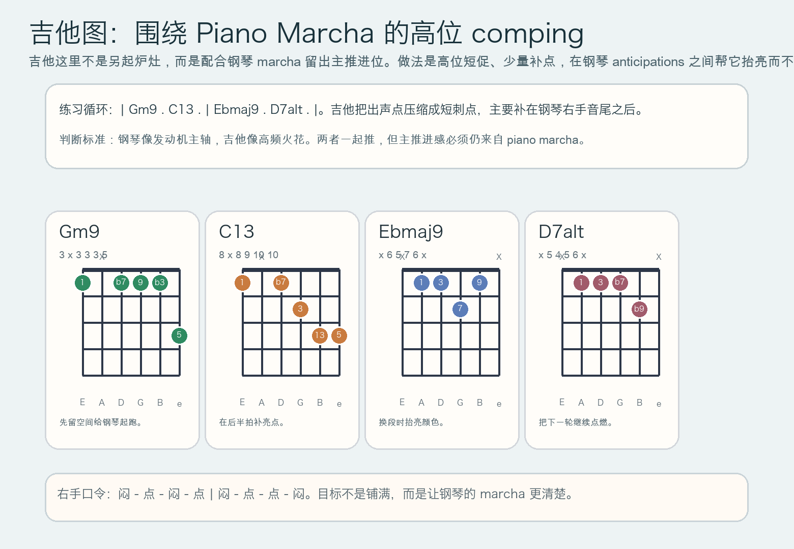

# 2026-06-24：Timba Piano Marcha

## 今日知识点

今天只讲一个知识点：**Timba Piano Marcha，也就是 Timba 里钢琴把和声入口、反拍 anticipations 与固定重复型组织成“持续往前推”的主推进线。**

昨天的 `Timba Gear Change` 讲的是：整段 groove 在同样拍速里突然切到下一档。

今天只再往前推进一步：

**当乐队已经换到高压档位以后，钢琴到底靠什么把这一档稳稳撑住？**

答案就是 `piano marcha`。

它和普通的“分解和弦伴奏”不一样：

- 它不是随手把和弦弹开
- 它有明确的固定落点
- 它常常故意把亮点放在 `&` 和后半拍
- 它的任务是持续把段落往下一拍拖

你可以先把它理解成：

```text
Timba Bell Pattern：高频层负责抬亮、提示和催动
Timba Gear Change：整段 groove 突然切到更高压的一档
Timba Piano Marcha：钢琴把这一档的推进感固定下来，持续往前推
```

今天真正要抓住的是：

**Timba Piano Marcha 的核心，不是“和弦很多”，而是“钢琴用固定型不断制造 anticipations，让段落始终往前咬”。**





## 钢琴使用场景

钢琴上，`Timba Piano Marcha` 很适合放在 **gear change 已经发生、主歌进入高能段、副歌要持续顶住、铜管与打击乐已经同时上压、编曲需要一个不会掉速的发动机层** 的场景里。

今天用 `G` 小调做一个入门版两小节循环：

```text
| Gm9 . C13 . | Ebmaj9 . D7alt . |
左手：负责和声支点，常在拍头或提前半拍切入
右手：负责 marcha 亮点，把重点放在 &、后半拍、短促双音
```

钢琴上最关键的是三件事：

1. 左手要先把和声支点站稳，不然右手再忙也只是散。
2. 右手的亮点必须短、准、靠前，听起来像一直在把下一拍拉近。
3. 每轮都要保持同一个“推进口气”，不能第一轮推、第二轮散。

它尤其适合这样练：

- 第一步，右手只弹一个双音 `A-D`
- 第二步，把双音固定到 `&` 和后半拍
- 第三步，再加入左手 `Gm9 - C13 - Ebmaj9 - D7alt`
- 第四步，保持音量不要越来越大，只让推进感越来越稳

## 吉他使用场景

吉他上，今天不是让你去“复制整条 piano marcha”，而是学会 **围绕它做高位 comping**。因为在真正的 Timba 编配里，钢琴常是主推进线，吉他更像补光和加火花。

今天可以直接套用同一套和声：

```text
| Gm9 . C13 . | Ebmaj9 . D7alt . |
```

吉他上的重点是：

1. 出声要短，不要扫太长，不然会把钢琴 marcha 的边缘磨钝。
2. 亮点尽量放在钢琴右手音尾后，像接力，而不是抢拍头。
3. 高位和弦比低位厚扫更适合这个主题，因为它更像“火花层”。

最常见的错误是：

- 吉他也弹成主推进线，结果和钢琴打架
- 每个和弦都扫满一拍，失去 Timba 的短促咬拍感
- 只顾密，不顾落点，听起来会变成乱



## 可演奏例子

钢琴例子：

```text
例子 1（右手单独练）
数法：1 & 2 & 3 & 4 &
右手：. x . x . x x x
要求：每个 x 都要短，像在往前咬。

例子 2（加左手）
左手：x . . x x . . x
右手：. x . x . x x x
要求：左手给支点，右手给推进，不要互相盖住。

例子 3（完整两小节）
和声：| Gm9 . C13 . | Ebmaj9 . D7alt . |
要求：循环两分钟，感受“不是在弹和弦”，而是在持续推段落。
```

吉他例子：

```text
例子 1（纯节奏）
闷 - 点 - 闷 - 点 | 闷 - 点 - 点 - 闷
要求：保持右手连续，但每次出声都像短刺点。

例子 2（带和弦）
和弦：| Gm9 . C13 . | Ebmaj9 . D7alt . |
要求：把出声点留在钢琴 marcha 的空隙里，像补光而不是盖住主线。
```

## 今日练习

1. 先拍手数 `1 & 2 & 3 & 4 &`，把右手 marcha 口令念成 `空-点-空-点-空-点-点-点`。
2. 钢琴右手只用一个双音练 3 分钟，确认每个亮点都短促且稳定。
3. 再加入左手 `Gm9 - C13 - Ebmaj9 - D7alt`，连续循环 2 分钟，不要越弹越散。
4. 吉他先全闷音练 `闷 - 点 - 闷 - 点 | 闷 - 点 - 点 - 闷`，再把四个和弦放进去。
5. 把昨天的 `Timba Gear Change` 接到今天的 `Timba Piano Marcha`：先换挡，再让钢琴用固定型把高压档位维持住。

## 一句话总结

Timba Piano Marcha 的核心，是让钢琴用固定的 anticipations 和和声支点持续往前推，把高能段落稳稳“发动”起来。
