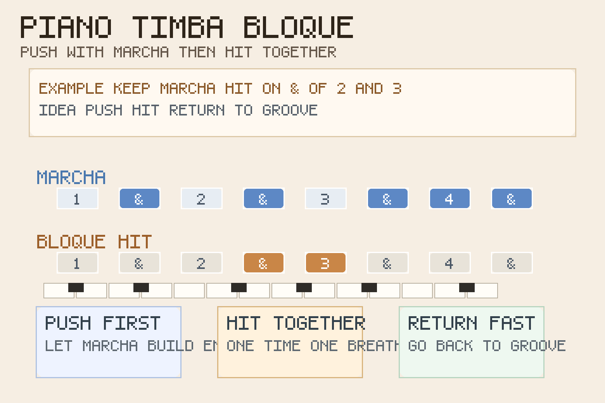
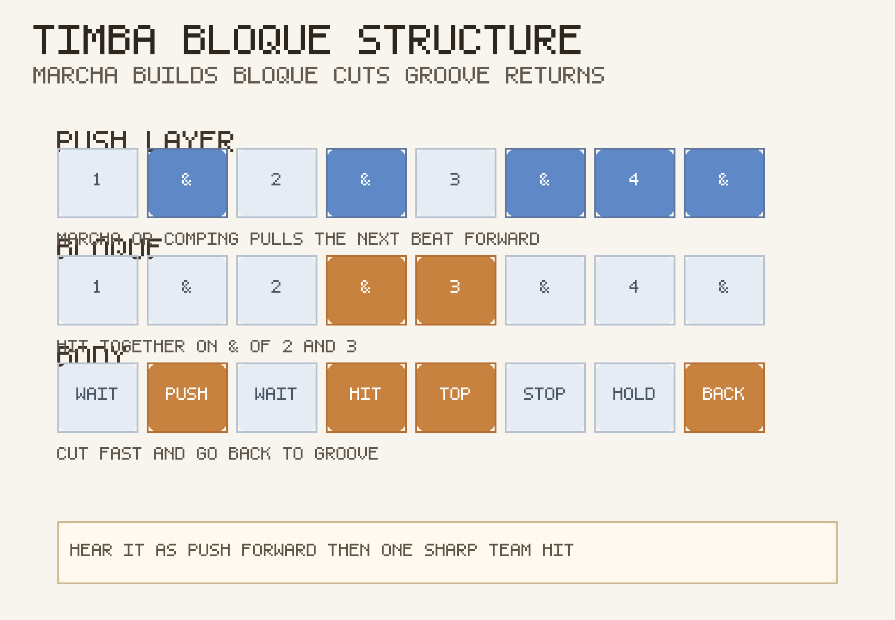
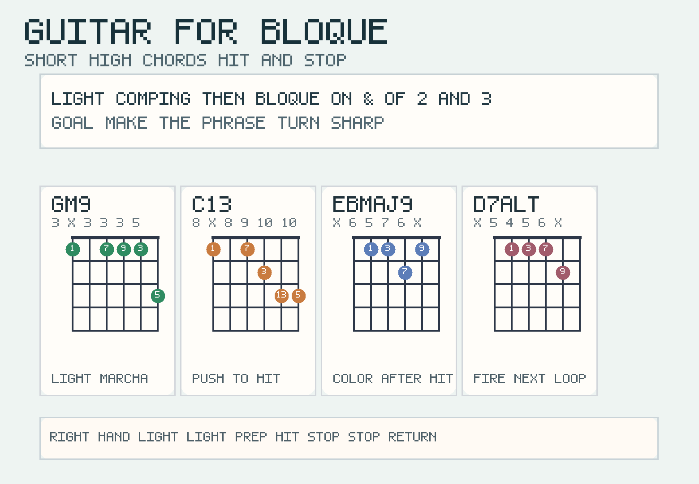

# 2026-06-25：Timba Bloque

## 今日知识点

今天只讲一个知识点：**Timba Bloque，也就是 Timba 里全队在 groove 内部突然统一击打出来的重音断点。**

昨天的 `Timba Piano Marcha` 讲的是：钢琴如何用固定推进型把高能段落持续顶住。

今天只往前推进一步：

**当 marcha 已经把能量一路推起来以后，乐队怎样在某个瞬间“整队一起砸一下”，让段落突然更炸？**

答案就是 `bloque`。

它不是普通重拍，也不是随手加一个 accent：

- 它通常是整队统一动作
- 它常出现在高能段落内部
- 它的作用是把持续推进的 groove 暂时“结块”
- 它打完以后，往往要立刻回到 marcha 或下一层 groove

你可以先把它理解成：

```text
Timba Bell Pattern：负责高频提示与抬亮
Timba Gear Change：负责整段 groove 的换挡
Timba Piano Marcha：负责把高压档位持续顶住
Timba Bloque：负责在高压档位里突然给出全队统一爆点
```

今天真正要抓住的是：

**Timba Bloque 的核心，不是“打得更重”，而是“所有人同一时刻、同一口气地打出一个断点标点”。**





## 钢琴使用场景

钢琴上，`Timba Bloque` 很适合放在 **副歌高能段已经跑起来、piano marcha 正在持续往前推、铜管准备加入统一口号、编曲需要一个全队一起“砸下去”的转折点** 的场景里。

今天用 `G` 小调做一个入门版循环：

```text
前一小节：| Gm9 . C13 . |
bloque 小节：在 & of 2 和 3 做统一重击，再立刻收住
回到下一轮：| Ebmaj9 . D7alt . |
```

钢琴上的关键有三件事：

1. 在 bloque 之前，先让 marcha 把能量积够，不然重击会像平地起跳。
2. bloque 要短、准、齐，像“啪”地一下把段落打出一个标点。
3. 打完以后不要拖成长音，要立刻给下一轮 groove 留空间。

最实用的练法是：

- 左手先只弹和声入口
- 右手先只练 `& of 2 -> 3` 的统一落点
- 再把两者接起来，感受“先推，再砸，再回”

## 吉他使用场景

吉他上，今天的重点不是连续扫弦，而是 **围绕 bloque 做高位短刺点 comping**。因为在真正的 Timba 编配里，bloque 往往需要吉他和钢琴一起切出同样的攻击边缘。

今天也沿用同一套和声：

```text
| Gm9 . C13 . | Ebmaj9 . D7alt . |
```

吉他的重点是：

1. bloque 前的 comping 要轻，像蓄力，不要先把能量用光。
2. bloque 那一下要像刀口，出声短而整齐，不要扫成长条。
3. 打完以后要真的停，不要手还在惯性刷弦。

最常见的错误是：

- 还在按普通伴奏思路持续扫
- bloque 那一下太长，听起来像普通重拍
- 和钢琴没有统一落点，结果爆点散掉



## 可演奏例子

钢琴例子：

```text
例子 1（先练落点）
数法：1 & 2 & 3 & 4 &
动作：. . . x x . . .
要求：`& of 2` 和 `3` 要像一个连着的统一砸点。

例子 2（加 marcha 铺垫）
前半：. x . x . x x x
bloque：. . . x x . . .
要求：先把 groove 推起来，再突然一起收紧。

例子 3（完整循环）
和声：| Gm9 . C13 . | Ebmaj9 . D7alt . |
要求：第一小节推，第二小节砸，随后立刻回到下一轮。
```

吉他例子：

```text
例子 1（纯节奏）
口令：轻点 - 轻点 - 预备 - 砸 | 停 - 停 - 回 groove
要求：先蓄力，bloque 那一下像切口。

例子 2（带和弦）
和弦：| Gm9 . C13 . | Ebmaj9 . D7alt . |
要求：bloque 和钢琴完全对齐，打完立刻停手。
```

## 今日练习

1. 先拍手数 `1 & 2 & 3 & 4 &`，只把 `& of 2` 和 `3` 拍重，练出一个紧凑的双击感。
2. 钢琴右手单独练 bloque 落点 3 分钟，确保每次都短促、整齐。
3. 再加入前一小节 marcha，练“先推 1 小节，再砸 1 次”的循环。
4. 吉他先全闷音练同样落点，再把 `Gm9 - C13 - Ebmaj9 - D7alt` 放进去。
5. 把昨天的 `Timba Piano Marcha` 接到今天的 `Timba Bloque`：先让 groove 跑起来，再在同一口气里打出统一标点。

## 一句话总结

Timba Bloque 的核心，是在持续推进的 groove 里让全队同一时刻打出一个短促而统一的爆点。
