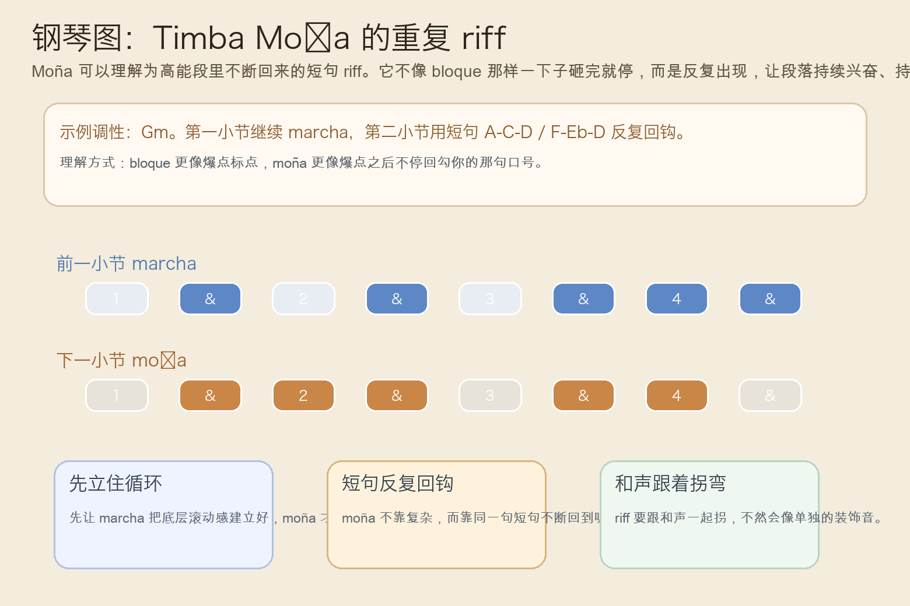
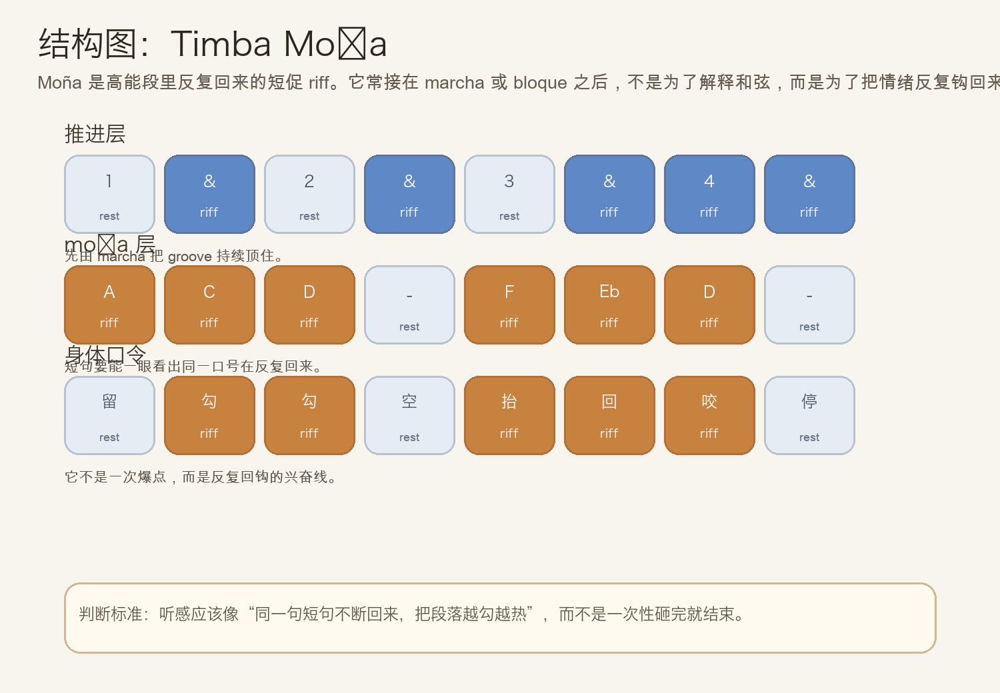
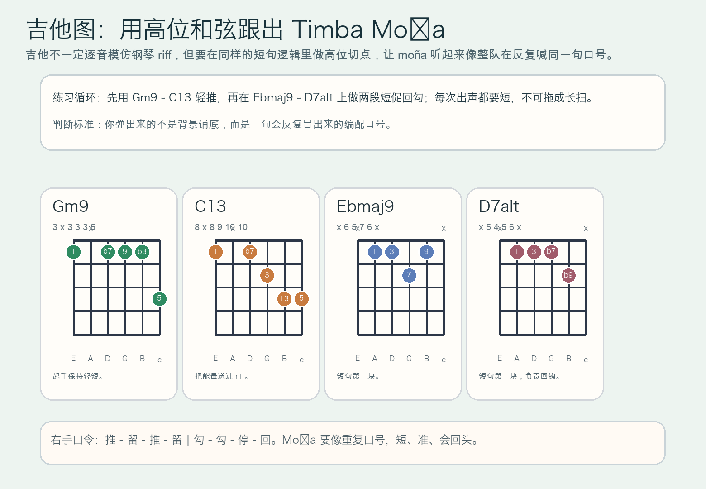

# 2026-06-26：Timba Moña

## 今日知识点

今天只讲一个知识点：**Timba Moña，也就是 Timba 高能段里反复回来的短促 riff / 口号型句子。**

昨天的 `Timba Bloque` 讲的是：乐队怎样在 groove 内部突然统一砸出一个爆点标点。

今天只再往前推进一步：

**如果不是只“砸一下”，而是让一小句很抓耳的短句不断回来，把全场持续往前勾，会发生什么？**

答案就是 `moña`。

它和 bloque 不一样：

- bloque 更像一次性的统一爆点
- moña 更像会反复出现的短句口号
- bloque 常负责“砸下来”
- moña 常负责“砸完以后继续把兴奋拉住”

你可以先把它理解成：

```text
Timba Piano Marcha：负责持续推进
Timba Bloque：负责突然统一爆点
Timba Moña：负责让一条短句不断回头，把高能段越勾越热
```

今天真正要抓住的是：

**Timba Moña 的核心，不是“riff 更复杂”，而是“同一句短促口号不断回来，让段落持续兴奋”。**





## 钢琴使用场景

钢琴上，`Timba Moña` 很适合放在 **副歌高压档已经立住、marcha 正在持续推、bloque 刚刚把全队炸醒、接下来需要一个能反复勾住耳朵的短句层** 的场景里。

今天用 `G` 小调做一个入门版两小节循环：

```text
前一小节：| Gm9 . C13 . |
moña 小节：| Ebmaj9 . D7alt . |
右手短句：A - C - D | F - Eb - D
```

钢琴上的关键有三件事：

1. moña 必须短，像口号，不能弹成大段即兴。
2. 短句要会重复回来，第一次像提出，第二次像强化。
3. 和声变化时，riff 的重心也要跟着拐，不然会像脱离编配的装饰音。

最实用的练法是：

- 左手先只站住 `Gm9 - C13 - Ebmaj9 - D7alt`
- 右手先只练 `A-C-D` 和 `F-Eb-D` 两个小块
- 再把它们放进固定落点里，感受“不是一直铺，而是一直回勾”

## 吉他使用场景

吉他上，今天的重点不是密集扫弦，而是 **围绕 moña 做高位短句 comping**。因为真正的 Timba 编配里，吉他常常不是主旋律，但会和钢琴一起把那句口号“刻”得更清楚。

今天也沿用同一套和声：

```text
| Gm9 . C13 . | Ebmaj9 . D7alt . |
```

吉他的重点是：

1. 每次出声都要短，像切点，不要扫成长条。
2. 如果钢琴负责更明确的音高轮廓，吉他就负责把同一节奏口号再刻深一点。
3. 第二次回到 moña 时，可以稍微更亮，但不能更乱。

最常见的错误是：

- 只顾重复和弦，没有做出“短句回来”的感觉
- 扫弦太长，把 moña 弹成普通伴奏
- 每次回句都改太多，结果听众抓不住口号



## 可演奏例子

钢琴例子：

```text
例子 1（右手先练口号）
数法：1 & 2 & 3 & 4 &
右手：. A C D . F Eb D
要求：A-C-D 和 F-Eb-D 要像两块能记住的短句。

例子 2（加入 marcha 铺垫）
前一小节：. x . x . x x x
下一小节：. A C D . F Eb D
要求：先让 marcha 推起来，再让 moña 像口号冒出来。

例子 3（完整循环）
和声：| Gm9 . C13 . | Ebmaj9 . D7alt . |
要求：连续循环时，听感应该越来越“抓耳”，不是越来越忙。
```

吉他例子：

```text
例子 1（纯节奏）
口令：推 - 留 - 推 - 留 | 勾 - 勾 - 回 - 停
要求：后半小节像重复口号，不像普通扫弦。

例子 2（带和弦）
和弦：| Gm9 . C13 . | Ebmaj9 . D7alt . |
要求：第二小节把出声点做得短而准，像和钢琴一起喊同一句话。
```

## 今日练习

1. 先拍手数 `1 & 2 & 3 & 4 &`，把后半小节念成 `A-C-D / F-Eb-D`，练出一句会回头的口号感。
2. 钢琴右手单独练这两个三音块 3 分钟，确保每次都短促、可辨认。
3. 再加入前一小节 marcha，练“先推 1 小节，再回一句 moña”的两小节循环。
4. 吉他先全闷音练同样的节奏轮廓，再把 `Gm9 - C13 - Ebmaj9 - D7alt` 放进去。
5. 把昨天的 `Timba Bloque` 接到今天的 `Timba Moña`：先整队砸出爆点，再用重复短句把兴奋继续吊住。

## 一句话总结

Timba Moña 的核心，是让一条短促而抓耳的 riff 反复回来，把高能段落持续勾住、持续推热。
