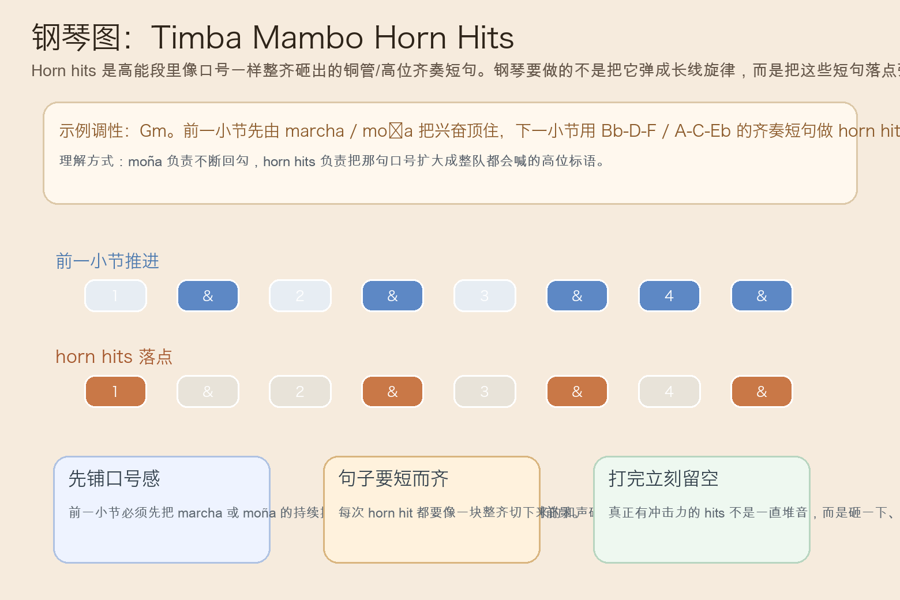
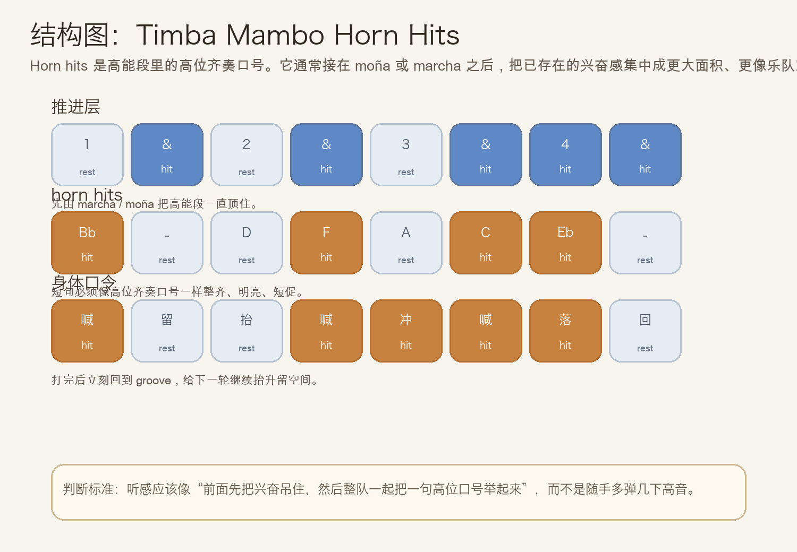
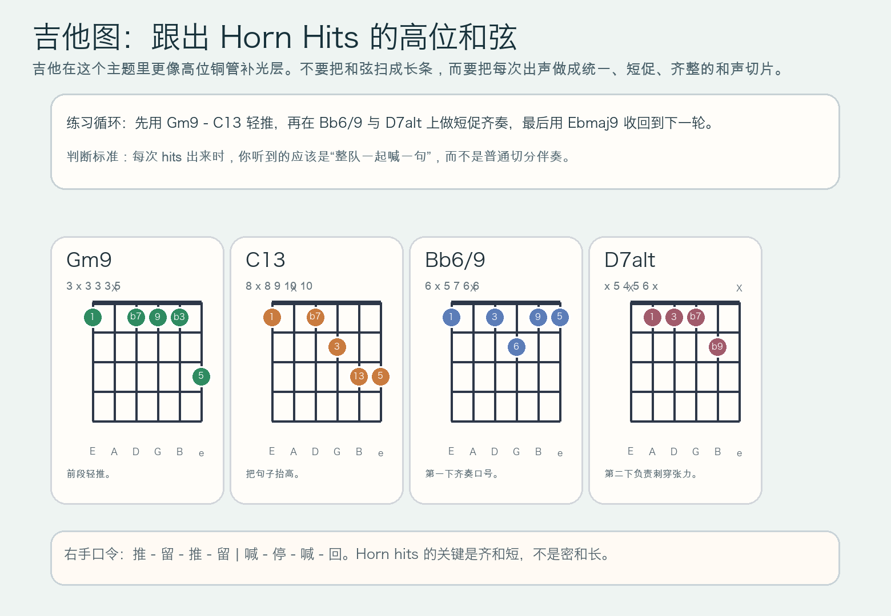

# 2026-06-29：Timba Mambo Horn Hits

## 今日知识点

今天只讲一个知识点：**Timba Mambo Horn Hits，也就是 Timba 高能段里由铜管或高位齐奏层打出来的短促口号型重击。**

上一次的 `Timba Moña` 讲的是：一小句短促 riff 如何反复回来，把兴奋一直勾住。

今天只再往前推进一步：

**如果这句会回头的口号，不再只是钢琴或局部伴奏层的小句子，而是被整个高位齐奏层一起举起来，会发生什么？**

这就是 `Timba Mambo Horn Hits` 的核心。

你可以先把它理解成：

```text
Timba Moña：短句不断回来，持续勾住听众
Timba Mambo Horn Hits：把这句口号扩大成整队高位齐奏，一下子把段落喊亮
```

它的重要性在于：

1. 它会把已经存在的高能 groove 集中成更明确的“口号感”。
2. 它通常比普通 comping 更短、更齐、更像标语，而不是连续铺底。
3. 它能和 `marcha`、`moña`、`bloque` 分工：前者负责推，后者负责喊。
4. 学会它之后，你会更容易分辨为什么很多 Timba 高潮段听起来像“整队一起举牌发声”。

今天真正要抓住的是：

**Timba Mambo Horn Hits 的价值，不是音更多，而是把高位短句做成全队统一的强口号。**





## 钢琴使用场景

钢琴上，`Timba Mambo Horn Hits` 很适合放在 **副歌已经顶住、moña 正在不断回勾、铜管准备加入统一口号、编曲需要一句能让全场立刻抬头的高位短句** 的场景里。

今天用 `G` 小调做一个入门版两小节循环：

```text
前一小节：| Gm9 . C13 . |
hits 小节：| Bb6/9 . D7alt . |
右手短句：Bb-D-F | A-C-Eb
左手支点：Gm9 - C13 先稳住，再在 hits 小节只给短支点
```

钢琴上最关键的是三件事：

1. 前一小节先把推进线站稳，不然 hits 会像平地起跳。
2. hits 必须短、齐、亮，像铜管齐奏，不要弹成长线旋律。
3. 每次 hit 后要真的留空，让下一下更像“回应”，而不是一口气铺满。

它尤其适合这样练：

- 先只弹右手 `Bb-D-F / A-C-Eb` 两个三音块
- 再把这两个三音块放进 `1、& of 2、& of 3、& of 4` 的固定落点
- 最后加回左手 `Gm9 - C13 - Bb6/9 - D7alt`，体会“先推再喊”的组织逻辑

## 吉他使用场景

吉他上，`Timba Mambo Horn Hits` 很适合放在 **高位 comping 要暂时从背景补光变成前景齐奏、需要和钢琴/铜管一起打出口号、编配里想让 guitar 也承担短促高位标语** 的场景里。

今天可以直接套这个循环：

```text
| Gm9 . C13 . | Bb6/9 . D7alt . |
```

这里的重点不只是和弦名，而是：

- 前一小节用轻短闷音维持发动机感
- 到 hits 小节时，每次和弦都像切片一样干净、统一
- 出声后立刻收手，避免扫成长条
- 高把位发声比低把位厚扫更容易做出铜管式高位亮度



吉他上它尤其适合：

- 先全闷音练右手 `推 - 留 - 推 - 留 | 喊 - 停 - 喊 - 回`
- 再把 `Gm9`、`C13`、`Bb6/9`、`D7alt` 填进对应亮点
- 和钢琴合练时，故意追求“像一起喊一句口号”，而不是像两个人各弹各的

最常见的错误是：

- 每下都弹太长，结果听起来只是普通切分伴奏
- 只有高音没有齐整落点，像装饰而不像口号
- 前一小节已经太满，导致 hits 没有抬升空间

## 可演奏例子

钢琴例子：

```text
例子 1（右手三音块版）
右手：Bb-D-F | A-C-Eb
要求：每组三音都像同一口号的一部分，短、齐、亮。

例子 2（加入前一小节推进）
第一小节右手：. x . x . x x x
第二小节右手：x . . x . x . x
要求：第一小节负责推，第二小节负责喊，角色要分明。

例子 3（加入左手支点）
左手：Gm9 . C13 . | Bb6/9 . D7alt .
要求：左手只给支点，不要把高位 hits 的空间占满。
```

吉他例子：

```text
例子 1（纯右手动作）
右手：推 - 留 - 推 - 留 | 喊 - 停 - 喊 - 回
要求：后一小节的“喊”必须明显更整齐、更像齐奏短句。

例子 2（带和弦）
和弦：| Gm9 . C13 . | Bb6/9 . D7alt . |
要求：Bb6/9 与 D7alt 两次 hit 都要短促，像跟铜管同一口气。

例子 3（接上昨天主题）
第一轮：先做 moña 的回勾
第二轮：把同样兴奋感扩大成 horn hits
要求：听感要从“反复勾住”变成“整队喊出来”。
```

## 今日练习

1. 先拍手数 `1 & 2 & 3 & 4 &`，把后半句念成“喊 - 停 - 喊 - 回”，体会 hit 和留空的对比。
2. 钢琴右手单独练 `Bb-D-F / A-C-Eb` 两组短句 3 分钟，要求每组都短促整齐。
3. 再加入左手 `Gm9 - C13 - Bb6/9 - D7alt`，练“第一小节推进、第二小节齐奏口号”的两小节循环。
4. 吉他先全闷音练节奏轮廓，再把高位和弦放进去，确认每次出声都像切片而不是长扫。
5. 把 `Timba Moña` 接到今天的 `Timba Mambo Horn Hits`：先用短句把兴奋勾住，再把它扩大成高位齐奏口号。

## 一句话总结

Timba Mambo Horn Hits 的核心，是把已经被推起来的高能短句扩大成整队统一、短促而明亮的高位口号。
