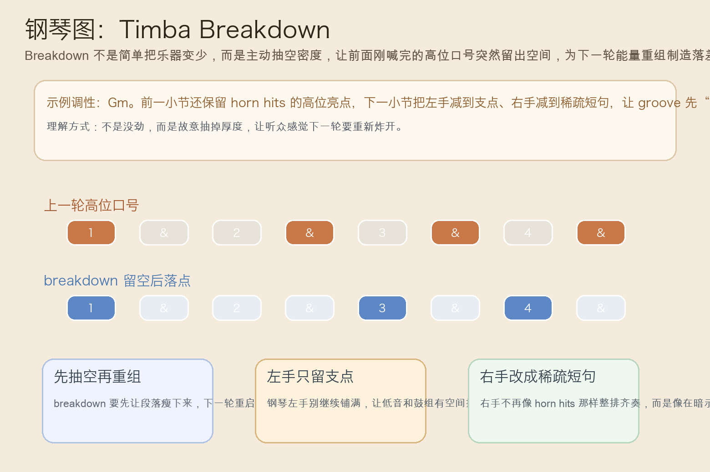
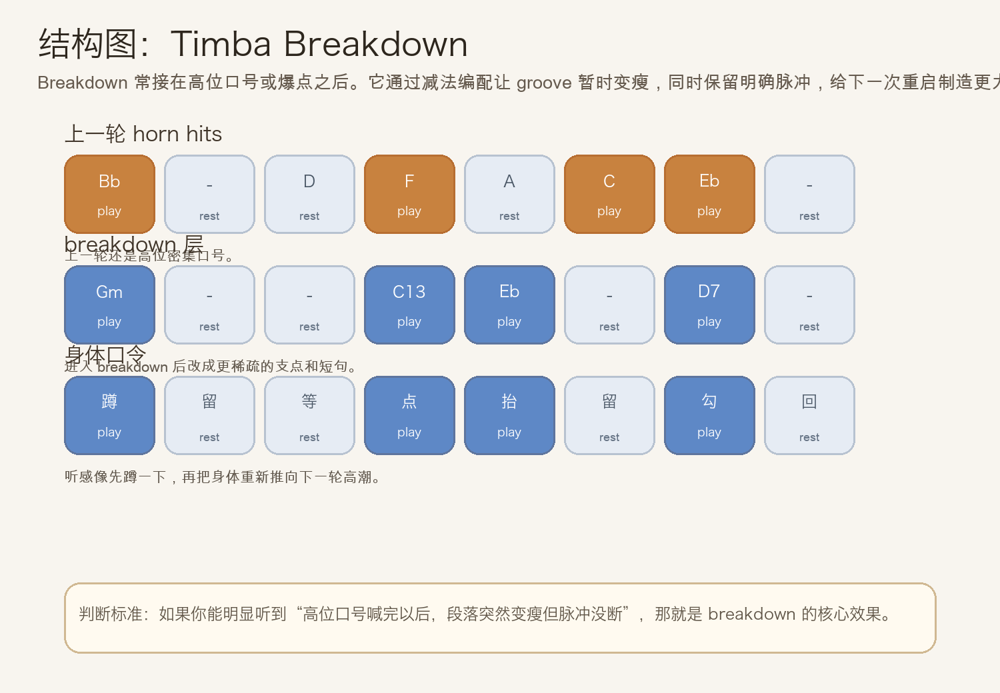
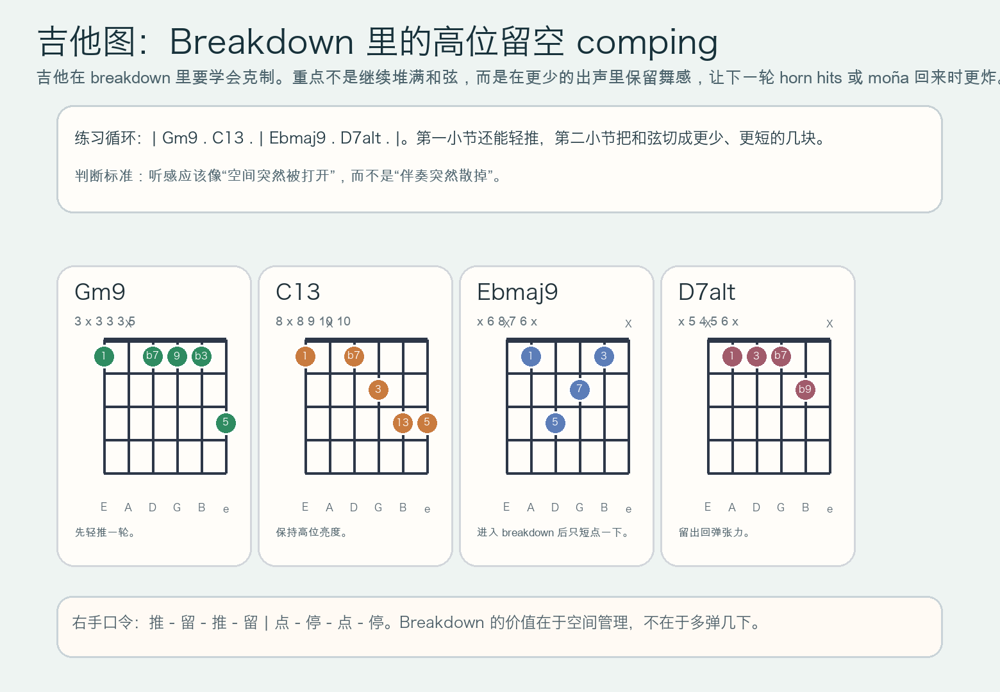

# 2026-06-30：Timba Breakdown

## 今日知识点

今天只讲一个知识点：**Timba Breakdown，也就是 Timba 高能段里主动把编配抽空、让能量暂时“蹲下来”再重组的段落处理。**

上一次的 `Timba Mambo Horn Hits` 讲的是：把高位短句扩大成整队一起喊出来的口号。

今天只再往前推进一步：

**如果这句口号已经喊到最亮，接下来乐队怎样不靠一直加东西，而是靠“突然抽空”让下一轮回来时更炸？**

答案就是 `breakdown`。

它不是单纯“音更少”：

- 它是有目的地减法编配
- 它会保留脉冲，但抽掉一部分厚度
- 它常接在 horn hits、bloque 或 moña 之后
- 它的作用是让下一轮重启更有落差

你可以先把它理解成：

```text
Timba Moña：短句反复回勾
Timba Mambo Horn Hits：把短句扩大成整队高位口号
Timba Breakdown：高位口号喊完后，故意抽空编配，为下一轮重组能量
```

今天真正要抓住的是：

**Timba Breakdown 的核心，不是“突然变弱”，而是“在不丢脉冲的前提下主动腾出空间，让下一轮回来时更有冲击力”。**





## 钢琴使用场景

钢琴上，`Timba Breakdown` 很适合放在 **horn hits 已经把全队喊亮、段落需要先蹲一下再继续冲、鼓和低音要重新组织下一轮重拍入口** 的场景里。

今天用 `G` 小调做一个入门版两小节循环：

```text
前一小节：| Gm9 . C13 . |
breakdown 小节：| Ebmaj9 . D7alt . |
左手：只保留支点，不再铺满
右手：从整齐 horn hits 改成更稀疏的短句落点
```

钢琴上最关键的是三件事：

1. breakdown 之前要先有足够亮的前情，不然“抽空”就不会成立。
2. 左手要缩减到清楚的支点，让低音和鼓组有重新站稳的空间。
3. 右手必须少而准，像在暗示“下一轮马上回来”，而不是随手乱减。

它尤其适合这样练：

- 先弹一轮完整的 horn hits
- 第二轮立刻把右手改成更少的两个或三个落点
- 左手只在和声支点上短促落下
- 保持拍感不塌，只让密度变瘦

## 吉他使用场景

吉他上，`Timba Breakdown` 很适合放在 **高位 comping 不再负责把场面顶满，而是要帮整队腾出空间、保留舞感、等待下一轮重启** 的场景里。

今天可以直接套这组和声：

```text
| Gm9 . C13 . | Ebmaj9 . D7alt . |
```

吉他的重点是：

1. 第一小节还能轻推，但第二小节必须明显更克制。
2. 出声要短，宁可少两下，也不要把 breakdown 弹回普通切分伴奏。
3. 每个和弦都要像“支点”而不是“铺底”，让编配里真的听得到空气。

最常见的错误是：

- 以为 breakdown 就是没精神，结果节拍也一起散掉
- 和弦虽然变少了，但每次都扫太长，空间还是没出来
- 前后两小节密度差不明显，听众感觉不到“蹲一下再起”的落差



## 可演奏例子

钢琴例子：

```text
例子 1（先对比密度）
上一轮：x . . x . x x .
breakdown：x . . x x . x .
要求：后一轮音更少，但拍感不能松。

例子 2（左手缩减）
左手：Gm9 . C13 . | Ebmaj9 . D7alt .
要求：只给短促支点，不要继续铺满和弦。

例子 3（完整循环）
第一轮：先做 horn hits
第二轮：立刻切成 breakdown
要求：听感要像“先喊出来，再突然蹲下蓄力”。
```

吉他例子：

```text
例子 1（纯右手动作）
口令：推 - 留 - 推 - 留 | 点 - 停 - 点 - 停
要求：第二小节的空间感必须明显更大。

例子 2（带和弦）
和弦：| Gm9 . C13 . | Ebmaj9 . D7alt . |
要求：Ebmaj9 与 D7alt 只做短切片，别把后一小节扫满。

例子 3（接上昨天主题）
第一轮：先做 horn hits
第二轮：进入 breakdown
要求：听感从“整队喊口号”变成“突然让出空间等下一轮爆开”。
```

## 今日练习

1. 先拍手数 `1 & 2 & 3 & 4 &`，连续拍两轮，第二轮只拍更少的几个点，但节拍不能飘。
2. 钢琴右手先练一轮 horn hits，再立刻改成 breakdown 版落点，体会密度落差。
3. 左手加入 `Gm9 - C13 - Ebmaj9 - D7alt`，只保留短支点，避免铺满。
4. 吉他先全闷音练 `推 - 留 - 推 - 留 | 点 - 停 - 点 - 停`，再把和弦填进去。
5. 把昨天的 `Timba Mambo Horn Hits` 接到今天的 `Timba Breakdown`：先把口号喊亮，再让编配突然变瘦，为下一轮重启留出更大的爆发空间。

## 一句话总结

Timba Breakdown 的核心，是在高能段里主动抽空编配、保留脉冲，用空间落差把下一轮爆发衬得更狠。
